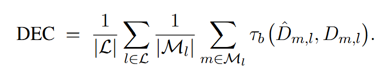
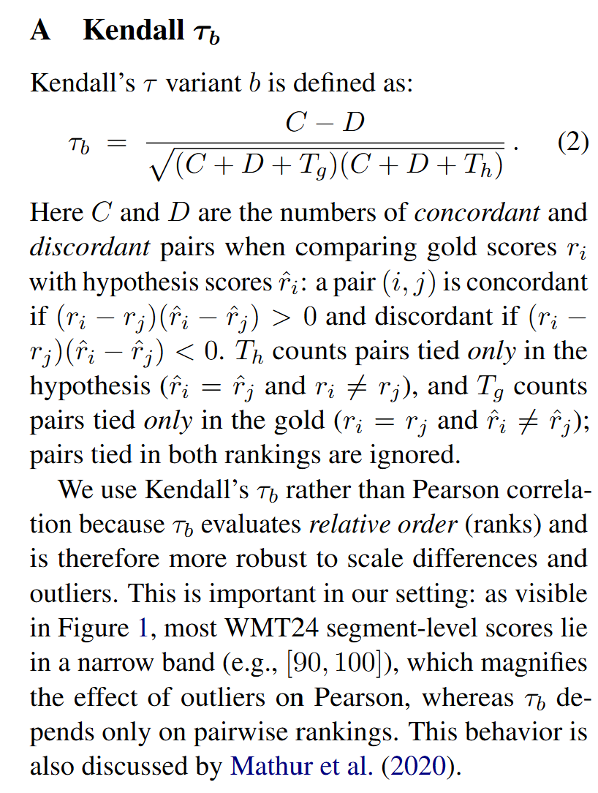
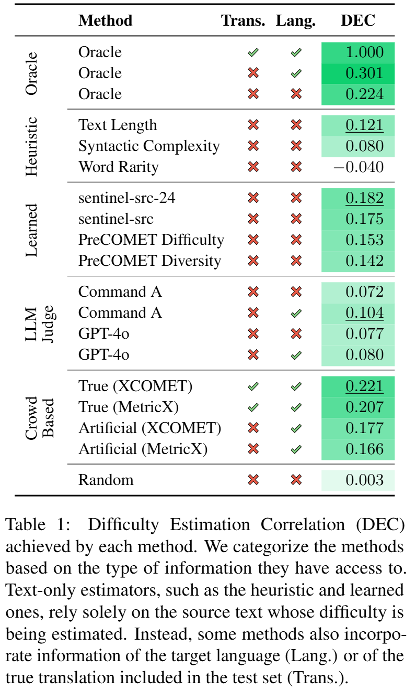
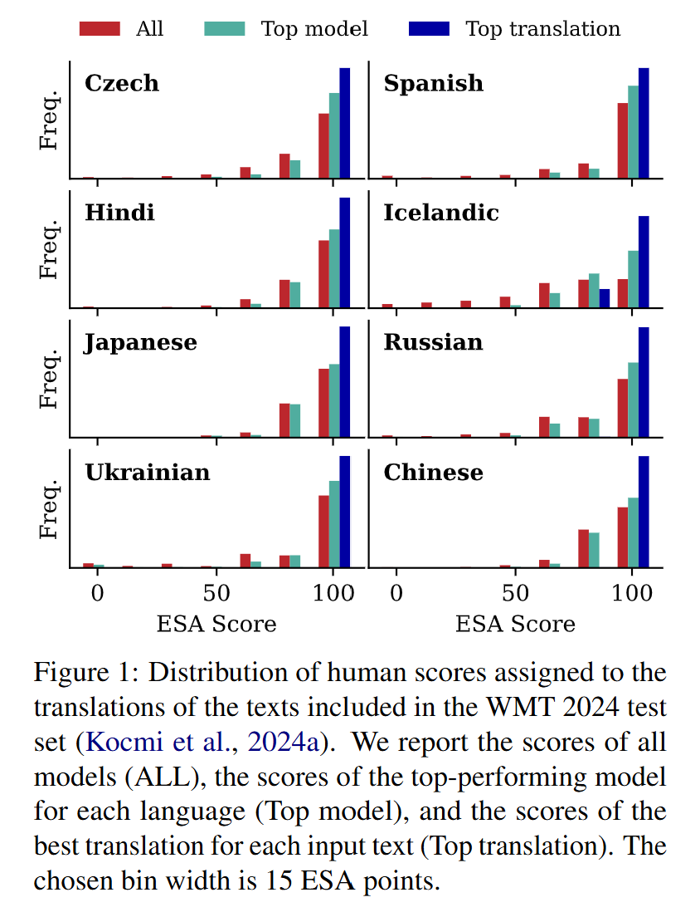
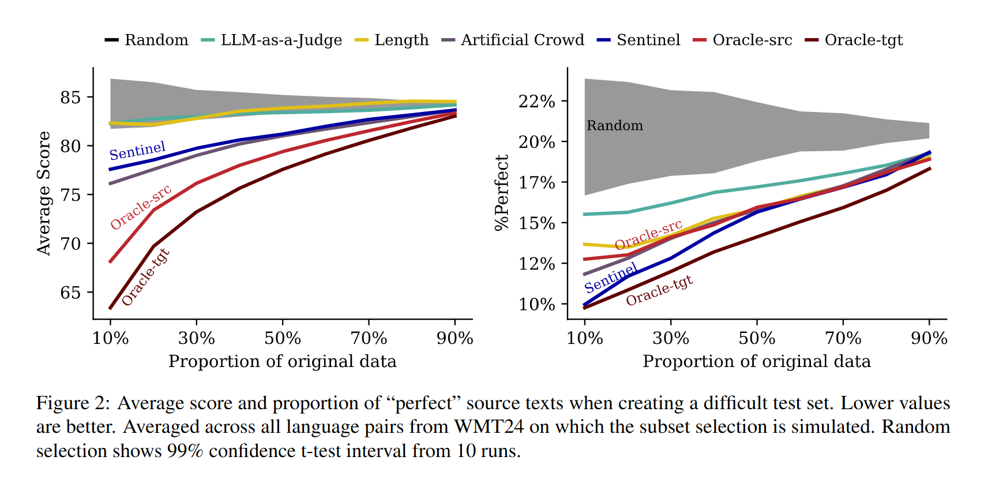

# Estimating Machine Translation Difficulty

----

**Author:** Lorenzo Proietti, Stefano Perrella, Vilém Zouhar, Roberto Navigli, Tom Kocmi  
**Journal/Year:** EMNLP 2025  
https://aclanthology.org/2025.findings-emnlp.1317.pdf  

----

## 들었던 생각
- related works에 나와있는 MT difficulty를 추정하는 매우 많은 방법론을 다 적어보았습니다. 원래 related works는 이렇게까지 자세하게 리뷰하진 않았는데, 여기서는 하나하나 citation 따라가면서 읽어보면 좋을 듯하여...
- DEC 내용이 제가 제일 관심있었던 연구에 가까운 것 같습니다
- 논문 전체가 매우 비싸고, 규모가 큰 연구라는 생각이 강하게 들었습니다... (사람이 WMT 2024에 있는 모든 언어 Translation에 대해서 annotation.....) 이정도 규모는 되어야 EMNLP main accept이 되나요? (아니면 연구 규모랑은 큰 상관이 없나요?)
- Creating Benchmark의 관점에서는 특정 기준을 정하고 기존 datas를 거르는 방식으로 만들어서 생각보다 할만 할지도?라는 생각이 들었습니다.

## 요약

### 1 Introduction

#### Data sample difficulty 인지의 필요성?
- during training: Curriculum Learning (난이도 낮은 것부터 높은 것까지 순차대로 학습하는 것) -> training & performance efficiency 증가
- during inference: easy examples에 대해 early-exiting -> computational cost 감소시킬 수 있음
- model evaluation의 지표가 될 수 있음 (너무 쉽거나 너무 어려우면 model 성능을 제대로 판별하기 힘듦)

#### 논문의 main contribution
- *Translation Difficulty Estimation*: formally translation difficulty 정의
- *Difficulty Estimation Correlation (DEC)*: performance of difficulty estimation method를 평가하기 위한 방법
- test baseline & novel approachs to difficulty estimation -> validate practical utility by creating challenging benchmark

#### 주요 발견
- sentinel-src가 번역 난이도를 판별하는데 좋음
- 따라서 위 모델의 two improved versions를 train 시켜 public 공개 -> sentinel-src-24, sentinel-src-25

### 2 Related Work
- Human Translation Difficulty 추정
  - Mishra et al. (2013): time, test length, word polysemy degree, syntactic complexity 등으로 정의
  - Vanroy et al. (2019): error count, word translation entrophy, syntactic equivalence with translation duration, gaze 등의 correlation 분석
  - Lim et al. (2023, 2024): word alignment distributions, decoder perplexity를 사용

- Machine Translation Difficulty 추정
  - Kocmi, Bojar (2017): sentence length, word rarity, number of coordinating conjuctions in the text 사용 (linguistic-motivated)
  - Platanios (2019): sentence length, rarity 사용 (linguistic-motivated)
  - Zhang et al. (2018), Liu et al. (2020): text 생성 과정에서 model의 confidence 등 intrinsics 사용
  - Almeida (2017): binary classification task로 여김 -> quality estimation과 유사
  - Zhan et al. (2021b): artificial crowd-based approach (leverages automatic metrics)
  - Zhan et al. (2021a): 대상 token과 translation 결과물 사이의 embedding similarity 사용
  - Don-Yehiya et al (2022): **PreQuEL task** 정의 그러나...
    - WMT 2020 Quality Estimation Shared Task evaluation 사용: difficulty보단 quality estimation에 가까움 
    - 오직 two language directions, all produced by the same MT model 사용
    - difficulty estimators / benchmark 생성은 안 함
  - 그래서 이 논문에서는:
    - translation difficulty estimation을 distinct task로 정의
    - 11개 언어 (MT models, human translators) 포괄

### 3 The Difficulty Esimation Task
- Translation Difficulty에 영향을 줄 수 있는 요소들
  - length
  - syntactic complexity
  - idiomatic language (관용적 표현)
  - rare/specialized vocabulary
  - translation direction
  - human translators와 동일 관점: culture background, linguistic familiarity
  - machine translators만 해당: parameter 수, training data, model architecture
- 해당 요소들을 모두 포괄하여 정의 (absolute term)하면 generalization이 힘들 수 있음 -> 특정 언어와 accuracy of a particular translator에 relative하게 정의

#### Task Definition
- ${x}$: source text
- ${m}$: model
- ${l}$: target language
- Difficulty Estimation: ${d_m,l}$ 추정 (expected quality of a given text's translation)

#### Evaluation
- ${D}$: ground-truth difficulty scores
- $\hat{D}$: predictions of difficulty scores
*Difficulty Estimation Correlation (DEC)*: Kendall $\tau$ 이용 (model-language 사이)
  

#### Contrasting DEC with standard MT meta-evaluation strategies
- baseline: Group-by-Item 
  - **same source text** -> different translations -> 여기에서의 correlation을 averaging
  - 원문들의 특징(예: 길이)과 번역 품질 사이에 발생하는 잘못된 상관관계(spurious correlation)를 예방
- DEC: Group-by-System 
  - human과 metric assessment 사이의 correlation 계산
  - **different source text** (produced by the same MT system) -> correlation averaging
  - 어떤 source text가 MT이 어려운지 판별 가능

### 4 Methods for Difficulty Estimation

#### 4.1 Heuristic-based estimators (휴리스틱 기반)
- text length
- word rarity
- syntactic complexity

#### 4.2 Learned estimators
- PreCOMET: evaluation에 적합한 sample을 고르는 regressor
  - PreCOMET_diversity: 다양성 위주 선택
  - PreCOMET_difficulty: 난이도 위주 선택 (IRT 사용)
- sentinel-src: source alone으로부터 translation quality 추정. 원본의 feature와 quality score간의 spurious correlation을 학습한다는 목적을 갖고 있음

#### 4.3 LLM-as-a-Judge
- 프롬프트를 사용하여 0에서 120사이의 difficulty score를 매기게 함

#### 4.4 Crowd-based Estimators
Translation Difficulty를 '주어진 텍스트의 예상 번역 품질'로 정의한 점에 기반
  - 1단계: translate a source text -> 2단계: use reference-less MT metrics to estimate the quality of results
  - variety를 위해 다양한 모델 사용
  - Artificial Crowd
    - metric: XCOMET-QE-XXL, MetricX-24-Hybrid-QE-XXL
  - True Crowd
    - metric: XCOMET, MetricX

### 5 Experiments

#### 5.1 Experimental Setup
- test sets: WMT 2024 General MT and Metric shared tasks
- 각 번역은 인간에 의해 annotation됨 (Error Span Annotation/Multidimensional Quality Metircs을 따름)
- estimator model: sentinel-src를 확장하여 sentinel-src-24 및 sentinel-src-25 훈련

#### 5.2 Results
- DEC  

- Human & Machine Translation Comparison

### 6 Creating Difficult Benchmarks
- 기존 WMT2024는 너무 쉬움
- sample 중 어려운 subset을 고르는 task를 정의

#### 6.1 Setup
- focus on: 영어 -> 중국어, 체코어 등 
- sample당 single difficulty score 할당
- model traslation의 human score가 감소하는가?를 기준으로 삼음
- 25% budget scenario

### 6.2 Results
