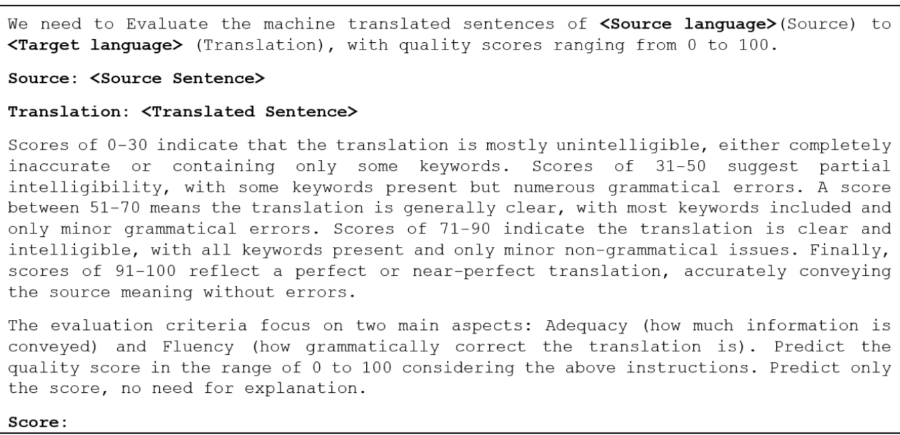
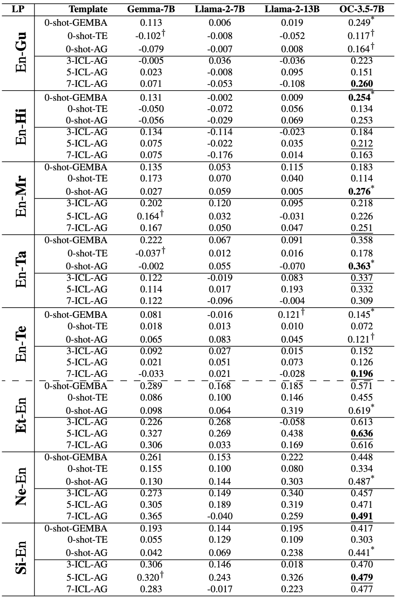
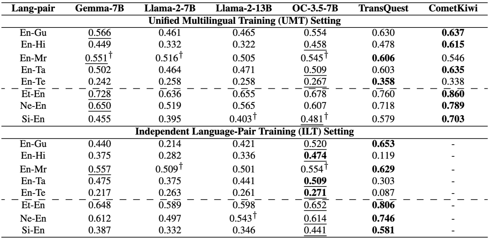

# When LLMs Struggle: Reference-less Translation Evaluation for Low-resource Languages

----

**Author:** Archchana Sindhujan, Diptesh Kanojia, Constantin Orasan, Shenbin Qian
**Journal/Year:** RoLesLM 2025

https://aclanthology.org/2025.loreslm-1.33/

----
## Introduction
- 저자원 언어쌍에서의 Reference-less MT Evaluation (Segment-level QE) 연구
- zero-shot, few-shot(ICL), instruction fine tuning 실험 (annotation guideline 기반)


## Background

- QE의 종류 (due to granularity(세분화 수준)) (디테일 작성 클로드)

| 종류 | 단위 | 출력 | 대표 모델 | 장점 | 단점 |
|------|------|------|-----------|------|------|
| Word-level | 단어/토큰 | OK/BAD 태그 | OpenKiwi, DeepQuest | 오류 위치 파악 | annotation 비용 높음 |
| Phrase-level | 어구 | 어구별 태그 | (Word-level 확장) | 어구 단위 맥락 | phrase 경계 모호 |
| Segment-level | 문장 | 단일 점수 | TransQuest, CometKiwi | 빠르고 실용적 | 오류 위치 불명확 |
| Document-level | 문서 | 문서 점수 | DocQE | 담화 수준 반영 | 데이터 희소, 비용 높음 |

- Segment-level QE
  - 보통 regression task로 분류됨: DA (Direct Assessment) score prediction
  - DA score는 'semantic accuracy'와 'cross-lingual semantic match' 둘다에 관련됨 ('번역 결과 단일' 및 '원문-번역문' 고려)

- 이전 연구들
  - GEMBA (2023): prompt-based metric for translation quality evaluation
    - 이 연구에서의 프롬프트를 reference-less setting으로 바꿔서 재사용
  - Hwang et al. (2024)
    - LLM들이 source, reference를 번역 평가에 어떻게 사용하는지 연구
    - reference text: accuracy, correlation 향상에 도움을 줌
    - source text: 부정적인 영향을 줌 (QE 등에서 한계)
  - Mujadia et al. (2023)
    - Eng-Indic corpus를 사용하여 adapter를 pre-tune하는 방식으로 QE 수행
    - 이후 supervised QE data를 사용하여 모델을 다시 fine-tune
    - MT를 사용한 pre-tuning이 도움 되지 않음을 보임 
  - MQM
    - fine-grained error annotation 수행
    - low resource 한계

## Methodology

### Datasets
- low resource language pairs 사용 (DA score 포함) (디테일 작성 클로드)
  - WMT 2023 (English -> 인도 소수어)
    - Gujarati → 🇮🇳 인도 (구자라트 주)
    - Hindi → 🇮🇳 인도 (공용어)
    - Marathi → 🇮🇳 인도 (마하라슈트라 주)
    - Tamil → 🇮🇳 인도 (타밀나두 주) + 🇱🇰 스리랑카 (공용어)
    - Telugu → 🇮🇳 인도 (안드라프라데시 주 / 텔랑가나 주)
  - WMT 2022 (소수어 -> English)
    - Estonian → 🇪🇪 에스토니아 (공용어)
    - Nepali → 🇳🇵 네팔 (공용어)
    - Sinhala → 🇱🇰 스리랑카 (공용어, Tamil과 함께)
  - 힌디어랑 에스토니아어는 MT에서는 mid-resource긴하지만 QE에서는 low resource가 맞음

### Prompting Strategies 
- 1) Zero-shot
  - **TE prompt**: instruct the model to act as a translation evaluator
  - **AG prompt**: providing additional context from human annotation guidelines (하단 예시)
  - **GEMBA**: GEMBA 연구에서 사용된 방법을 reference-less로 바꿔서 사용

  

- 2) ICL (in-context learning)
  - **AG prompt** 
  - example annotations을 5가지 범위로 증강 (1 - 30 - 50 - 70 - 90 - 100)
  - 이후 3종류 세팅으로 구분 (어떤 범위로부터 샘플을 구성하는지에 따라): 
    - 3-ICL: 1-30, 70-90, 90-100 
    - 5-ICL: 각 범위마다 한개씩 
    - 7-ICL: 각 범위마다 한개씩 + 1-30, 90-100

- 3) Instruction fine-tuning
  - **AG prompt**
  - **Unified Multitingual Training (UMT)**: 8개의 모든 저자원 언어 리소스를 합쳐서 모델들을 fine tuning 
  - **Independent Language-Pair Training (ILT)**: 각 언어쌍을 따로따로 fine tuning 

### Details
- LLMs (zero-shot, few-shot, fine-tuning에 모두 사용)
  - Gemma-7B(google)
  - OpenChat-3.5(openchat): conditioned-RLHF(Reinforcement Learning from Human Feedback) 사용
  - Llama-2-7B(meta), Llama-2-13B(meta): SFT(Supervised Fine-Tuning), RLHF 사용

- Model (Instruction fine-tuning setting) 
  - TransQuest (on Independent Language-Pair Training and Unified Multilingual Training setting)
  - fine tuned COMET (on low resource)

- Zero-shot, few shot setting
  - vLLM framework
  - zero shot, ICL 모두 temperature 0.85 / 0 두 가지 모드 실험
  - input sequence length: 1024 (zero shot), 4096 (ICL)

- Instruction fine-tuning setting
  - LLaMA Factory framework 사용
  - LoRA 사용: rank 64
  - 4-bit quantization
  - 16 bit floating-point preision 


### Evaluation & Metrics
- Correleation between: DA mean (3 annotators) & Predictions 
- Corelation (디테일 작성 클로드)

| | Pearson | Spearman | Kendall's τ |
|--|---------|----------|-------------|
| **데이터 타입** | 연속형 | 순서형/연속형 | 순서형/연속형 |
| **정규분포 가정** | ✅ 필요 | ❌ 불필요 | ❌ 불필요 |
| **측정 대상** | 선형 관계 | 단조 관계 | 쌍 일치율 |
| **이상치 강건성** | 약함 | 중간 | 강함 |
| **범위** | -1 ~ +1 | -1 ~ +1 | -1 ~ +1 |
| **MT 평가 활용** | 드묾 | 시스템 수준 | 세그먼트 수준 (WMT) |

- 통계적 유의성 검증: two tailed paired T-test

## Results

### Zero-shot and few-shot setting

```
Table 1: Spearman correlation (ρ) between the predicted and human-annotated scores for all the experimental settings. Bold indicates the overall top score per language pair, asterisks (*) denote top scores in zero-shot settings, and underlined values highlight the best among ICL settings. The (†) symbol denotes statistically insignificant results (p > 0.05), and the dashed line separates language pairs with English as target.
```
- 대부분의 언어 쌍에서 AG prompt가 가장 높은 점수를 보임
- zero-shot 세팅의 모든 언어 쌍에서 OpenChat모델이 가장 높은 점수를 보임

### Instruction fine-tuning setting

```
Table 2: Spearman correlation (ρ) scores between the predicted and mean DA scores for UMT and ILT fine-tuning. For both settings exclusively, scores underlined represent best amongst LLMs, and scores in boldface indicate overall best scores amongst both LLMs and encoder-based models. (†) denotes the statistically insignificant results (p > 0.05). The dashed line separates language pairs with English as the target.
```
- UMT setting
  - fine-tuned encoder-based models이 항상 좋은 성적
  - 가장 low resource인 언어쌍들에 대해 대체로 좋은 성능 (다양한 언어 데이터를 통합하는 것이 모델의 일반화 성능을 높여주기 때문)
- ILT setting
  - UMT와 달리 다른 모델들도 좋은 성적을 냄 

## Discussion
- Tokenization 분석
  - fine-tuned encoder based model이 LLM보다 좋은 성적을 보이는 이유
  - 저자원 비영어권 언어: LLM이 생성하는 토큰 수가 실제 단어 수와 크게 다름 (언어 의미 일치를 파악하는데 어려움)
- 오류 분석
  - OpenChat 모델의 En-Ta 언어 쌍에서의 주요 오류 유형
  - 부정확한 용어, NER, 문법 오류, 장문 처리 미흡, 정보 누락 등

## Conclusion
- low-resource language pairs를 대상으로 LLM을 이용한 reference-less QE 연구를 수행하였음
- 기존 SOTA 프롬프트와 대비하여 새로운 AG (annotation guideline) 기반 프롬프트 제시
  - zero-shot setting에서 best performance 달성
  - few-shot과 instruction fine-tuning setting에서 pretrained encoder based approach에 근접한 성능 달성
- LLM-based QE의 저자원 언어에 대한 취약성 제고
  - tokenization, pre-training stage에의 접근 필요 
  - 모델 training에서의 언어학 기반 접근 필요

## 느낀 점
- 이전 논문 (Estimating Machine Translation Difficulty)에서는 통계적 유의성 검증 과정이 없었는데 해당 과정을 넣어주니 신뢰도가 올라감
- 상관계수 3종 중 왜 Spearman's를 주요 지표로 삼았는지에 대한 이유가 없어서 아쉬움. 그러나 3종의 상관계수를 모두 사용한 점은 notable
- 논문의 주요 기여가 "저자원 언어 번역쌍 QE에 대한 AI 모델의 성능 연구" 및 "그 성능을 올리기 위한 프롬프팅 방법론"이다. 하지만 저자원 언어쌍이라고 해봐야 위에 명시된 것 처럼 주로 인도 계열 언어이다. scope가 매우 좁아보이는데 ACL2025에 억셉된 논문이여서 좀 의외임...
