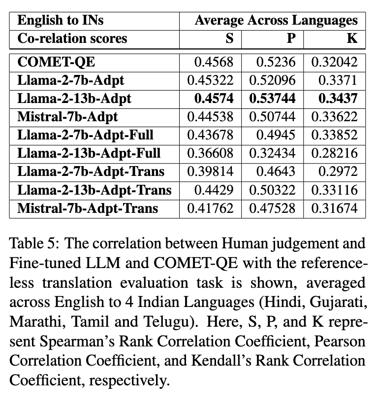

# Towards Large Language Model driven Reference-less Translation Evaluation for English and Indian Languages

----

**Author:** Vandan Mujadia, Pruthwik Mishra, Arafat Ahsan, Dipti Misra Sharma
**Journal/Year:** ICON 2023

https://arxiv.org/pdf/2404.02512

----
## Introduction
- 목적: LLM이 영어-인도어군 페어에서 (인간과 유사하게) QE를 수행할 수 있도록 함
- translation evaluation task construction (score: 1 to 100)
- existing methods vs trained system in this paper -> human judgement와 얼마나 연관되어 있는가

## Methodology
### 실험 셋팅 
  - zero-shot setting
  - in-context setting
  - fine-tuning setting (LoRa parameter-efficient fine tuning, full fine-tuning)
- 추가 셋팅 (multi-task fine-tuning): QE 학습과 동시에 **source + reference corpora를 이용하여 translation task로도 fine-tuning하여** QE 성능에 연관이 있는지 실험

### Dataset
- QE 데이터셋: WMT2023으로만 사용. 순서대로 인도 언어군 종류, training 페어 갯수, validation 페어 갯수
  - Gujarati 7000 1000
  - Hindi 7000 1000
  - Marathi 26000 1000
  - Tamil 7000 1000
  - Telugu 7000 1000
- MT 데이터셋 (source + referece data): **BPCC**

### Model
- prompting 대상 모델 (zero-shot, ICL)
  - opt-6.7b
  - Bloom-7B
  - LLaMA-7B
  - MPT-7B
  - Falcon-7B
  - LLaMA-2-7B
  - LLaMA-2-13B
  - Mistral-7B

- fine-tuning 대상 모델
  - LLaMA-2-7B, -13B
  - Mistral-7B
  - COMET-QE 

## Results and Discussion 
- correlation 사용: Spearman's, Pearson, Kendall's
  - zero shot: 성능 쓰레기
  - ICL: 마찬가지로 쓰레기 (example을 그냥 흉내만 냄)
  - fine-tuning: 가장 좋은 성능 
- 하지만 src-ref corpora를 이용하여 translation까지 학습시킨 multitask learning를 한다고 해서 학습에 별다른 영향을 주지는 않음

## 들었던 생각
- **BPCC**라는 인도어군 source + referece data가 있다고 논문에서 말해줘서 어렵지 않게 내 실험에서 silver label을 구축할 수 있을 것 같음. (감사!!)
- 해당 논문에서 src-ref 코퍼스를 사용한 것은, **코퍼스를 이용하여 translation task를 학습**시키는 동시에 **WMT DA를 이용하여 QE task 학습**도 진행한, multi-task fine-tuning이므로 내 아이디어(silver label)과 다르다고 볼 수 있음
- (Sindhujan et al., 2025)과 비교 (대상 llm 등 디테일이 아닌 큰 차이점 위주로 서술)
  - 프롬프팅 차이점: Annotation Guideline을 프롬프트에 포함시켰는지 여부
  - fine-tuning 차이점: 전체 인도어군을 한꺼번에 학습시킨 세팅이 있었는지 여부
  - 데이터셋 공통점: 둘다 WMT 2023을 사용하여 QE 학습 데이터셋이 너무 적음 (규모도 동일)
  - fine tuning으로 성능을 올렸다는 점은 이전 논문과 같은 결론이지만, 두 논문 다 llm fine-tuning으로는 encoder-based model에 비해서 한참 뒤떨어진 성능밖에 못뽑음
  - Sindhujan의 fine-tuning 성능이 저자원 언어에서 이 논문에 비해 올라간 원인: 언어 페어들을 한꺼번에 학습시켰다는 점임 (UMT seting)
    - 이 부분을 확대해서 내 논문에 적용해볼 수 있지 않을까함 
