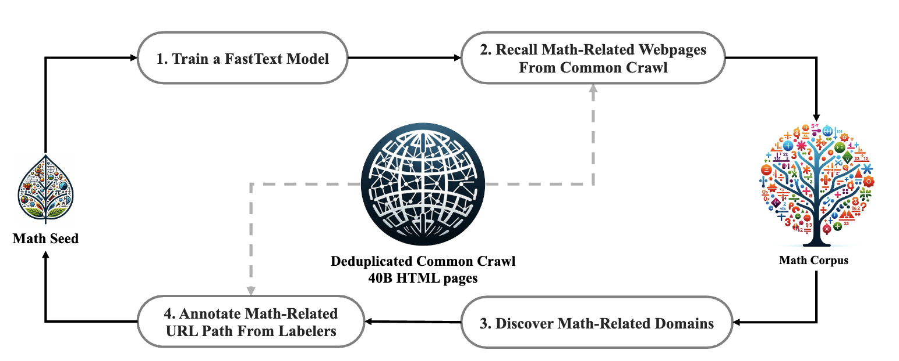
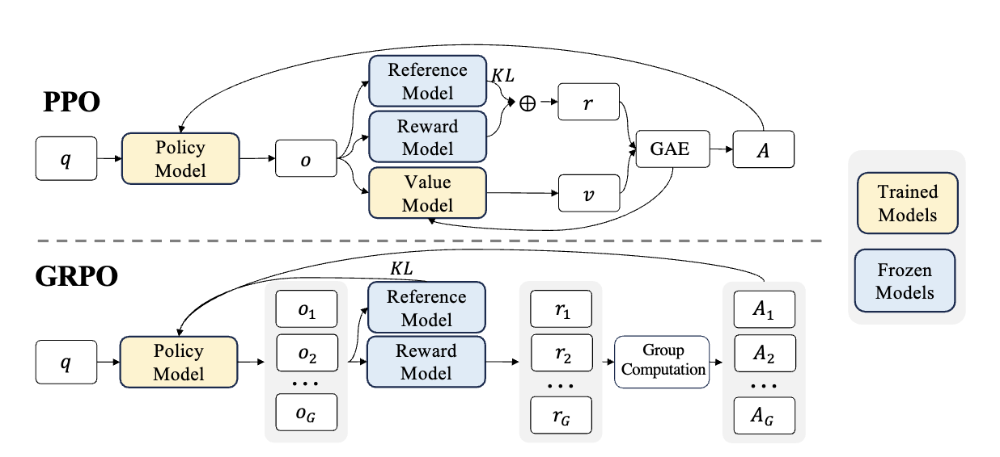
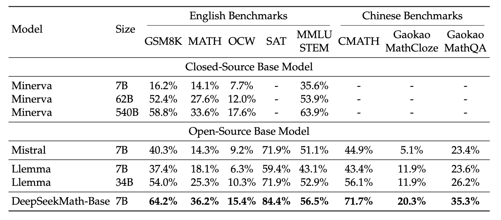
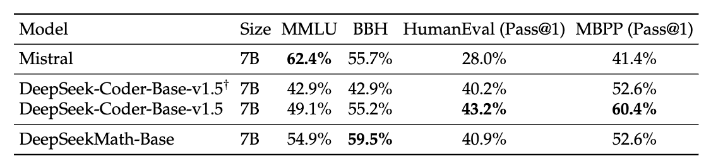
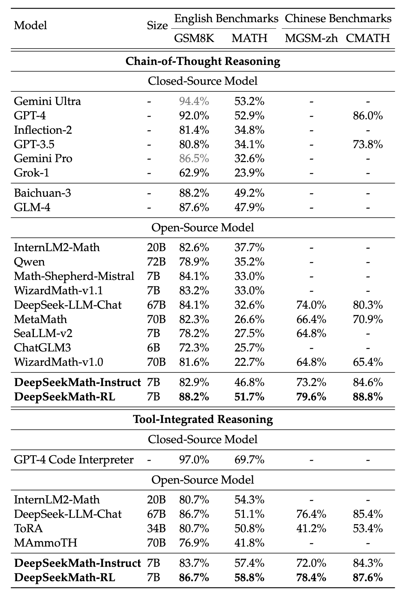
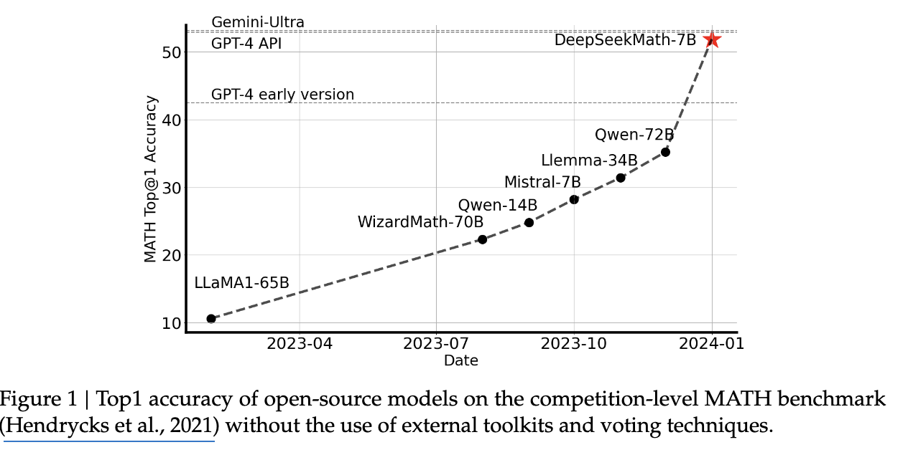
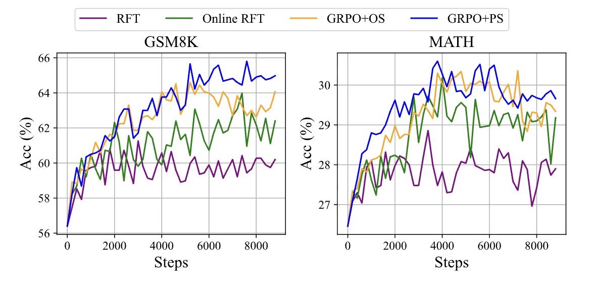
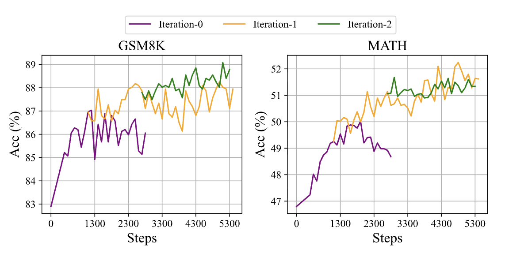

# DeepSeekMath: RL - GRPO

## 1 기본 정보

- 논문 제목: DeepSeekMath: Pushing the Limits of Mathematical Reasoning in Open Language Models
- 링크: https://arxiv.org/abs/2402.03300
- 발표일: 2026년 7월 7일
- 발표자: 장지수

## 2 한 줄 요약
7B opensource model인 DeepSeekMath 7B에 대한 technical report. (2024년 2월) 초거대 비공개 모델에 준하는 수학 추론 능력을 달성. 핵심은 1. 고품질 수학 데이터를 대규모로 수집하는 파이프라인 구축 **2. GRPO라는 새로운 강화학습 기법**을 제시.

## 3 문제 설정
- 기존의 오픈소스 모델들은 비공개 모델들(GPT-4, Gemini-Ultra)에 비해 고난도 벤치마크들에서 성능이 뒤쳐지고 있었음.  

- 수학적 추론 능력은 단순히 패턴을 외우는것이 아니라, 논리적 단계를 따라가서 정확한 계산을 수행해야 함. 따라서 수학 벤치마크에서 좋은 성능을 보인다면, 과학/공학/프로그래밍처럼 논리적 사고가 필요한 모든 분야에 응용할 수 있음.

- 기존 오픈소스 모델들의 문제
    - 일단 텍스트 데이터로 학습함 -> 수학 약함
    - RL 기반 fine-tuning을 시도하는 연구들도 있었지만, 대부분 PPO를 사용하였음 (PPO는 계산비용이 크고 메모리 효율이 떨어짐)
    - 수학 데이터를 모으려해도 어떤 데이터가 필요한지, 어떻게 효과적으로 수집할지에 대한 명확한 방법론 부재

## 4 핵심 아이디어

1. 수학 데이터 수집 파이프라인
    - Common Crawl이라는 거대한 web text data 중 수학에 관련된 콘텐츠만 뽑아냄.
    - 단순히 특정 키워드 (예: "Math")로 필터링 하는 것이 아닌, 반복적으로 유사도가 높은 문제들을 찾아내는 파이프라인 구축
    - 최종 결과: 1200억 토큰

2. 새로운 RL 알고리즘인 GRPO (중요)
    - 모델이 같은 문제에 대해 생성해내 여러 개의 답변들을 종합적으로 평가하여 상대적인 성능 비교
    - 별도의 value function 유지 불필요 (메모리 절약, 속도 개선)
    - 기존 PPO에 대항하는 새로운 알고리즘

## 5 방법론

### 5.1 데이터에 관하여: DeepSeekMath Corpus (수학 데이터 구축 파이프라인)
- 방법
    - step 1: 수학 관련은 positive (OpenWebMath), 비관련은 negative (CommonCrawl에서 랜덤 추출)로 분류
    - step 2: 분류기 학습
        - fastText embedding으로 벡터화 (256 dimension) 
            - (참고) fastText embedding이란? character level n-gram
                - running ->  <ru, run, unn, nni, nin, ing, ng>로 분해하여 ru vector, run vector, unn vector 등으로...
                - OOV 표현 가능, 철자 변화에 강함 (running, runs는 많은 n-gram 공유 -> 비슷한 위치 벡터)
        - 해당 벡터들을 이용해 수학 관련 페이지를 분류하는 모델 학습 (classifier)
    - step 3: Common Crawl dataset의 모든 문서들을 벡터화한 후 위에서 학습시켰던 분류기에 통과시킴 -> 이 페이지가 수학 관련일 확률을 0에서 1 사이로 출력 -> 점수 순서로 내림차순 정렬 (높은 점수부터) -> 상위 K개 페이지를 선택하여 실제 데이터로 추가
    - step 4: 찾은 데이터들이 진짜로 수학 문제 (수학 답안지)인지 필터링 (사람이 시행, 페이지 단위가 아니라 domain/URL 단위 주석)
    - step 5: 새로 발견한 좋은 문제들을 시드로 추가 후 다시 step 1~4 반복
    - step 6: benchmark decontamination - 4번의 iteration에서 수집이 끝난 코퍼스에서 평가 벤치마크와 10-gram이 정확히 일치하는 텍스트 구간 제거 (중복 제거). 10 토큰 미만의 짧은 벤치마크 텍스트는 최소 3-gram exact match로 중복 제거. (웹 크롤링 데이터의 우려점인 data contamination 방어)

- 최종 결과 (4번의 iteration): 1200억 수학 관련 토큰

### 5.2 학습에 관하여: 전체 파이프라인 3단계
1. Pretraining: DeepSeekMath-Base 7B
    - DeepSeek-Coder-Base-v1.5 7B (코드로 pretrain된 모델)에 학습 
    - data: 120B token mix
    - 성능: MATH 36.2%, GSM8K 64.2%
2. Supervised Fine-tuning: DeepSeekMath-Instruct 7B
    - data: chain-of-thought, program-of-thought, tool-integrated reasoning 세가지 포맷
    - 성능(CoT): MATH 46.8%, GSM8K 82.9%
3. RL(GRPO): DeepSeekMath-RL 7B
    - data: SFT data 중에서 english GSM8K/MATH 계열 약 144K 개
    - 성능(CoT): MATH 51.7%, GSM8K 88.2%, self-consistency(maj@64)에서 MATH 60.9%

### 5.3 GRPO (Group Relative Policy Optimization) Algorithm
- PPO, GRPO 공통 objective function (loss function은 여기에 - 붙인 거 (GRPO는 KL divergence까지...))

${\mathcal{L} = \mathbb{E}[\min(r_t(\theta) * \hat{A}_t, \text{clip}(r_t(\theta), 1-\epsilon, 1+\epsilon) * \hat{A}_t)]}$
- ${\hat{A}_t}$: Advantage. 즉 어느 정도만큼 잘했냐?
- ${r_t(\theta) = \pi_\theta(a_t|s_t) / \pi_{\text{old}}(a_t|s_t)}$ (정책 비율)
    - r_t = 1 → 새 정책이 옛 정책과 똑같이 행동
    - r_t > 1 → 새 정책이 그 토큰을 더 잘 뽑게 됨
    - r_t < 1 → 덜 뽑게 됨
- ${\text{clip}(r_t(\theta), 1-\epsilon, 1+\epsilon)}$: ${r_t}$가 ${[1-\epsilon, 1+\epsilon]}$ 범위를 벗어나면 강제로 그 경계값으로 잘라버림 (${\epsilon}$는 보통 0.1~0.2). 정책이 한 번의 업데이트로 너무 급격하게 변하는 걸 막는 안전장치
- ${\min(\cdot, \cdot)}$: 비관적 선택 ㅠㅠ (pessimistic). clip을 안 한 항과 clip한 항 중 더 작은 쪽을 목적함수로 선택. 새 정책이 옛 정책에서 크게 벗어나지 않게 함
- ${\mathbb{E}[\cdot]}$: expectation. 샘플링한 trajectory(응답)들과 그 안의 토큰들에 대한 평균. 실제 구현에선 batch 평균

- 기존 PPO 방식
    - 교수님 (value function)이 시험을 낼 때, 미리 학생들이 평균적으로 70 정도를 받을 것이라고 예상함
    - 최서연 학생이 80점을 받으면 -> 최서연 학생의 실제 점수(80)을 예상 점수(70)과 비교해서 학생이 10점 정도 잘했네라고 판단
    - 교수님의 예측 능력 (value function) 자체를 계속 훈련해야됨
    - loss function에서 Advantage: GAE (Generalized Advantage Estimation)
        - 1단계: TD error (한 스텝짜리 "예상하지 못했던 이득"): ${\delta_t = r_t + \gamma V(s_{t+1}) - V(s_t)}$
            - 지금 받은 보상 ${r_t}$ + 다음 상태의 예상 가치 ${\gamma V(s_{t+1})}$ -> 실제로 벌어진 일
            - ${V(s_t)}$ -> 원래 기대했던 가치 (즉 그 차이는 "기대보다 얼마나 좋았나"를 한 스텝 단위로 잰 것 (교수님이 예상했던 값 - 최서연 학생의 실제 점수))
        - 2단계: GAE (TD error들의 감쇠 가중합): ${\hat{A}_t = \sum_{l=0}^{\infty} (\gamma\lambda)^l \, \delta_{t+l} = \delta_t + \gamma\lambda\,\delta_{t+1} + (\gamma\lambda)^2\,\delta_{t+2} + \cdots}$
            - 현재 시점부터 미래의 TD error들을 (γλ)로 감쇠시켜 다 더함. 이때 λ는 bias-variance 조절 knob:
                - ${\lambda=0}$: ${\hat{A}_t = \delta_t}$ 하나만 사용 -> variance 낮지만 V가 부정확하면 bias 큼
                - ${\lambda=1}$: 사실상 Monte Carlo return ${- V(s_t)}$ → bias 없지만 variance 큼
                - 보통 ${\lambda \approx 0.95}$ 정도로 중간 선택
        - ${V(s_t)}$, ${V(s_{t+1})}$이 계속 등장하고 있음 -> PPO는 policy와 별개로 value network(critic)를 학습·유지해야 한다는 것 (GRPO는 이 V를 group 평균으로 대체해서 통째로 삭제)
    - KL penalty의 위치: reference model과의 KL divergence를 reward 안에 섞어서 넣음 

- GRPO 방식
    - 교수님이 미리 평균 점수를 예상하지 않음
    - 시험을 본 후 반 전체 평균이 실제 70점이고, 조현아 학생이 80점을 받으면 -> 조현아 학생의 실제 점수 (80)를 실제 전체 평균 (70)과 비교해서 학생이 10점 잘했네라고 판단
    - loss function에서 ${\hat{A}_i = (r_i - \text{mean}(r_{\text{batch}})) / \text{std}(r_{\text{batch}})}$  (n개의 샘플들의 평균 보상)
    - KL penalty의 위치: KL 항을 reward가 아니라 loss에 직접 별도 항으로 추가함

- GRPO Detail
    - 각 문제마다 K개의 다른 응답을 생성 (sampling)
    - 각 응답의 정확성을 반단해서 보상 r 할당 (정답=1, 오답=0) -> 그냥 rule 기반은 아니고, rule로 라벨링한 데이터로 학습한 별도의 reward model 사용
    - 그 k개 응답들의 평균 보상 계산
    - 정책 stochastic gradient update에서 이 평균을 baseline으로 사용

- GRPO가 좋은 이유:
    - 메모리 절약: value fucntion을 유지할 필요가 없어서 메모리 사용량 감소
    - 더 직접적인 신호: 추상적인 예측 (value function)이 아닌 실제 데이터 (평균값)을 사용함 -> 더 명확
    - 안정성: 여러 샘플의 평균을 사용하니 노이즈에 더 강함
    - 계산 효율: Advantage 계산이 더 간단해짐 -> 학습 빨라짐
    

## 6 실험 및 결과

### 6.1 Pretraining: DeepSeekMath-Base 7B 평가
- 모델 크기가 아니라 pre-training corpus 품질이 수학 능력을 결정함. 7B 모델이 데이터만 좋으면 큰 모델을 이김
    - DeepSeekMath-Base 7B가 미네르바(540B)를 넘음
    - 중국어 수학 문제 (CMATH, Gaokao)에서도 Llemma 34B 대비 강함 (다국어 굳)

- 일반 능력이 유지됐냐?
    - MMLU (역사, 법, 의학, 물리 등 종합 과목 시험), BBH (당시에 모델들이 사람보다 못했던 태스크 모음: 논리 퍼즐, 다단계 추론 등)는 오름 -> 수학 pre-training이 일반적인 추론 능력도 향상시킴
    - 근데 코딩 (HumanEval, MBPP)는 약간 하락

### 6.2 SFT and RL: DeepSeekMath-RL 7B

- RL에서 오픈 소스 최초 CoT MATH 50% 돌파
- RL에서 Tool-intergrated MATH는 58.8%를 찍음 (어려운 문제일수록 Python 계산이 유리하단 소리)
- 하지만 GPT, Gemini Ultra와는 여전히 격차 -> 오픈소스 SOTA라는 점!

- main figure: 오픈소스 모델들의 MATH top-1 정확도 추이
    - external toolkit / voting 없이 순수 top-1 기준 비교
    - DeepSeekMath-7B가 51.7%로, GPT-4 API(52.9)·Gemini-Ultra(53.2) 점선 바로 아래까지 도달
    - 직전 오픈소스 최고였던 Qwen-72B(35.2%) 대비 +16%p를 1/10 크기(7B) 모델로 달성 → 크기가 아니라 데이터+RL이 중허다

### 6.3 RL 분석 실험
#### 6.3.1 사전 정보 
- 비교 대상이 되는 방법론 정의 (등장인물 소개)
    - Supervised Fine-tuning
        - 사람이 준비한 gold labeled data로 학습
    - RFT (Rejection sampling Fine-tuning)
        - 아이디어: 모델이 직접 쓴 답안 중에서 정답인 것만 골라서 그걸 gold label 삼아 다시 SFT
        - 방법: SFT가 끝난 모델로 답을 여러개 샘플링 -> 최종 답이 맞은 것만 남김 (틀린건 Rejection) -> 그 맞는 답으로 다시 fine-tuning
        - Online과의 차이점: 답안을 뽑는 건 학습 시작 전에 한 번임
    - Online RFT
        - 맞는 답 모음을 미리 만들어주지 않고, 학습 중인 지금의 policy가 실시간으로 답을 뽑고, 그 중 정답인 걸로 바로바로 업데이트
    - DPO (Direct Preference)
        - 아이디어: reward model 없이, (좋은 답, 나쁜 답) pair를 주고 좋은 답의 확률은 올리고 나쁜 답의 확률을 내리는 걸 직접 최적화
        - 원래는 사람 선호 데이터 (더 좋은 답변을 선택하세용 이러는거)용으로 유명해진 방법임. 수학에서는 간단하게 정답=좋은답, 오답=나쁜답으로 pair를 만들어서 쓸 수 있음
        - RFT와의 차이: RFT는 틀린답을 그냥 버리는데, DPO는 틀린 답안을 확률 낮추는데 활용
        - 이거도 offline (쌍을 미리 만들어두고 씀)
    - PPO
        - 위에서 많이 서술
    - DRPO
        - 이거도...

- 근데 위 방법의 **gradient**를 다 뜯어 써보면 전부 같은 꼴이 나온다는 거임 ㄷㄷ

${\nabla_\theta J = \mathbb{E}\big[, GC \cdot \nabla_\theta \log \pi_\theta(o_t \mid q, o_{<t}) ,\big]}$

    - ${\log \pi_\theta}$: 모델이 이 토큰을 더 잘 뽑게 **미는 방향**
    - GC: Gradient Coefficient. 그 방향을 얼마나 씨게 밀지 정함

- 그렇다면 위 방법론들 + PPO/DRPO의 차이가 이 세개 다이얼로 정리됨: **Data Source (어떤 답안 데이터?) / Reward (누가 어떻게 채점?) / Gradient Coefficient (얼마나 쎄게 미냐?)**
    - SFT: 사람이 정답 제공 / 채점 없음 / GC=1
    - RFT: SFT로부터 offline sample / rule-based / 맞은 거만 GC=1
    - online RFT: online sample / rule-based / 맞은 거만 GC=1 
    - DPO: offline 맞은거 틀린거 쌍 / rule-based / 학습된 reward-model / 맞은 답은 + 방향, 틀린 답은 - 방향
    - PPO: online / reward model / GC = advantage (GAE로 계산)
    - GRPO: online / reward model / GC = group 상대로 advantage 계산

### 6.3.2 그럼 이 세 개 다이얼들 중에 뭐가 중요하냐

- Data Source 다이얼이 중요하냐?: (offline) RFT vs online RFT
    - 실험 결과: 초반엔 비슷하다가 후반에 Online RFT가 확실히 앞섬
    - why?: 학습이 진행될수록 policy는 SFT model보다 훨씬 좋아져 있는데, offline RFT는 여전히 옛날 SFT 모델이 뽑아놓은 답으로 공부하니까 -> 결론: online sampling이 좋다

- 어떤 GC가 중요한가?: online RFT vs GRPO 두개
    - 둘 다 online인데, online RFT는 전부 똑같은 세기 (GC=1)밀고, GRPO는 reward 기반 advantage로 잘한 만큼 차등해서 밀어줌
    - 실험 결과: GRPO 승 -> 결론: 맞았냐/틀렸냐 binary 보다 "얼마나 잘했냐" 비례하는 세밀한 GC가 이득

- 그럼 Reward를 얼마나 세밀하게 측정해야 되는가: GRPO+OS + GRPO+PS
    - OS (outcome supervision) = 최종 답만 O/X 채점
    - PS (process supervision) = 풀이 단계 마다 부분점수 (멀0모0개론 삼각김밥 시험지의 추억..)
    - 결과: PS 방식 승. 특히 MATH에서의 긴 추론에서 효과적. 답은 맞았지만 중간 과정이 엉터리인 풀이 / 답은 틀렸지만 9할이 맞는 풀이를 구분 가능 (사람하고 똑같네요 신기)

- Iterative RL - reward model도 같이 성장해야 하는가
    - policy가 발전할 수록 reward model을 재학습
    - 1회차 iteration에서는 큰 향상, 2회차에서는 이득이 작아짐 (diminishing returns)

## 7 기술적 디테일

### 7.1 수학 문제 풀이의 포맷
    - 모델은 CoT(Chain of Thought) 형식으로 답변 생성
    - 중간 단계를 명시적으로 생성하도록 함 -> 모델의 추론 과정 추적 가능, 오류 줄어듦

> Problem: [문제]

> Let me think step by step.

> Step 1: [분석]

> Step 2: [계산]

> ...

> Therefore, the answer is [최종 답변]

### 7.2 KL Penalty 정리 (PPO vs GRPO)

- KL penalty가 왜 필요한가?
    - RL 단계에서 모델은 "reward만 높이면 됨"이라고 학습함 -> reward model의 허점을 파고들어 이상한 텍스트를 생성하는 reward hacking이 발생할 수 있음
    - 방지책: "reference model(보통 SFT 직후 모델 사용)에서 너무 멀어지지 마"라는 벌점 = KL penalty (β는 벌점의 세기)
    - 학생(policy)이 점수(reward)만 좇다 보면 꼼수 풀이를 배울 수 있으니, "원래 배운 풀이 방식(reference)에서 크게 벗어나지 마"라는 제약을 거는 것

- PPO 방식: KL을 reward 안에 섞음
    - 토큰별 reward: ${r_t = r_{\text{task}} - \beta \cdot \log(\pi_\theta/\pi_{\text{ref}})}$
    - 정답 보상과 KL 벌점이 하나의 r_t로 합쳐진 채 GAE(advantage 계산)로 흘러감 -> advantage가 KL에 오염됨

- GRPO 방식: KL을 loss에 별도 항으로 추가
    - reward는 순수 task reward만 유지 -> group 평균 baseline이 "누가 문제를 잘 풀었나"만 깨끗하게 비교 가능
    - ${\mathcal{L}_{\text{GRPO}} = \text{clipped surrogate} - \beta \cdot D_{\text{KL}}(\pi_\theta \| \pi_{\text{ref}})}$

- Unbiased estimator
    - 진짜 KL divergence는 vocabulary 전체에 대한 기댓값이라 정확한 계산이 비쌈 -> 지금 샘플링된 토큰 하나로 추정해야 함
    - 순진한 추정치 ${\log(\pi_\theta/\pi_{\text{ref}})}$는 음수가 나올 수 있고 variance가 큼
    - 논문의 추정치: ${D_{\text{KL}} \approx \pi_{\text{ref}}/\pi_\theta - \log(\pi_{\text{ref}}/\pi_\theta) - 1}$
    - ${x = \pi_{\text{ref}}/\pi_\theta}$로 놓으면 ${x - \log(x) - 1}$ 꼴: ${x=1}$(두 정책이 같음)일 때 0, 그 외엔 항상 양수 (${x-1 \geq \log(x)}$ 부등식 때문)
    - 기댓값을 취하면 진짜 KL과 같아짐 = unbiased

- 비유: PPO는 벌점을 성적표(reward)에 섞어 advantage까지 오염시키고, GRPO는 성적표는 깨끗하게 두고 벌점을 감점 항목(loss)으로 따로 관리

## 8 생각해볼 거리

- RL은 Maj@K는 올리지만 Pass@K는 거의 못올림 (논문이 인정함). 즉 모델이 원래 절대 못풀던 문제를 풀 수 있게 만든 게 아니라, 풀 수는 있지만 그게 확실한건지 모르던 상태에서 정답을 자주 1등으로 뽑게 된 것임. 그렇다면 GRPO는 RL로 모델의 능력을 향상시킨게 아니라, 정렬을 잘 시킨것인가.
- 비교 baseline 제한 (같은 크기(7B)의 다른 open-source model과 상세한 비교 부족)
- DeepSeekMath Corpus의 데이터 파이프라인을 다른 도메인에서도 적용할 수 있을까?
- (제가 이 논문 정리하면서도 가장 많이 이해하는데 시간을 썼던 부분이지만) PPO vs GRPO의 방법론 비교는 있어도, 정량 비교 실험은 없음.

## 9 후속 아이디어 (해볼 수 있는 작은 실험들)

- 저자원 언어쌍 데이터 구축 (-> 고려 필요)
    - DeepSeekMath 방법론을 언어쌍 코퍼스 구축에 사용
    - fastText 기반으로 반복 수집 자동화
- 논문에서 다루지 않았던 일반화 성능에 대하여 실험. 작은 모델로 RL 전후 Pass@K 곡선을 그려서, RL이 정말 새 능력을 못 만드는지 다른 도메인에서도 확인
- GRPO를 MT에 적용해보기
    - reward model을 XCOMET, COMETkiwi 등으로
    - rule-based reward가 없는 도메인에서도 GRPO가 통하는가,,,

## 10 참고 자료
이 논문에서 자주 인용되는 관련 논문들
- PPO (Schulman et al., 2017): ["Proximal Policy Optimization Algorithms"](https://arxiv.org/abs/1707.06347) - GRPO의 기반이 되는 기존 RL 알고리즘
- Chain-of-Thought (Wei et al., 2022): ["Chain-of-Thought Prompting Elicits Reasoning in Large Language Models"](https://arxiv.org/abs/2201.11903) - 수학 문제처럼 추론이 필요한 태스크에서 단계적 사고를 유도하는 방법
- Self-Consistency (Wang et al., 2023): ["Self-Consistency Improves Chain of Thought Reasoning in Language Models"](https://arxiv.org/abs/2203.11171) - 여러 추론 경로의 다수결로 최종 답변을 결정하는 기법
