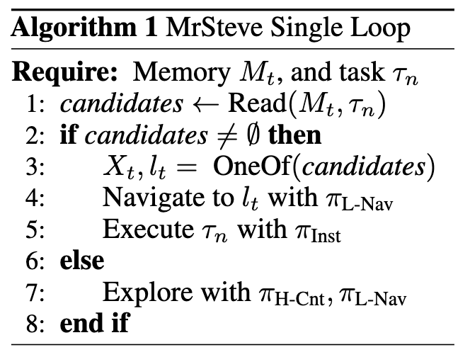

# MrSteve: Instruction-Following Agents in Minecraft with What-Where-When Memory

----

**Author:** Junyeong Park et al.

**Journal/Year:** ICLR 2025

https://arxiv.org/pdf/2411.06736

----

## 1. Introduction
- 최근 LLM을 Planner로 사용하는 hierarchical Agent 구조 덕분에 Minecraft와 같은 환경에서 general-purpose embodied AI (환경 안에서 직접 action을 하는 AI)가 크게 발전했음

- 마크가 많이 쓰이는 이유?: demanding, open-ended environment with rich interaction possivilities 제공

- Hierarchical Agent 구조가 많이 쓰임: 큰 계획은 LLM (Planner)이 세우고, 실제 조작은 다른 모델(Controller)이 수행
    - LLM Planner: high-level. 뭐 할지 계획 (예시: "철검이 필요" --> LLM은 '나무를 캔 다음 곡괭이를 만들고, 철을 찾아야지"라고 plan)
    - Controller: instruction following, low-level. WASD, 마우스 클릭.... (대표적인 controller: Steve-1)

- 근데 이러한 프레임워크가 효과적이려면 high-level planner와 low-level controller가 같이 발전해야함. 
    - 이전 연구들은 high-level planner에 집중한 편 (e.g., maintaining skill library)
    - Planner가 한참 high-level인데 비해 controller는 low-level이면 --> controller부터 performance bottleneck 야기

- 가장 대표적인 예시로 [Steve-1 (Lifshitz et al., 2024)](https://arxiv.org/pdf/2306.00937)
    - 얘는 Transformer-XL를 base로 함
        - shor-term memory의 한계 - 마지막 128개의 hidden state만 기억
        - 마크의 simulation speed는 20Hz -> few seconds of gameplay만 기억
        - 늘리고 싶어도, transformer의 quadratic complexity and FIFO (First-In-First-Out) only memory structure로는 long-horizon tasks를 다루기 어려움 
    - 결국 agent는 short memory span으로 인해 과거를 기억하지 못함
        - {"철검이 필요" --> '나무를 캔 다음 곡괭이를 만들고, 철을 찾아야지"}의 예시에서 만약 나무를 5분 전에 강 건너편에서 봤었어도, 현재 주변에 나무가 없을 경우 강 건너편을 기억하지 못하고 그냥 무작정 지금부터 나무를 새롭게 찾게 된다는 소리임

## 2. Main Idea and Contribution 
- 위 문제를 해결하기 위하여 low-level controller agent 소개: Memory Recall Steve, 즉 **MrSteve**

- MrSteve의 첫번째 key component: **PEM** (Place Event Memory) - instantiation of What-Where-When Episodic Memory
    - 이전 연구들은 high-level planner의 episodic memory에만 집중함
    - memory management가 더 efficient - 위에서 언급됐던 transformer structure memory 한계 완화
    - spatial & event-based information을 다룸 -> 장소와 사건을 hierarchically 정렬

- MrSteve의 두번째 key component: **Exploration Strategy and a Memory-Augmented Task Solving Framework** (build upon the PEM structure)
    - agent는 다음 두 가지 행동 중 선택 
        - 갖고 있는 정보가 **없는** 경우: exploration 
        - 갖고 있는 정보가 **있을** 경우: task-solving based on recalled events
    - 이걸 가는하게 하는 new navigation policy = VPT-Nav
 
 - Main Contributions
    1. Steve-1의 limitation을 지적하고 그것의 bottelneck이 **MrSteve**로 어떻게 해결될 수 있는가를 보임 (Steve-1: the most widely used instruction-following controller)
    2. **Place Event Memory (PEM)**을 고안하여 limited memory capacity에서도 spatial, event-based data를 저장할 수 있게 함
    3. **Exploration Strategy and a Task Solving Module**을 고안하여 마크 내에서 high task-solving performance를 유지하며 efficient exploration을 하게끔 함. 
    4. 논문의 agent가 exploration, long sequence of task solving 두 가지 축에서 existing baselines를 모두 능가함

## 3. Related Works

### 3.1 Low-level Controllers in Minecraft
- Policy models
    - MineCLIP (2022): contrastive video-language model을 reward 모델로 사용하기 위해 text-video data로 train시킴 
    - VPT (2022): label이 없는 비디오로 pre-trained (text instruction 없음)
    - Steve-1 (2024): VPT의 연장. text instruction으로 low-level action을 generate
    - GROOT (2023): text instruction 대신 reference video 사용
    - MineDreamer (2024): Steve-1의 연장, subgoal images를 MLLM과 Diffusion로 생성 (based on text and current observation)
- 그러나: episodic memory 없음

### 3.2 LLM-Augmented Agents
- Pre-trained LLM을 zero-shot planners로 사용 (강력한 reasoning 능력 이용)
- 이러한 접근은 두 가지로 분류할 수 있다
    - LLM을 code 생성기로 사용 -> code를 이용해 환경과 직접적으로 interact
    - LLM을 text-based subgoal 생성기로 사용 -> 이후 goal-conditioned low-level controller가 수행
- 이 연구에서는 후자의 경우에 집중

### 3.3 Memory in Agents
- Memory systems in agents의 목표: retrieve robust and accurate high-level plans for long-horizon tasks
- 현존 방식: 성공한 task의 instruction과 plan을 저장
    - Voyager (2023): skill codes를 text 형태로 unimodel storage에 저장
    - GITM (2023): entire skill codes를 저장
    - MP5 (2024) & JARVIS-1 (2023): plans and whole multimodal obsevation을 저장
    - Optimus-1 (2024): multimodal information을 summarize하여 저장
 - 그러나: 이러한 메모리 시스템들은 high-level planners를 위한 sequence of high-level skills를 저장 (low-level controllers에게 not optimized)

## 4. Method

- Problem Setting
    - sparse sequential task scenario 정의
        - 에이전트는 text instruction을 통해 지속적으로 task를 부여받는다
        - e.g., Obtain water bucket
        - task는 environment 또는 LLM이 생성한 subgoal plans
    - task-relevant resources (e.g., water, cow)는 희소하다고 가정 
    - episode가 시작될 때 에이전트는 observation $`X_t=\{i_t,l_t,t\}`$를 부여 받음
        - $`i_t`$: pixel observation (1인칭)
        - $`l_t = (coord_x, coord_y, coord_z, yaw, pitch)`$: positional information (agent의 상대적인 3D position, 5차원, respect to initial position $`l_0`$ and time $`t`$)
        - $`t`$: time step

- Instruction Following
    - Naive approach: Steve-1을 이용하여 instruction-following policy $`\pi_{\text{inst}}(a_t|h_t, \tau_n)`$를 따르도록 함 -> 키보드와 마우스를 이용한 low-level control을 일으킴
        - $`h_t`$: past pixel observation sequence $`i_{t-128:t}`$
    - 기존 approach의 한계:    
        - past observation은 Steve-1 안에 있는 Transformer-XL layers에 의해 처리 되지만, 이건 겨우 수천 steps ago에 불과함
        - Transformer의 O(n^2) complexity는 더 긴 observation을 불가하게 함
        - 즉 sparse sequential task를 하기에 적합하지 않음

- MrSteve
    - MrSteve란?: Memory Module과 Solver Module을 갖고 있는 memory-augmeted instruction following policy
    - Memory Module: Place Event Memory $`M_t`$ 사용. 방문했던 장소의 새로운 이벤트 저장
    - Mode Selector in Solver Module: Place Event Memory에 기반하여 Explore mode와 Execute mode 중 선택
        - 만약 task-relevant resource가 메모리에 없다면 explore mode 선택
        - 만약 task-relevant resource가 메모리에 있다면 execute mode 선택 -> agent가 해당 resource의 위치로 이동 -> task를 풀기 위하여 $`\pi_{\text{inst}}`$를 따르도록 함

### 4.1 Memory Module: Construction of Place Event Memory
- **FIFO Memory $`M_t`$**
    - FIFO란? First In First Out. (편의점에서도 선입선출함. 편의점 3사 다 해본 편순이 피셜)
    - 메모리의 가장 단순한 형태
    - 이때 capacity는 $`N`$
    - 매 timestep t마다 X_t를 M_t에 저장하지 않음
    - 대신, $`\text{video}_{i_t-H:t}`$ 에서 비디어 인코더로 비디오 임베딩 $`e_t=\text{Enc}_{v}(i_{t-H:t})`$ 을 추출하여 experience frame $`x_t=\{e_t,l_t,t\}`$ (라텍스 문법 치는데 진심 10분 넘게 걸린듯) 
    - memory가 꽉차면 선입선출로 오래된거부터 지움
    - memory 읽을 때는 cosine similarity 사용 (task embedding $`\tau_n=\text{Enc}_{t}(\tau_n)`$ 이랑 video embedding $`e_t`$) -> task-relevant frames를 반환 
    - 비디오 인코더, 텍스트 인코더, H=16 (프레임 개수. 비디오 클립의 window의 길이)은 MineCLIP (Fan et al., 2022a) 사용: CLIP이 마크 플레이 영상이랑 캡션으로 train 된거
    - 하지만 FIFO memory는 단점도 있음
        1. 메모리 사이즈에 따라서 메모리 읽는 computational complexity가 선형으로 증가
        2. sparse sequential task는 선입선출 방식이 bias가 될 수 있음

- **Place Memory** (Cho et al., 2024)
    - trajectory에 있는 agent의 위치 정보를 개별 장소마다 cluster로 분할한 후, 개별 clsuter는 FIFO memory에 assign
    - agent's position $`l_t = (coord_x, coord_y, yaw)`$
        - x,y: 위에서 봤을 때 x,y좌표
        - yaw: 시야 방향 (머리 방향)
        - 위 정보들의 concatenation
    - Place Memory $`M_k`$는 k번째 place cluster 및 그 cluster의 center position, center embedding을 나타냄.
    - 이러한 구조는 center embedding을 먼저 extract함으로서 top-k place를 찾음 (메모리 읽기를 효율적으로 만듦)
    - 이후 각 클러스터 안에서 relevant frame을 fetch
    - 메모리가 꽉 찬 경우: 가장 큰 cluster의 가장 오래된 frame을 지움
    - 하지만 아직도 한계: FIFO는 아직도 과거의 novel experience를 지울 수 있음 -> 중요한 거만 고르는 전략이 필요

- **Place Event Memory** (이 논문에서 제시)
    - 각 place cluster에서 distinct event를 capture함
    - 위 Place Memory에서는 agent의 Position을 experience frame의 기준으로 ㅅ삼았지만, distinct event는 기준으로 삼을게 애매함
    - 이 문제를 해결하지 위해 video embedding의 cosine similarity를 사용하는 것
    - 각 place cluster $`M_k`$ 는 event cluster $`E_i^k`$ 로 나누어짐
        - $`E_i^k`$의 의미: k번째 place cluster 안의 i번째 event cluster
        - center embedding으로 characterize
    - Event cluster 형성 방법: DP-Means algorithm이 MineCLIP이 만든 frame들의 video embedding에 적용됨 -> cluster center 형성 -> 그게 바로 각 클러스터의 center embedding이 됨 
    - 만약 새로 생성된 클러스터와 기존에 존재하던 클러스터의 cosine similarity가 threshold c를 넘으면 그 두 클러스터는 합쳐짐 -> event cluster들이 distinct함을 유지
    - 메모리가 꽉 차면, 가장 큰 이벤트 클러스터의 가장 오래된 프레임부터 지움

### 4.2 Solver Module: Mode Selector, Exploration, and Navigation

Solver Module은 'Model Selector', 'Hierarchical policies $`\pi_{\text{H-Cnt}}`$, $`\pi_{\text{L-Nav}}`$', 'Goal-conditioned Navigator'로 구성됨

- Mode Selector
    - task-relevant resource가 메모리에 있는지 보고 explore할지 execute할지 경정
    - 먼저 "task embedding"과 "event cluster의 center embedding"를 내적하여 "task alignment score"를 산출
    - 이후 "task alignment score"를 이벤트 클러스터 안에 있는 top-k "experience frames"와 내적하여 특정 threshold h보다 높은 점수를 내보인 frame들을 모음
    - 이러한 동작은 FIFO 동작에 비해 훨씬 computational efficieny를 가짐 (FIFO는 alignment score를 whole frame에 적용)

- Hierarchical Episodic Exploration: Mode selector가 explore를 선택한 경우
    - memory-based hierarchical exploration method: 한번 갔던데를 또 가는 비효율성을 줄임
    - High-level goal selector $`\pi_{\text{H-Cnt}}`$ (Count-Based), Low-level goal achiever $`\pi_{\text{L-Nav}}`$로 구성
    - High-level goal selection:
        1. visitation grid map (LxL): agent의 동선이 discretized and marked.
        2. goal selector가 visitation map을 GxG 사이즈의 grid cell로 나눈 뒤, 가장 방문이 적었던 grid cell로 감
        3. 만약 가장 방문 횟수가 적었던 grid cell이 여러개라면 가장 가까운데로 감
        - 이러한 방식은 미방문 장소를 direct하게 방문하면서도 unnecessary revisit을 최소화함
        - 만약 맵이 엄청 크면 -> 단순히 visitation grid map에 new grid를 추가하면 됨
    - Goal-Conditioned VPT Navigator:
        - 강, 산과 같은 복잡한 환경을 navigate하는 것은 단순히 from scratch의 RL policy로는 힘들 수 있음
        - 그걸 해결하기 위해 VPT를 starting policy로 사용, goal-conditioned navigation policy로 fine-tune -> 이러한 형식의 policy를 **VPT-Nav**라고 함
        - VPT는 OpenAI가 마크를 위해 만든 foundation model임 (기본적으로 마크를 하는 법을 알고있다는 뜻)
        - VPT with LoRA adaptor의 출력에 goal embedding을 더한 뒤 fine-tuning을 위해 PPO 사용 (reward based on the distance to the goal location)
            - LoRA: 원래 weight는 freeze, 작은 저차원 행렬만 추가
            - PPO: VPT weight가 아닌 LoRA, goal encoder, policy head, value head만 학습
        - 즉 마크를 플레이하는법 (general, 무거움)이 아닌 목표를 향해 움직이는 것만 추가로 학습시켰다는 뜻 

## 5. Experiments

너무 지쳐서 실험은 읽지 않음