# World Models

----

**Author:** David Ha, Jürgen Schmidhuber

**Journal/Year:** NeurIPS 2018

https://arxiv.org/pdf/1803.10122

----

5장 (더 어려운 연구에 대한 제안)과 6,7장 (Schmidhuber의 연구 계보 정리)는 생략합니다.

## 1. Introduction

- 인지 이론 이야기로 시작: "사람은 머릿속에 world model을 갖고 있다."
    - 인간은 일상 생활을 할 때 내재된 internal mental model을 활용하여 시공간의 abstract representation을 활용한다
    - 예를 들어 사람이 일상적으로 길을 걸어갈때 '길의 방향, 모양', '발을 앞으로 디뎠을 때의 내 다음 위치' 정도만 생각하지 '내가 걷는 길 옆에 나있는 풀의 구체적인 모양 및 개수" 등까지 세세하게 머릿속으로 그리진 않는다는 뜻.
    - 야구 선수가 "공을 어떻게 칠지" 결정하고 근육을 이용하여 실행하는데에는 instinct predict ability가 작용한다. (시각 정보가 뇌에 도달하기 전에 결정해야하기 때문)

- 기존 RL의 문제점
    - Assignment problem: RL에서 일련의 action sequence가 끝난 후 reward를 받았을 때, 정확히 어떤 action이 그 결과에 기여한 건지 판단하기 모호함 -> 따라서 model의 parameter가 많을 수록, 어떤 parameter가 기여했는지 판단하기 더 어려워짐
    - 위 문제를 해결하기 위해 보통은 작은 neural network를 사용해왔음

- 이 논문의 접근: large neural network를 large world model과 small controller model로 쪼개서 Agent로 사용하자!

## 2. Agent Model

- Agent의 구성 - 3가지 models (V,M,C)
    - V,M: World Model 
    - C: Controller

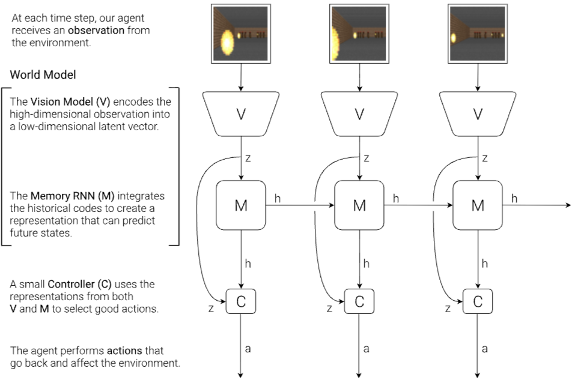

### 2.1 VAE (V) Model

- "agent가 무엇을 보는가?"를 압축
- V model의 역할: input의 abstract, compressed representation을 배우는 것.
- input: 고차원의 high dimensional input observation. 보통 이런 observation은 video sequence의 일부인 2D 이미지 frame임 (게임 화면 등)
- 본 논문에서는 Variational Autoencoder를 사용해서 각 이미지 프레임을 small latent vector z로 압축함
- 위 예시에서 걷는 사람이 '길의 방향과 모양'을 대강 고려하는 것을 배우는 것. (길 옆에 난 풀의 구체적인 모양은 굳이 머릿속으로 그려내지 않고 무시하는 것)

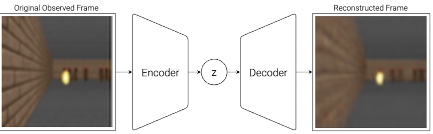

### 2.2 MDN-RNN (M) Model

- "무슨 일이 일어나고 있는가?"를 압축
- M Model의 역할: 미래를 예측하는 것 (V model이 생산해낼 것으로 예상되는 future z vector를 예측)
- 근데 사실 미래는 정해져있지 않다!
    - 그럼 어떻게 하냐?: deterministic z 대신 probability density function p(z)를 출력한다
    - Gaussian Distribution의 mixture로서의 p(z)를 근사하며, RNN을 훈련시켜서 next latent vector z_(t+1)를 출력하도록 함.
    - 좀 더 구체적으로는: ${P( z_{t+1} | a_t, z_t, h_t)}$
        - a: action taken at time t
        - z: latent vector at time t
        - h: hidden state of the RNN at time t
    - 이때 sampling 과정에서 temperature parameter τ를 조절하여 model uncertainty를 컨트롤함
- 위 예시에서 걷는 사람이 '내가 발을 내디뎠을 때 내가 위치할 다음 위치 (다음 상황)'을 예측하는 것을 배우는 것.

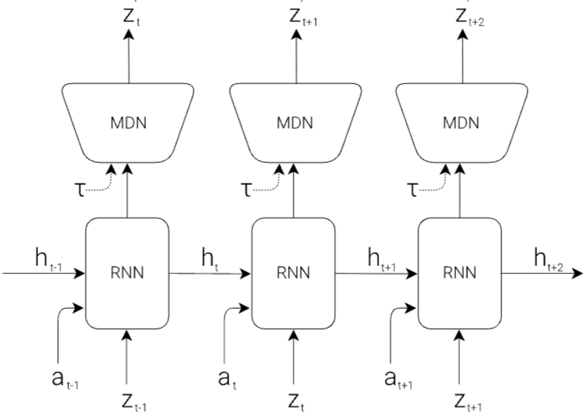

### 2.3 Controller (C) Model

- action 수행 (cumulative reward를 최대화)
- 해당 논문에서는 C Model을 최대한 simpla and small하게 만들었음 (most of the agent's complexity는 world model (V, M)에 있도록)
- V, M model과는 별도로 train 
- C는 간단한 sinlge layer linear(!) model임 (z_t와 h_t를 directly하게 a_t로 mapping해줌)
    - ${a_t = W_c[z_t h_t] + b_c}$
        - W_c와 b_c: weight matrix and bias
        - input vector z_t, h_t를 concatenate 

### 2.4 Putting V,M,C together

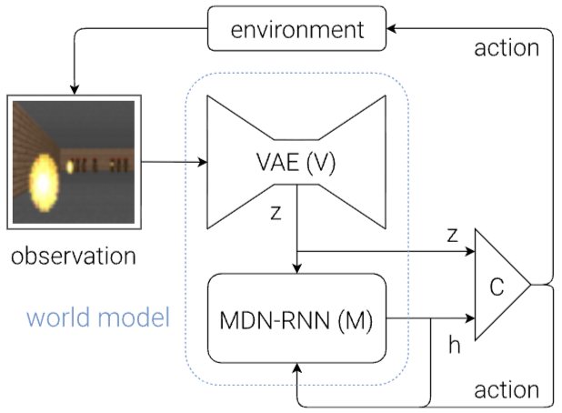

- controller C에게 아래와 같은 코드가 주어짐 (pseudo code임)

```python
def rollout(controller):
    ''' env, rnn, vae are '''
    ''' global variables '''
    obs = env.reset()
    h = rnn.initial_state()
    done = False
    cumulative_reward = 0
    while not done:
        z = vae.encode(obs)
        a = controller.action([z, h])
        obs, reward, done = env.step(a)
        cumulative_reward += reward
        h = rnn.forward([a, z, h])
    return cumulative_reward
```
- 위와 같은 간단한 코드 구조의 이점:
    - model의 대부분의 complexity와 paramter를 V, M에 집중하게 된다면
    - 작고 귀여운 linear model인 C를 train할 수 있는 unconventional way choice가 많아진다.
- 이 논문에서는 CMA-ES를 training algorithm으로 채택
    - Covariance-Matrix Adaptation Evolution Strategy
    - weight를 gradient descent로 학습하지 않고, 여러 후보를 만들어보고 성적이 좋은 방향으로 weight를 진화시키는 방법
    - 처음에 여러개의 weight 후보를 뽑고, 그 여러 weight 버전의 controller들 중 가장 성적이 좋은것들을 채택. -> 성적이 좋았던 weight들이 어떤 방향에 분포해있었는지를 보고, 다음 세대의 후보를 그 주변에서 더 많이 뽑음.  
    - 간단해서 좋음

## 3. Car Racing Experiment

### 3.1 World Model for Feature Extraction

- CarRacing-v0라는 car racing environment에서 실험
- 각 게임 시행마다 자동차 트랙이 랜덤으로 생성됨
- 적은 시간 안에 많은 타일 (네모 영역)을 밟을 수록 agent에게 reward가 부여됨 

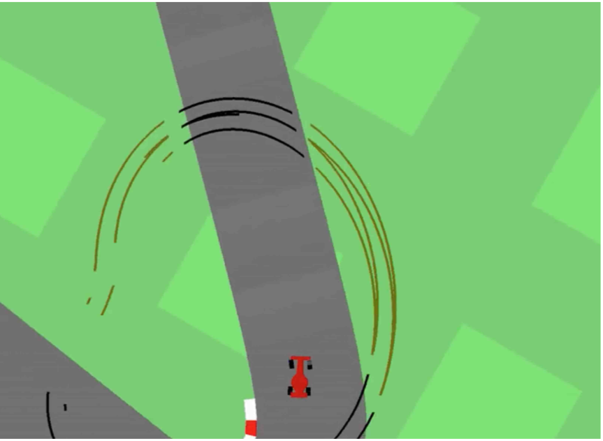

- agent는 3가지 continuous action을 선택할 수 있음: 좌회전/우회전, 가속, 브레이크
- V model training을 위해 environment의 random rollout 만개 수집
    - agent가 random acting -> random action a_t record -> resulting observation from the environment
    - 이런 observation을 VAE에게 줘서 latent space of each frame을 배우도록 함
- 이후 trained V model을 이용하여 각 time frame을 z_t로 변환한 뒤, 그걸 M model을 train하는데 씀  
    - recorded random action a_t와 pre-processed data인 z_t를 이용하여 MDN-RNN을 훈련 -> ${P( z_{t+1} | a_t, z_t, h_t)}$을 Gaussian mixture로서 modeling
- 이 실험에서 World Model인 V와 M은 환경으로부터 직접적인 reward signal은 몰루.
    - controller C만 reward information에 접근 가능 

### 3.2 Procedure

- 이미지: 위에서 서술하였던 과정을 summarize하는 steps

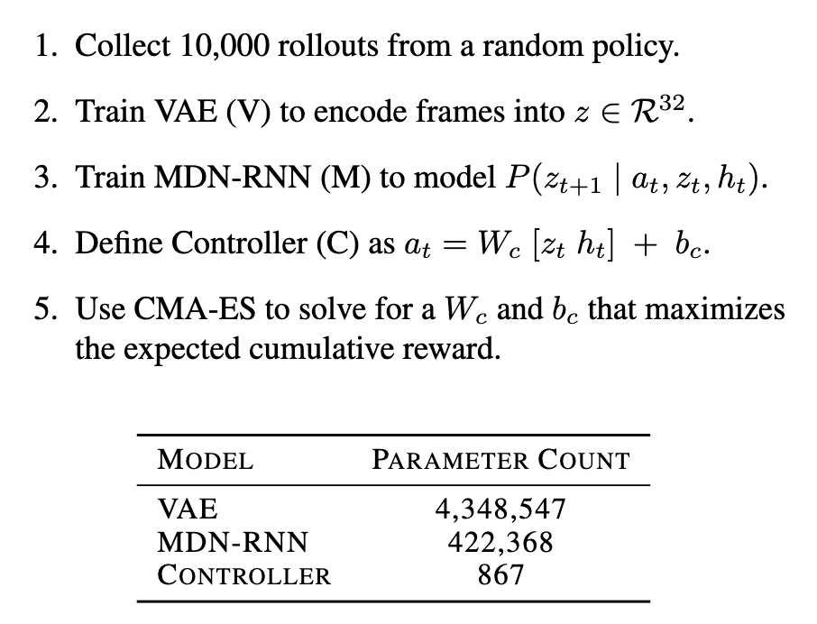

### 3.3 Experimental Results

- V Model Only
    - 이전 연구에서 observation에 대한 good set of hand-engineered information을 input으로 넣어 small feed-forward network로 적절한 navigation policy를 배울 수 있다는 것이 논의된 바 있음
    - 이러한 맥락에서, C가 V에만 접근할 수 있도록 먼저 실험 -> controller c를 ${a_t = {W_c}{z_t} + b_c}$ 로 정의
    - 결과: 불안정하며, 코너에서 트랙 이탈을 자주 함
    - average score of 632 ± 251 over 100 random trials
    - C에 hidden layer를 더하는 것이 약간 도움 되기는 했지만, 문제를 해결하는데 충분하지는 않았음
    - V model만 있으면 (= z_t만 있으면) -> 순간을 표현하는 representation만 captureehlrh, predictive power는 없음

- Full World Model (V and M)
    - M model: ${z_{t+1}}$ 를 predict
    - 이렇게 만들어진 ${z_{t+1}}$ 와 ${h_{t}}$ 를 combine하여 C에게 준다
    - 결과: driving capability가 눈에 띄게좋아짐 (안정적이고, 코너도 잘 돎)
    - 특징: explicit planning이 굳이 필요가 없음 (왜냐하면 ${h_{t}}$ 가 이미 미래 정보를 담고 있으니깐)
        - controller가 미리 직접 시뮬레이션 할 필요 없이 RNN의 hidden state를 보고 바로 행동을 결정한다는 뜻
        - 앞선 예시에서 야구 선수가 "공을 어떻게 칠지" 결정하고 근육을 이용하여 실행하는데에는 instinct predict ability가 작용하는 것과 유사
    - average score of 906 ± 21 over 100 random trials 
    - 이전의 기존 RL methods에서는 각 frame마다 pre-processing이 필요했었음 (edge-detection 등)

### 3.4 Car Racing Dreams

- 월드모델은 own car racing scenario를 가질 수 있음
- 주어진 current state를 바탕으로 ${z_{t+1}}$ 의 probability distribution을 만들 수 있고, 그것으로부터 sampling하여 real observation으로 취급하여 사용.
- 이러한 hallucinated enviroinment generated by M에서 trained C를 놓음 
- 아래 figure: agent가 its own dream world에서 운전하는 모습

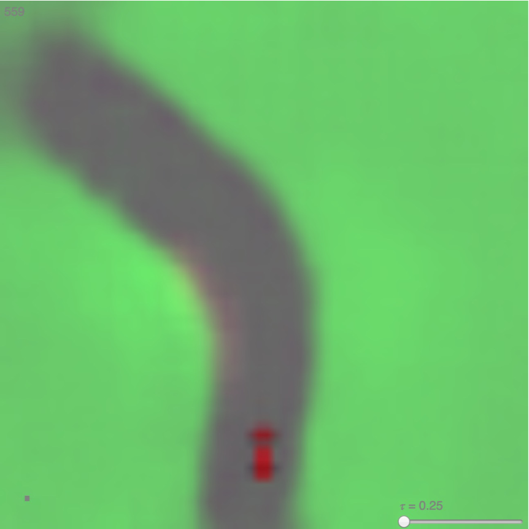

## 4. VizDoom Experiment

### 4.1 Learning Inside of a Dream

- 위로부터 real environment에서 학습한 policy는 dream environment와 유사하게 보인 다는 것을 보았음. 이것으로 부터 질문이 파생됨 - own inside dream에서 policy를 배우고, 이걸 실제 환경으로 transfer할 수 있을까?
- 이를 실험하기 위해 Viz-Doom environment를 mimic하는 world model을 train -> 그렇게 생성된 가짜 (hallucination)에서 controller를 train
- Viz-Doom이란?: DOOM을 AI 연구용으로 만든 환경
    - agent는 몬스터가 쏘는 fireball을 피해야됨
    - explicit reward는 존재하지 않음 -> cumulative reward는 살아있는 시간임
    - 아래 이미지: (위) 실제 DOOM (아래) Viz-Doom

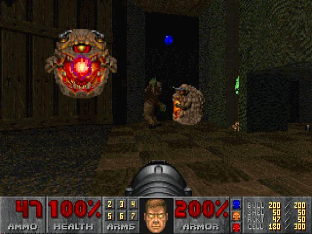

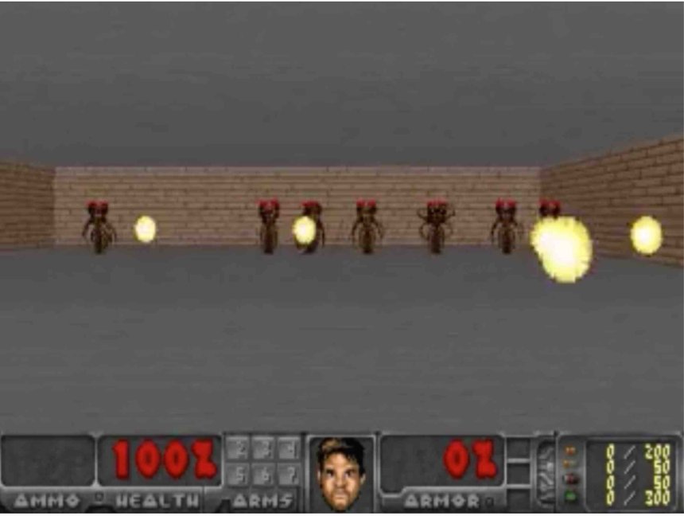

### 4.2 Prodedure

- Car Racing task와 다른 점
    - Car racing: M model이 next z_t만 모델링하면 됐었음
    - Viz-Doom: 다음 장면 z_t 뿐만 아니라, 다음 프레임에 agent가 죽을지 말지에 대해서도 예측해야됨. 죽을지 말지( ${d+t}$ )는 binary event임.

- OpenAI Gym environment인 것 처럼 M에게 interface를 씌움 (가짜 Gym 환경)
    - OpenAI Gym이란?: RL agent가 게임/환경과 상호작용할 때 사용하는 표준 규격
    - 왜 이렇게 하냐?: RL 알고리즘 입장에서는 이게 진짜 게임인지, M이 만든 가상 환경인지 알 필요가 없어짐

- 이러한 시뮬레이션 환경 안에서는, **V model이 hallucination process 중 픽셀 프레임들을 encode할 필요가 없어짐** 
    - 훨씬 빨라짐
    - M이 꿈속에서 z를 생성하고 C한테 그냥 주면 되니까, V가 놀고잇는 것
    - 반면 실제 환경에서는 실제 게임 화면을 V가 z로 압축해야됨

- 아래 steps로 이루어짐

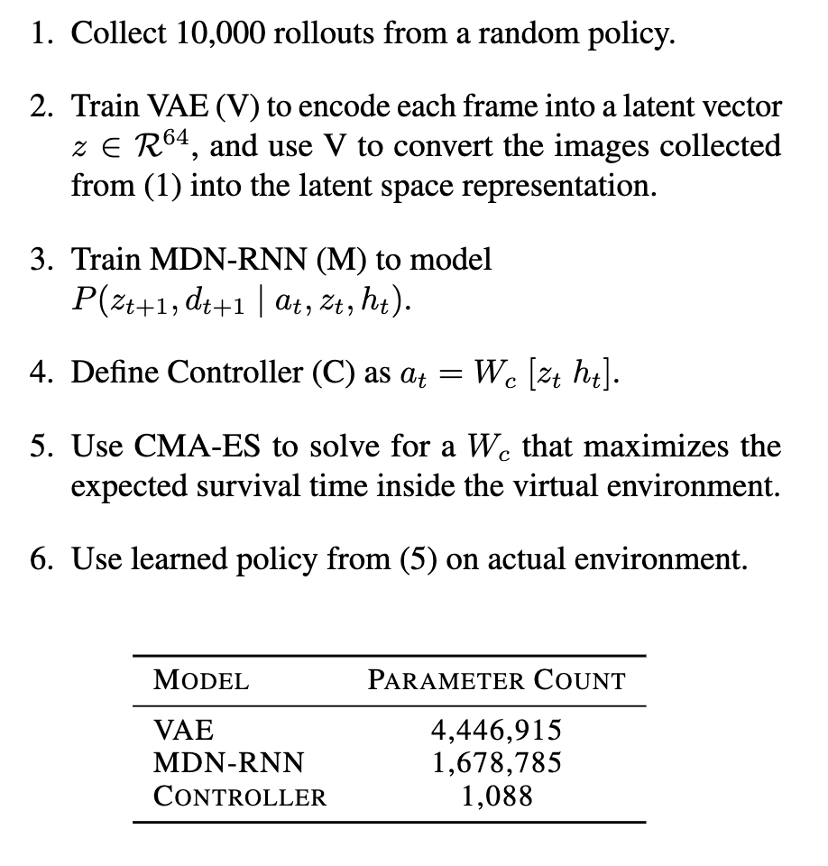

### 4.3 Training Inside of the Dream

- virtual environment에서 agent는 ~900 times of steps를 달성함
- RNN-based world 모델은 실제 환경을 따라하고, 게임의 주요 요소를 배움 (게임 로직, 몬스터 행동, physics, 3D 그래픽 랜더링 등)
- virtual environment에서 추가적인 uncertainty를 더하는 것: ${z_{t+1}}$ 샘플링 과정에서 temperature τ를 올림

### 4.4 Transfer Policy to Actual Environment

- 이후 가상 환경에서 train된 agent를 original VizDoom으로 옮겨감
- 100 random consecutive trials에서 ~1100 time step 달성 (요구되었던 기준치가 750 time step이였음)

### 4.5 Cheating the World Model

- Adversarial policy 문제
    - agent가 adversarial policy (핵 또는 얍삽이)를 쓰기도 함 -> 이렇게 되면 제대로 된 학습이 불가능해짐 
    - world model은 실제 환경을 따라한 것이므로, 때때로 실제 환경에는 없는 trajectories를 만들어내기도 함. (논문에서는 어린아이가 현실에서는 불가능한 '하늘을 날기' 등을 상상하는 것과 유사하다고 표현)
    - 또한 현실과는 달리, 월드 모델에서는 controller가 M의 hidden state에 접근 가능함 -> 이걸 통해 핵을 배우기도 함

- 해결책: MDN-RNN as a dynamic model (Mixture Density Network, 스칼라 대신 확률 분포를 출력하는 RNN structure)
    - actual environment에 대한 확률 분포를 출력함 (deterministic future x)
    - 이렇게 되면 controller C가 envionment에 대해 stochastic version을 학습 가능
    - temperature 조절로 realism과 exploitability 사이 tradeoff 조절
    -  이때 중요한 점: VAE가 표현하는 Gaussian Distribution은 단일인데, RNN은 **Mixture of Gaussian**임.

- 아래 이미지: temperature parameter 정도에 따라 달성한 점수 정도

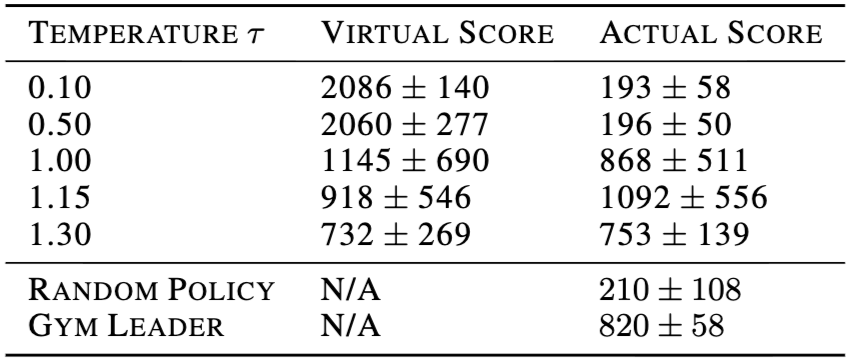


## 들었던 생각

1. 인간의 인지를 모방하는 것 같아서 매우 재미있게 읽었다.
2. 아직 world model 관련 논문 읽는 것의 초입이라 정확히 어떤 연구를 앞으로 해야될지는 감이 안 옴
3. 이 논문을 읽기 전에 되게 무서웠는데, 수업 시간에 배웠던 내용들이 나오니까 되게 반갑다. VAE (멀모) probability distribution (딥러닝) 등
4. 작성자도 그렇고, 인용된 논문들이 독일인 이름이 엄청 많이 보인다. 뭐지?ㅋㅋ
5. 나는 다른 게임을 한번도 안하고 초등학교 5학년때부터 롤만 14년했는데, Game World Model에서 롤이 한계를 갖는 구체적인 병목이 뭔지 궁금하다
6. 챗지피티가 알려준 연구 분야 계보:

```
World Models (2018)
        │
        ├── Model-Based RL
        │       └── Dreamer
        │             └── Dreamer 4
        │
        ├── Game World Models
        │       ├── Atari
        │       ├── Minecraft
        │       └── Multiplayer games
        │
        ├── LLM + Embodied Agents
        │       ├── Voyager
        │       ├── SIMA
        │       └── ...
        │
        └── LLM + World Models
                │
                ├── language-conditioned world model
                ├── planning with imagined futures
                ├── game agents
                └── general embodied agents
```
