# [Dreamer] Dream to Control: Learning Behaviors by Latent Imagination

[발표 자료](https://docs.google.com/presentation/d/18yhN-YJluou_1XPlJZ8EX4CXqKhrcnlr5G2KtHEf0Wg/edit?usp=sharing)

## 1 기본 정보

- 논문 제목: Dream to Control: Learning Behaviors by Latent Imagination
- 링크: https://arxiv.org/abs/1912.01603
- 발표일: 2026년 8월 18일
- 발표자: 장지수

## 2 들어가기에 앞서...

- 초기 월드 모델의 계보는 "18/05 World Models -> 18/11 PlaNet -> 19/12 Dreamer"로 이어집니다
    - World Models: 
        - VAE (V model) + MDN-RNN (M model) + small linear model (Controller, CMA-ES) 
        - 월드모델/컨트롤러 학습 분리
    - PlaNet:
        - RSSM으로 모델 통합 학습
        - CEM planning
    - Dreamer:
        - RSSM **그대로**
        - actor-critic을 latent에서, anlaytic gradient 

- World Models는 지난 랩미팅 때 논문 리뷰로 다루었고, 여기서는 [PlaNet](https://arxiv.org/abs/1811.04551)에 나오는 개념을 간단히 서술하겠습니다:
    - PlaNet 핵심 1 - RSSM (Recurrent State Space Model)
        - Dreamer가 그대로 가져다 쓰는 World Model의 구조
        - 핵심: latent state (${s_t}$)을 deterministic한 부분 (${h_t}$)와 stochastic한 부분 (${z_t}$)로 쪼갬 -> 둘 다 사용함으로서 장기 예측이 잘 됨
        - 순수 deterministic (RNN only) -> 미래의 불확실성 표현이 안 됨
        - 순수 stochastic (SSM only) -> 여러 step에 거친 정보를 안정적으로 기억하지 못함
    - PlaNet 핵심 2 - 정책 없이 online planning
        - PlaNet은 action model을 아예 학습하지 않음
        - 매 스텝마다 CEM이라는 derivative-free 최적화로 planning

- 5장의 Related Work는 생략하였습니다. 또한 이 리뷰에서는 논문에서 주 다루는 Deep Mind Control Suite 실험 내에서의 continuous action만 다루고, Appendix의 Atri에서 언급되는 discrete action은 간단히 언급만 하고 자세한 건 생략하였습니다.

## 1 Introduction

- Agent가 한번도 본 적없는 task를 풀기 위해서는 과거의 경험을 새 경험으로 generalize 해야하며, 여기에는 과거 경험을 representation으로 만들기 위해 world model이 필요하다. 

- Latent dynamic model이 세상 (=입력)을 latent state로 변환하는 이유?
    - 이를 통해 미래를 상상해야 하기 때문
    - 날 것의 상태 (= high dimensional input)는 latent state에 비해 memory가 너무 크기 때문에 상상 trajectory 수천 개를 병렬로 다룰 수 없다 

- Latent dynamic model에서 기존 방법들의 한계
    - 기존 방법: 
        - Parametric policy (World Models의 linear controller ${a_t={W_c}{[z_t h_t] + b_c}}$)
        - Online Planning (PlaNet의 방식. 정책 함수가 아예 없고 매 스텝마다 탐색)
    - 기존 방법의 한계
        - fixed imagination horizon에서 rewards를 고려하는 것은 근시안적인 behavior를 낳는다 (long-horizon task를 다룰 수 x)
        - 기존 방법들은 derivative가 없는 optimization 방법론을 씀 (신경망이 제공하는 gradient를 활용하지않고 버림)

- Dreamer는 위에서 제시된 기존 방법들의 한계를 돌파
    1. Novel actor critic algorithm: imagination horizon **너머의** rewards를 accont 가능
    2. Neural network dynamics가 제공하는 gradient를 효율적으로 활용함

- Summarized key contributions
    1. Learning long-horizon behaviors by latent imagination: action and state value 두 가지를 다 predict 하는 방식으로 달성
    2. Empirical performance for visual control: Dreamer를 DeepMind Control Suite에서 평가했을 때 당대 data-efficiency, conputation time, and final performance에서 모두 다른 agent들을 능가
        - Deep Mind Control Suite란?: DeepMind가 2018년에 공개한 표준화된 연속 제어 (continuous contrl) 벤치마크 모음. MuJoCo의 물리엔진을 기반으로 여러 task가 존재. (예시: 이미 서 있는 막대를 안 떨어트리기, 2D 치타를 달리게 하기)
    
## 2 Control with World Models

### 2.1 Reinforcement Learning

- 실제 환경: **Partially Observable Markov Decision Process** (POMDP)
    - 참고) Markov Decision Process (MDP): Markov 성질을 이용한 강화학습의 표준 틀. 미래는 현재 상태 ${s_t}$ 와 행동 ${a_t}$ 만으로 다음에 무슨 일이 일어날지 결정하는 것. 
        - 예시: 체스. 다음 행동을 결정할 때 지금 판에 있는 말들의 상태만 보면되지, 이 판이 여태까지 어떻게 변해왔는지는 상관없음
        - policy: ${\pi (a_t | s_t)}$ 이다. 
    - Partially Observable MDP (POMDP): 에이전트가 ${s_t}$ 를 직접 못보고, 불완전한 관측 ${o_t}$ 만 봄.  
        - 예시: 이 논문의 설정. 달리는 치타 이미지로 관측할 수 있는건 관절의 각도 뿐이다. 물리 시뮬레이션의 "진짜 상태"인 "속도"는 안 보임 -> 따라서 진짜 상태인 ${s_t}$ 가 아닌, 불완전한 ${o_t}$ 만 본다는 것.
        - policy: ${\pi (a_t | o_t)}$ 만으로는 부족함. 따라서 policy가 **과거 전체**를 봐야 함. 따라서 ${a_t \sim p(a_t \mid o_{\leq t}, a_{<t})}$ -> O_t 하나가 아니라 현재 time step까지의 모든 관측에 조건부임

- POMDP가 설정하는 조건들
    - discrete time step t (1부터 T까지)
    - continuous vector-valued actions ${a_t \sim p(a_t \mid o_{\leq t}, a_{<t})}$ generated by **agent**
    - high-dimensional observations and scalar rewards ${o_t , r_t \sim p(o_t , r_t \mid o_{< t}, a_{<t})}$ generated by **unknown environment**

- THE GOAL: to develop an agent that maximizes the expected sum of rewards

- 아래 이미지는 선택된 task들을 나타낸다.
    - Cup - 컵에 공 넣기: 컵을 좌우로 흔들어서 공을 튕겨 올린 뒤 컵 안에 받아야됨. 공이 컵 안에 들어간 순간에만 보상 1 (sparse reward case)
    - Acrobot - 체조 선수: 어깨 (위쪽 고정점)에는 관절이 없고 중간 관절만 움직일 수 있음. 목표는 아래로 늘어진 팔을 흔들어서 끝점을 위로 세우는 것. 그네 탈 때처럼 박자에 맞춰서 여러번 흔들어서 에너지를 쌓아야 넘어감.
    - Hopper - 외다리 뜀뛰기: 발 하나에 몸통 하나. 머리는 특별한 기능 없음. stand (한 발로 서서 버티기), hop (뛰어서 전진). 균형은 넘어지기 전에 미리 대응해야하기 때문에 어려움 (이미 기울어진 다음에 대응하면 늦음)
    - Walker - 두 발 보행: 2D 이족 보행 로봇. 다리 두개 각 다리에 무릎과 발목. 같은 몸체로 stand, walk, run을 수행. (보상 함수가 각각 바뀜)
    - Quadruped - 4족 보행: 유일한 3D 환경. 다리 4개, 관절 3개로 액션이 12차원임.

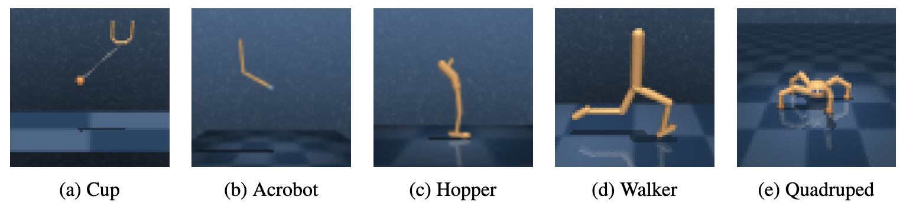

### 2.2 Agent Components

- Dreamer의 behavior (agent의 behavior)는 compact latent space에서 hypothetical trajectories를 predict하는 것이다.
- Dreamer의 operation:
    - 과거로부터 **latent dynamics model**을 익힌 뒤, future reward를 predict하는 것
    - Predicted latent trajectories로부터 **action and value models**를 익히는 것
        - Value model: optimizes Bellman consistency for imagined rewards (Bellman consistency가 뭔지는 뒤에서 후술)
        - Action model: gradient backpropagation of value estimates
    - Learned action model을 실제로 돌려서 dataset으로 사용할 new experience 수집

### 2.3 Latent Dynamics

- Dreamer는 세 가지 components로 구성된 latent dynamics model을 사용한다.
    - 1. Representation model: encodes observations and actions to create continuous vector-valued model states ${s_t}$ with Markov transitions
    - 2. Transition model: predicts future model states **without seeing the corresponding observations** that will later cause them.
    - 3. Reward model: predicts the rewards given the model states 

- 아래 이미지에서 $p$는 실제 환경이 관여하는 분포 (관측 $o_t$를 봐야함), $q$는 $p$의 근사 (관측 없이도 굴릴 수 있음) 

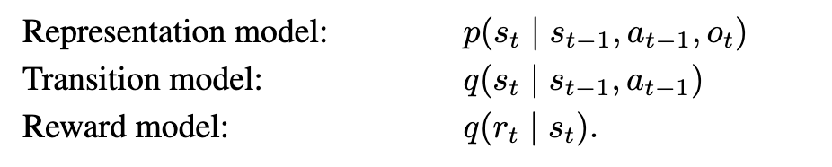

- 핵심: Transition model은 실제 image를 관측하거나 상상하지 않고 (즉, 디코더가 있는데도 일부러 안 쓰고) 스텝 내내 latent 내에서만 구름. -> 장점: low memory footprint and fast predictions of imagined trajectories in parellel.

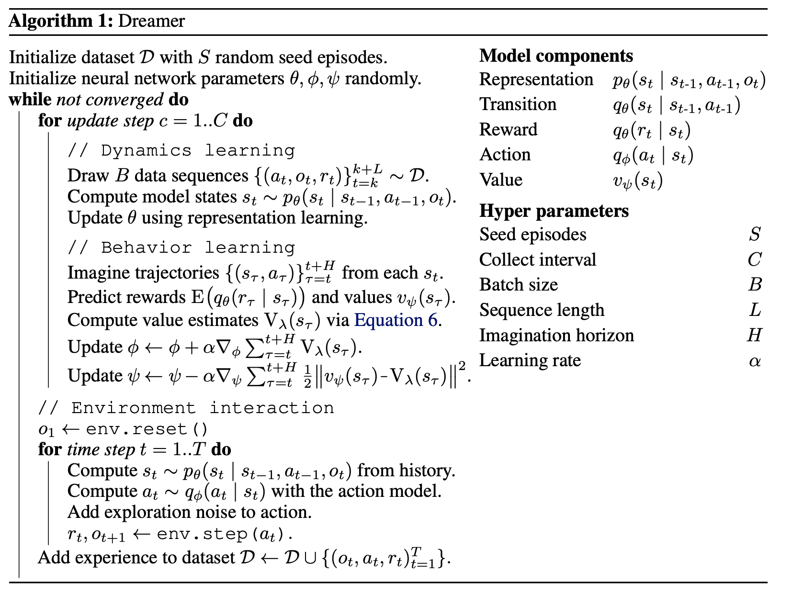

## 3 Learning Behaviors by Latent Imagination

- Dreamer가 상상 환경 (compact latent space of a learned world model) long-horizon behavior를 익히는 방법

### 3.1 Imagination Environment

- 상상 환경: Markov Decision Process (MDP) that is fully observed 
    - 상상 환경 내의 model state ${s_t}$ 가 Markovian인 이유?: representation model이 재귀적이기 때문 (현재 상태에 과거 전체가 누적되어 있음. 눈덩이 굴리듯이)
    - "fully observed"인 이유?: 관측이 잘 돼서 fully observed인게 아니라, 상상 환경에서는 관측이라는 단계가 아예 없어서. 실제 환경에서는 진짜 상태와 내가 보는 것이 달라서 fully observed가 불가능함. 근데 상상 환경에서는 내가 보는 상태가 진짜 상태랑 동일한 것.
- 상상 환경에서의 time index: ${\tau}$
- Imagined trajectories
    - 에이전트의 과거 경험으로부터 나온 true model states $s_t$ 로 시작한다.
    - 이후 prediciton of the transition model, reward model, policy를 따름
    - expected imagined rewards with restpect to policy를 최대화 하는 것이 목적

### 3.2 Action and Value Models

- imagined trajectories는 finite한 horizon H를 가지며, Dreamer는 이러한 horizon H를 **넘어** behavior를 고려함

- Action & Value model은 policy iteration에서 cooperatively하게 train됨.

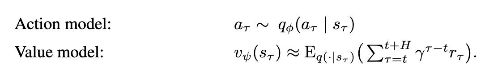

- Action model ${\phi}$ 
    - policy를 구현하고, 상상 환경에서의 action을 predict
    - output: tanh-transformed Gaussian (가우시안에서 sampling. 근데 무작위성을 입실론 (외부 입력)으로 빼내고, 나머지는 전부 deterministic하게 만든 뒤 tanh함수에 통과시킴. 범위를 (-1 1)로 맞춰주기 위해. (그냥 ~로 샘플링하면 확률적 연산이 되어서 gradient가 통과를 못하게 됨))

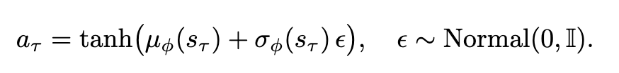

- Value model ${\psi}$ : action model이 각 state s_t에서 받을 expected imagined reward를 산정

### 3.3 Value Estimation

- Action & value models를 훈련 시키기 위해선, imagined trajectories의 state values를 산정해야됨.

- 이 때 trajectories는 실제 agent의 경험 s_t로부터 출발해서, 가지치기 하듯 각 지점에서 trajectories가 여러개로 뻗어감. 병렬 굳 (이때 활용하는 action이 위에서 서술한 action )

- Value 합을 구하는 방법은 다음 3가지 종류로 나뉘어지며, Dreamer는 이 중에서 ${V_\lambda}$ 를 사용함
    - ${V_R}$: $\tau$ 부터 horizon H까지의 reward를 단순합. H 너머는 고려 안 함. value model 사용 x
    - ${V_N^k}$: k 스텝을 직접 상상하고, k 스텝이 끝나는 지점부터는 learned value model을 이용하여 앞으로의 value를 산정해봄
    - ${V_{\lambda}}$: k를 하나 고르는 대신, k=1 부터 k=H 까지 전부 계산해서 가중평균함. (이유: Value model ${\psi}$ 가 부정확하거나 world model이 부정확할 수 있음. k가 낮으면 ${\psi}$ 의 오차를 물려받고, k가 크면 world model의 오차를 물려받음. 여러 추정치를 평균 내면 각자의 오차가 서로 상쇄됨)

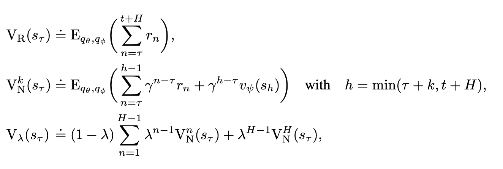

### 3.4 Learning Objective

- Action, Value Model의 objective
    1. 먼저 imagined trajectory의 모든 state ${s_{\tau}}$ 에 대하여 ${V_{\lambda}}$ 를 게산.
    2. 계산한 ${V_{\lambda}}$ 를 가지고 action, value model의 objective를 달성 (아래 식에서 왼쪽: action model, 오른쪽: value model)

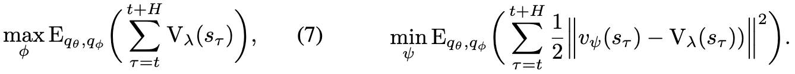

- ${V_{\lambda}}$ 는 Reward and value prediction에 dependent하고, reward and value prediction은 imagined states에 dependent하며, imagined states는 imagined action에 dependent하다. 

- 즉 모든 스텝이 neural network로 구현되며, stochastic backpropagation을 사용하여 미분값 계산. 이 때 gradient는 샘플링 방법에 따라 두 가지로 나뉜다
    - continuous action: reparameterization
    - discrete action: straight-through gradients -> 이 논문의 Appendix, 그리고 후속 연구들에서 나옴.

## 4 Learning Latent Dynamics

- 상상 환경에서의 Behavior 학습은 잘 generalize되는 **world model**을 필요로 한다.

- World 모델 없이 Reward Prediction?
    - 크고 다양한 dataset이 많으면 world model 없이도 control task를 푸는데 충분할 수 있음
    - 하지만 한정된 dataset (특히 reward가 sparse하면)으로는 힘듦

- 이 절에서 다루는 질문 **"world model을 학습시키는 목적함수를 뭘로 할까?"**는 위에서 여태까지 다뤘던 Dreamer와 별개임 (논문 표현으로는 'orthogonal')

- World model은 다음고 같은 components로 이루어짐
    - transition model: Recurrent State Space Model (RSSM)
    - representation model: RSSM + CNN (applied to the image observation)
    - observation model: transposed CNN
    - reward model: dense network

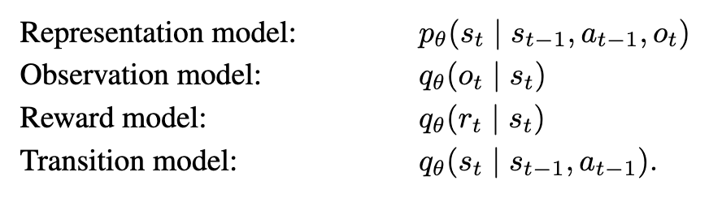

- 아래 이미지의 수식은 World Model의 목적함수이며, 공통 뼈대는 다음과 같음
    - 여기서 "관측 관련" 항만 달라지고 뒤의 두개는 똑같음
    - "보상 예측" 항 (${J_R^t = ln{q(r_t | s_t)}}$): latent state에서 reward를 맞히기 
    - "KL 정규화" 항 (${J_D^t}$): p (이미지를 본 뒤 만든 상태), q (이미지 없이 예측한 상태)가 비슷해야함 (상상을 현실과 비슷하게)

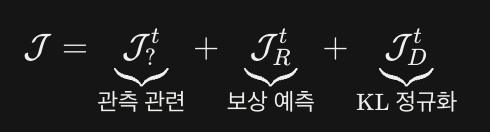

## 4.2 방법론 1: Reconstruction

- PlaNet에서 사용되었던 world model
- "관측 관련" 항 (${J_o^t = ln{q(o_t | s_t)}}$ ): latent state에서 원본 이미지를 복원하기. CNN (decoder)이 s_t를 받아 고차원 이미지를 뱉고, 이를 원본과 비교함
- 이미지를 복원할 수 있다 -> 이미지의 정보가 s_t에 다 들어있다 -> 좋은 표현이다
- 이 때 디코더는 오직 학습할 때만 씀 (상상, 행동 때 안 쓰임). 순전히 Represention building 용

## 4.3 방법론 2: Contrastive Estimation

- 방법론 2에서 픽셀 복원은 사실 낭비임 (치타가 달리는데 배경 하늘의 텍스쳐가 필요하진 않으니까)
- 그래서 observation model인 q(o_t | s_t)의 방향을 뒤집어서 (transpose) state model q(s_t | o_t)를 넣음
    - 앞 항: 현재 이미지 o_t로 부터 s_t를 잘 예측할 수 있어야함
    - 뒷 항: 배치 안의 다른 이미지 o' 들로부터는 s_t가 예측되면 안됨 (구별되어야함!!)
- infoNCE랑 같은 구조임 (ㄷㄷ)

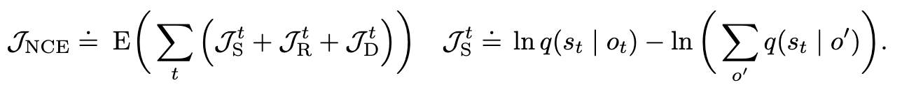

- 근데 반전: 실험 결과에서 Reconstruction이 더 성능이 좋았음 쩝... 

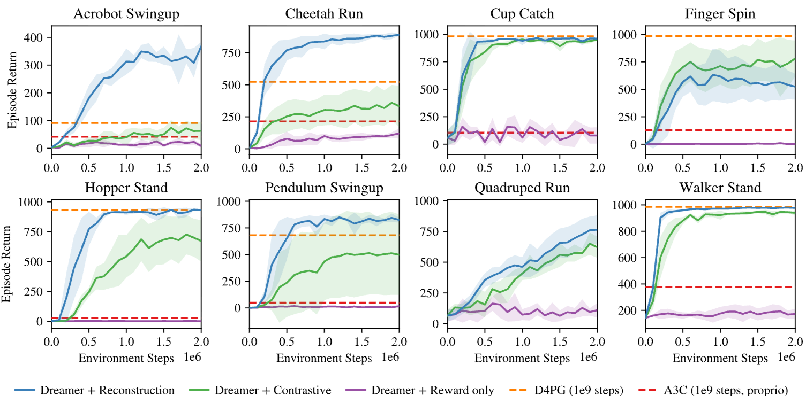

## 5 Experiments

## 5.1 Control Tasks
- 실험 환경: 위에 서술 (DeepMind Control Suite)
- Agent observation (image): 64 * 64 * 3
- action dimension range: 1~12
- action repeat: 2번

## 5.2 Performance

- Dreamer가 strong model-free D4PG agent의 성능을 능가
- Dreamer가 PlaNet의 data efficienty를 상속 받음: small amounts of experience로 잘 generalize할 수 있다는걸 다시 보임

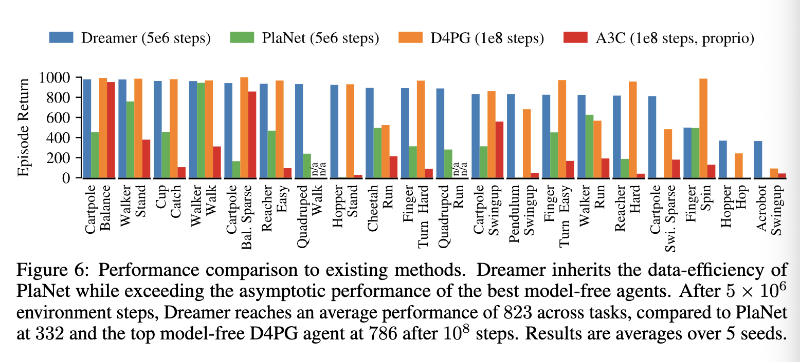

## 5.3 Long Horizons

- 여러 horizon length 설정하여 비교

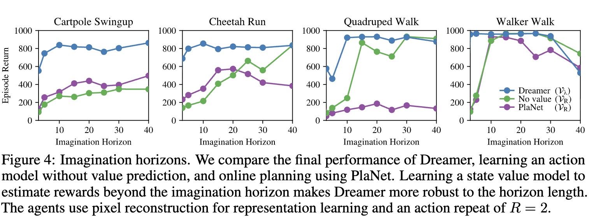

- value model의 존재가 long horizon에 robust하고 well-perform하다는 것이 보임 

## 7 생각해볼 거리

- 논문은 representation learning이 Dreamer와 orthogonal하다고 표현하지만, 위 실험 결과를 보면 오히려 representation learning 방식에 따라 Dreamer 성능도 달라짐. 이걸 orthogonal하다고 표현할 수 있는가?

- "이미지를 관측하지 않고 예측하는" 개념을 다른 모달리티 / task로 옮기면 어떻게 될까? 예를 들어 text 생성에서 latent 차원에서 여러 스텝을 상상하고 value로 평가한다면?