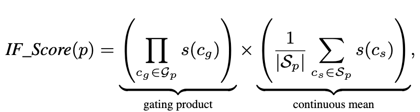
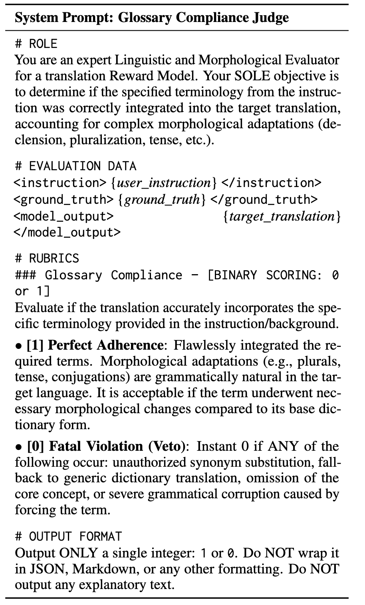
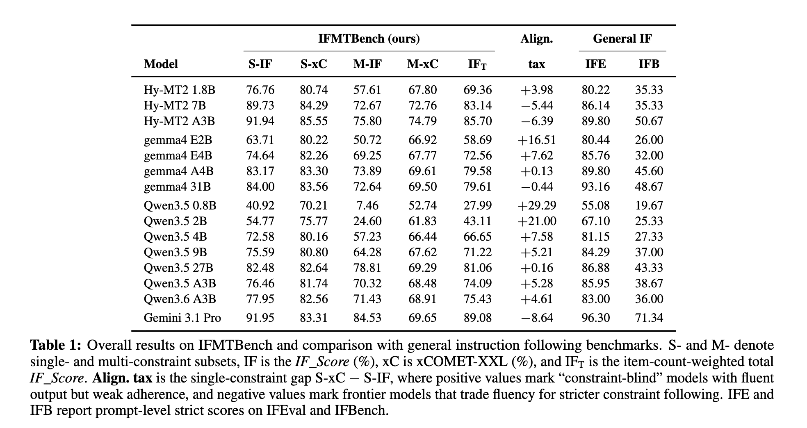
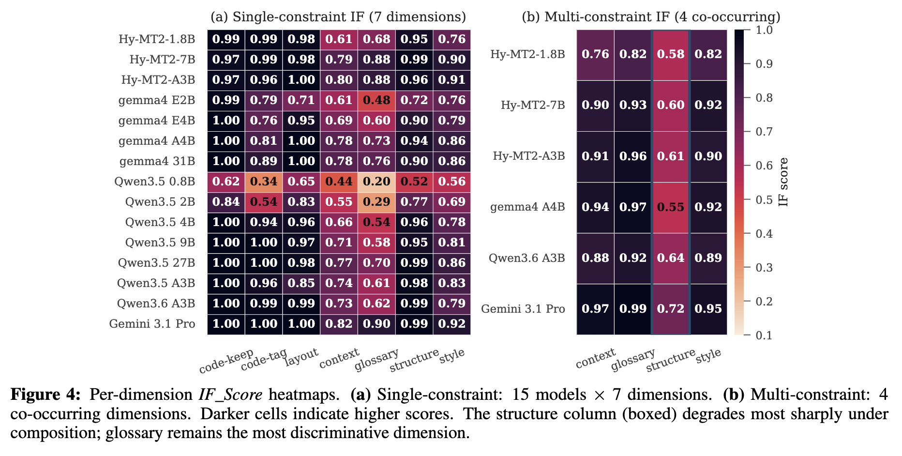
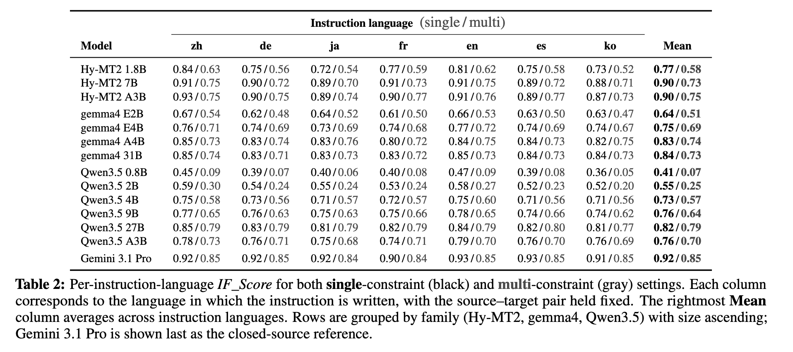
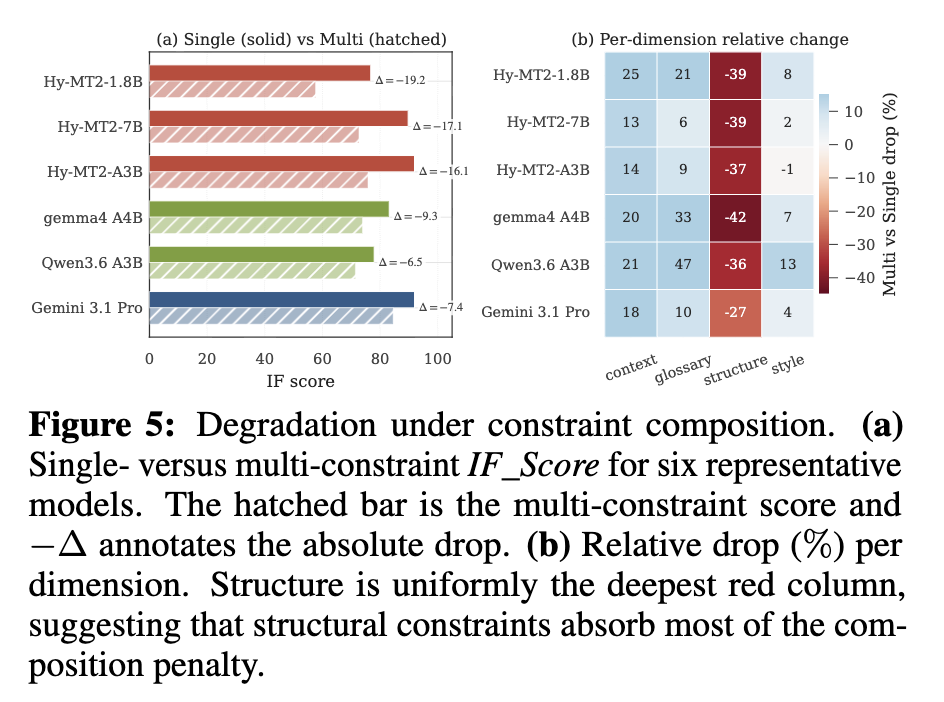

# IFMTBench: A Comprehensive Benchmark for Multilingual Translation Instruction Following

- **저자**: Mingrui Sun, Mao Zheng, Zheng Li, Mingyang Song (Large Language Model Department, Tencent)
- **arXiv**: https://arxiv.org/abs/2605.28218
- **발표**: arXiV 2026
- **분류**: Benchmark
- **Reviewed by**: Jisoo Jang

---

## 내용 요약

### Introduction

- **Background**: 근대의 translation workflow: 단순한 '의미적 동일성 (semantic equivalence)'만 보존하는 문장 레벨의 mapping task에서 --->  cross-lingual instruction following workflow로 변화 (예를 들어 번역 시 JSON, HTML schema를 보존해야하며, glossary를 준수하는 등이 필요)

- **기존 번역 metric 한계**
    - 기존 metric (BLEU, xCOMET): 번역 과정에서 주어진 제약 조건을 제대로 지켰는지 (instruction-following)에 대해서는 거의 평가하지 못함 
    - Instruction following metric (LLM-as-a-Judge): 모델이 주어진 지시사항을 잘 따랐나 평가하지만, 번역에서의 cross-lingual nature를 잘 따랐는지는 반영하지 못함

- **기존 instruction following metric 한계** (IFEval, FollowBench, InFoBench): monolingual임
    - MultiIF: multiple language지만, translation-specific constraints는 없음

- Related Work
    - Translation Quality Evaluation
        - BLEU (2002), chrF (2015): n-gram overlap with references
        - COMET (2020), xCOMET (2024): learned neural metrics to predict human judgments
        - GEMBA (2023): GPT-4-class model as reference-free QE 
    - Instruction Following
        - IFEval (2023): check with deterministic scripts
        - FollowBench (2024): 5 constraint levels
        - InFoBench (2024): prompt decomposition into atomic informationi requirements
        - IFBench (2025): targets generalization to out-of-domain verifiable constraints 
    - Translation + Instruction Following -> nascent (초기인)
        - WMT shared tasks (2023): central translation venue, but user-imposed constraints에는 limit # 이걸 제가 했어요!!
        - terminology control via prefix conditioning (2019), but multi-dimensional은 아님
        - MultiIF (2024): closest prior work, IFEval를 multi-language로 확장, but constraint set이 translation 관련이 아님

### Core Idea: IFMTBench (Instruction Following for Machine Translation)

- 내용: multilingual translation에서의 instrction following 

- 4가지 축으로 기존 한계를 보완함
    1. 번역에서 발생하는 constraints를 서로 겹치지 않는 두 종류로 분류
        1) Hard gating constraints: 조건을 지켰다/안 지켰다로 0/1로 판단 (규칙 기반)
        2) Soft contiouns constraints: binary로 판단하기 어려운 내용은 [0,1] rubric으로 판단
    2. 대규모 benchmark 제작
        - across 7 languages (Chinense, English, German, French, Japanese, Korean, Spanish) 
        - single constraint 4506개, multi-constraint 2838개
    3. Hybrid evaluation pipeline: Constraint 종류에 따라 평가 방법을 다르게 설계
        - Hard constraint -> Rule-based checker (LLM-as-a-Judge x)
        - Soft constraint -> Rubric-conditioned LLM judge
    4. **Translation quality**와 **instruction following**을 분리해서 봄

### 발견한 점

1. 모델 크기가 커질 수록 번역 품질 자체 보다는 instruction following 능력이 더 가파르게 상승

2. Constraint의 종류가 난이도를 크게 좌우한다. 
    - Glossary, structured-format -> 어려움
    - Layout, code-keep -> 괜찮은 편 

3. **instruction-following의 순위**와 **tranlsation quality의 순위**는 별로 일치하지 않는다. (loosely coupled)

### Main Contributions

1. 분류 체계: industrial quality requirements를 반영하는 gating/rubric 기반 scroing rule을 동반하는 translation constraints의 formal taxonomy 

2. 벤치마크: expert 검증이 동반된 7,344개의 multilingual dataset items (7 constraint 종류, 5 composition patterns, 7 langauges) + instructions paraphrased in all seven languages

3. 평가 프레임워크: hybrid evaluation framework (deterministic checkers + rubric-conditioned LLM judge)

4. Empirical study: 15개 models의 diagnostic signals for translation-specific post-training alignment 분석

### Main Method

#### Constraint Taxonomy

- Central premise (전제): translation constraints는 **실제 상황에서의 실패**를 반영한 structure로 평가되어야함

- Overall Constraint를 "gating constraints인 $C_{gate}$ "와 "continuous constraints인 $C_{cont}$ "로 분류
    - $C_{gate}$ : binary로 판단 가능 (예: JSON schema가 parseable한가?)
    - $C_{cont}$ : [0, 1] scale로 판단 가능 (예: 컨텍스트에 충실한가?)

1. Core Constraint Dimensions (7개)
    - Lexical & Semantic 분류
        - Glossary: 특정 target language의 용어 명시
        - Context: external background that disambiguates polysemy or supplies cultural and domain information 제공
    - Structure & Format 분류
        - Structured-data: JSON, HTML, CSV, Markdown schema 유지
        - Layout: 특정 separators and placeholders
        - Code-keep: inline code spans remain untranslated
        - Code-tag: code-tag markers wrapping remain unchanged
    - Style & Register 분류
        - Style: to align with prescribed formality level or tone

2. Composition of Multiple Constraints

- 실제 industrial workflow에서 보이는 patterns로 구성
    - context + glossary + style
    - glossary + struct + style
    - glossary + style
    - glossary + struct
    - context + glossary

- 이 조합들은 two principles를 따름
    1. **representativeness**: game localization, software internationalization, marketing content workflows
    2. **compatibility**: 몇몇 조합은 공존할 수 없으므로 그런 건 제외함

각 프롬프트 $p$ 와 constraint set  $C_p$ 에 대하여 $G_p = C_p \cap C_gate$ (binary로 판단 가능한 프롬프트 constraint set) 이고 $S_p = C_p \cap C_cont$ ([0, 1] scale로 판단 가능한 프롬프트 constraint set)일 때, 각 프롬프트 레벨의 score는 per-constraint score를 합쳐 계산한다:

- 만약 constraint가 0인 특수한 경우 -> 1로 처리 
- Hard constraint가 하나라도 실패하면 해당 프롬프트에 대한 전체 점수가 0이 됨

#### Dataset Constsruction

- three-stage pipeline으로 진행됨

1. Constraint-Driven Synthesis
    - constraint-first meta-prompting approach: synthesizer (텍스트 생성 모델)이 constraint를 먼저 정하고, 그 constraint를 만족하는 source text를 생성함
    - 이 때 mode collapse (데이터를 자동으로 생성할 때 너무 비슷한 것만 만들어지는 문제) 를 방지하기 위해 여러가지 랜덤한 요소를 집어 넣음 (stochastic) -> doman tag (분야 랜덤) / style seed (문체 랜덤) / target length range (텍스트 목표 길이 범위) / source-target language pair (언어쌍)

2. Expert Human Verification
    - synthetic data의 known concern을 해결하기 위해, professional linguists로부터 리뷰를 받음.
    - 전문가들이 수행한 것
        - AI 문체 수정
        - 사전에 주어진 constraint를 만족하는지
        - context-conditioned인 경우 background와 consistent한지
        - 민감할 수 있는 내용, 이름, 주소, 휴대폰 번호 등 검수

-> 4,506개의 single-constraint items 및 2,838 multi-constraint items across seven target languages

3. Multilingual Design
    - Targer languages: Chinese, English, German, French, Japanese, Korean, Spanish
        - 해당 언어쌍들을 채택한 이유
        - language family diversity (?) 
        - industrial relevance (top global software market) 
        - writing system diversity 
    - Translation directions: 각 아이템들은 고정된 src - tgt pair임
    - Instruction-language diversity: 각 task는 7개의 언어로 각자 다 진행됨 (굿)
 
#### Evaluation Framework

1. Rule-based Checkers for Gating Constraints
    - Glossary constraints: regex-based matching (ㄷㄷ)
    - Structured data constraints: dedicated parser to verify JSON, HTML, CSV, Markdown
    - Layout, Code-keep, Code-tag constraints: string-level verifiers 

2. Rubric-Based Judge for Continous Constraints
    - 하나의 LLM judge로부터 두 가지 0~5의 score를 반환받음.
        1. constraint dimension 당 한개 ([0, 1]로 정규화)
        2. rubric-style LLM-as-a-Judge protocols (rubric prompt 내용은 아래 사진, 언어쌍별로 번역되어서 쓰임)

3. Aggregation and Two-Dimensional Reporting
    - prompt-level $IF Score$는 위 수식에서 설명됨 
    - 이와는 별개로, xCOMET-XXL로 또 평가함 (인간 선호와 align으로 현재 SOTA)

### Experiments

1. Models
- MT model:
    - Gemini 3.1 Pro
    - Qwen3.5 family (0.8, 2, 4, 9, A3, 27 B)
    - Qwen3.6 A3B
    - gemma4 family (E2, E4, A4, 31 B)
    - Hy-MT2 family (1.8, 7, A3 B)
- Judge Model
    - gpt-oss-120b 
    - xCOMET-XXL

2. Configuration
- models:
    - all open-source models: officially recommed decoding settings 
    - non-think model: max token 4096
    - LLM judge (gpt-oss-120b): temperature 0 
- evaluation set (total 7,344):
    - 4506 single-constraint
    - 2838 multi-constraint

3. Overall Results

- 번역 품질 보단 IF가 모델 사이즈에 따라 급격하게 증가한다 (non-linear relationship)
- translation-specialized post-trained model (Hy-MT2 family)가 closed model (Gemini 3.1 Pro)에 근접한 좋은 성능을 보임
- IFE-IFB는 spaerman correlation 0.87이지만, 이는 파라미터 사이즈로 기인

4. Per-Dimension Analysis

- Single-constraint:
    - layout, code-keep 에서는 대체로 제약을 잘 따른다.
    - glossary, code-tag, context → 어려움 (even Gemini)

- Multi-constraint: 4가지 제약이 다 같이 올 경우 기회비용 분배에서 structure에 아끼는 경향 

5. Multilingual Behavior

  - 모델들은 언어별로 IF 능력이 차이가 많이 나며, 이는 모델들이 번역보다 instruction following 갭이 더 크다는 걸 의미함.  

  - 이러한 instruction following gap은 모델 사이즈가 커짐에 따라 급격하게 줄어듦

6. Single- vs Multi-Constraint Degradation

- Constraint composition이 uniform difficulty premium을 일으킨다긴 보다는, underlying weakness을 유발한다고 해석할 수 있음.

7. Decoupling Quality from Instruction Following

- MT model들의 translation quality와 instruction following 능력은 non-linear relationship을 보임
    - 이는 위 표의 alignment tax column을 통해 읽을 수 있음

- 작은 모델들에서는 tax가 주로 positive -> translation 능력에 비해 IF가 한참 모자름

- 큰 모델들에서는 tax가 주로 negative -> IF-first behavior로 볼 수 있음

- 이러한 결과는 quality metric 홀로로는 instruction adherence를 재기에는 poor proxy임

8. Comparison with General Instruction Following Benchmarks

- IFEval & IFBench: 기존 IF benchmakrs
    - 얘네가 이미 translation 영역에서도 ㄱㅊ았던거 아닌가?에 대한 의문점을 비교하고자 같이 실험

- 15개 모델 전체에서의 IFMTBench와 Spearman rank correlation:
    - IFEval: 0.92
    - IFBench: 0.87
    - 이 결과는 이미 기존의 벤치마크들에 문제가 없던 것처럼 보이지만, 사실 parameter size로 기인한 것이다

- IFMTBench의 IF_Score가 가장 높았던 8개 모델로만 Spearman rank correlation을 다시 재보았더니 :
    - IFEval: 0.65
    - IFBench: 0.55

- 즉, translation instruction follwing에서는 general instruction following benchmark가 no longer a reliable predictor였음을 시사함

### Limitation

- 언어 종류의 한계: 미래에는 lower resource 및 morphologically richer targets로 확장

- static한 dataset: adaptive variant 생성 방안 필요

- 현재 IFMTBench's scoring rule은 GROP style post training과 directly compatible함. -> future work 
