# Beyond "To whom it may concern": Tailoring MT to Audience and Intent

[발표 자료](https://docs.google.com/presentation/d/1DaV-RIxEjufkeuiOBZAwL0KujnPt7gadFvSUTlwZxOQ/edit?usp=sharing) 

## 1. 기본 정보

- 논문 제목: Beyond "To whom it may concern": Tailoring MT to Audience and Intent
- 저자: Raphael Merx, Ekaterina Vylomova, Trevor Cohn
- 링크: https://arxiv.org/abs/2606.03259
- 발표일: 2026년 9월 08일
- 발표자: 장지수

## 2. 배경 및 관련 연구

- 번역은 원래 화용론적 맥락을 고려하여 진행되어야 함.
    - 화용론적 맥락: audience, tone, communication itent

- 하지만 전통 MT는 번역이라는 문제를 source -> target 이라는 고정된 mapping으로 취급함
    - LLM이 해당 문제를 어느정도 해결하기는 했지만, 이러한 능력의 evaluation은 연구가 많이 되지 않음

- 기존의 context-aware MT는 limited scope를 가짐
    - implicit context through document-level translation 
    - explicit translation specifications on a single language-pair and a single domain 
    - context adaptation with narrow phenomena (like formality or pronoun consistency)

- Research questions
    1. To what extent can LLMs adapt translations to instructions, and how does this vary by **model size, language resource level, and domain?**
    2. How does **instruction-based adaptation** compare to **few-shot in-context examples**, and to **document context**? 
    3. When curated instructions are unavailable, can models **generate** effective ones from surrouning document context?

## 3. 핵심

- 핵심 아이디어: Systemic purpose-driven MT evaluation
    - 50 languages
    - 5 model sizes 
    - 8 text domains 

- 핵심 발견: **purpose-aware metric의 필요성을 highlight**
    1. Explicit instructions은 **translation adaptedness**를 상당히 증가시킨다.
        - 이때 model size와 함께 scaling을 보임
        - informal domains 일부에서 특히 높음
    2. Instruction을 주는 것이 semantically-matched few-shot example, paragraph-level context 보다 낫다
    3. 전통적인 MT metrics는 화용론적 맥락을 고려하지 못하며, 오히려 고려한 번역에 나쁜 점수를 주기도 한다.
    4. 만약 curated instruction 제공이 없다면, 모델들은 surrounding document context로부터 스스로 추론하기도 한다. (curated instruction 환경의 80%까지 달성)

## 4. Methodology

### 4.1 Task

- given: source text ${s}$ , instruction ${d}$ (specifying audience, formality, domain, contextual information)

- model translation: with instruction ${t}$, with no instruction ${t_0}$

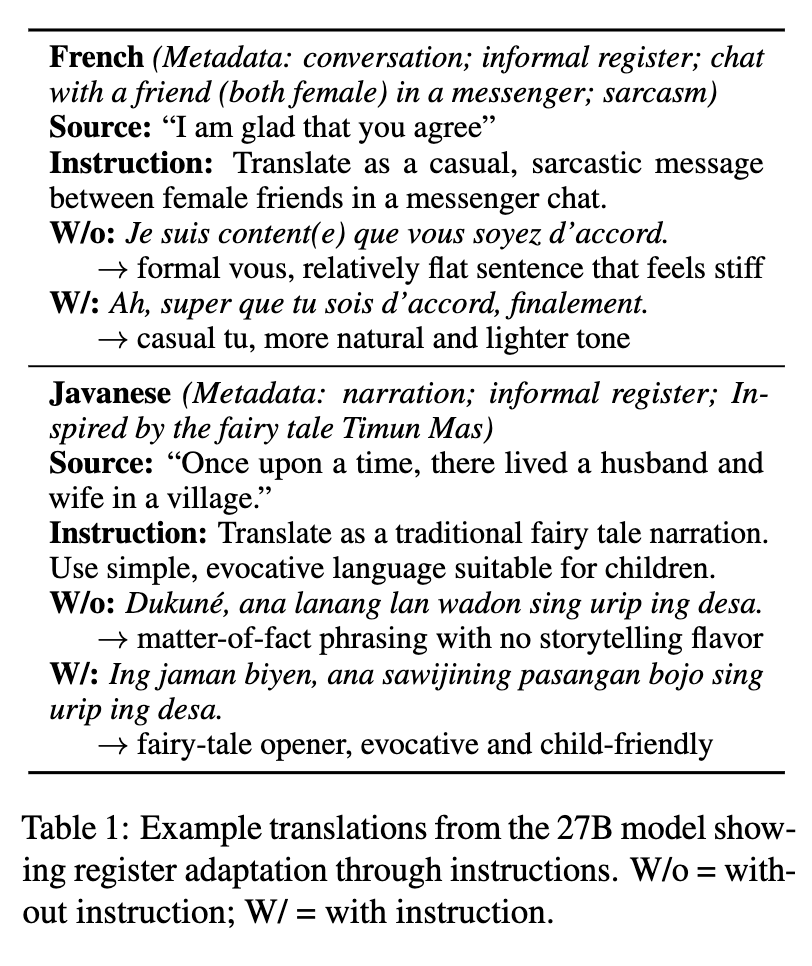

### 4.2 Data

- Dataset and Languages
    - BOUQuET dev set - primary benchmark
        - 504 instance per language
        - domain: social media, how-to articles, 문학 등
        - 각 열은 metatdata, register, comment describing context and intend를 포함하고 있으며, 이는 instruction generation에 사용됨
        - 모든 실험은 en --> xx direction (xx: Indonesian, French, Ukranian, Kmer, Javanese)
        - language family, 문법 구조, low/high 여부 등이 differ
    - WMT24++ - secondary benchmark (for generalize over 50 languages)

- Instruction Generation
    - 자연어로 된 instruction draft를 Gemini 3 Flash가 생성한 후 인간이 다시 검토
    - Instruction에는 translation's intended **audience, tone, purpose** 포함

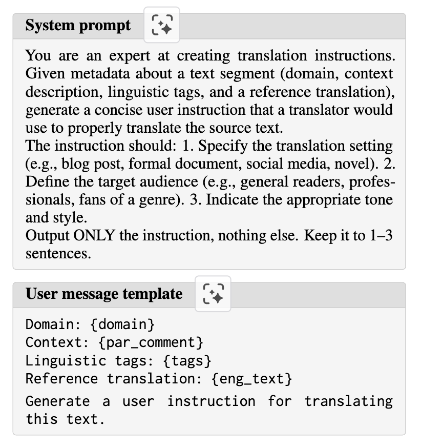

### 4.3 Translation

- Models: Gemma-3-4B/12B/27B, Gemma-4-31B, Qwen3.5-27B 

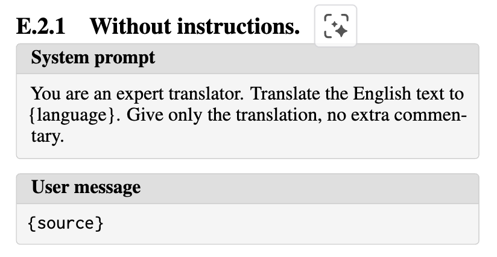

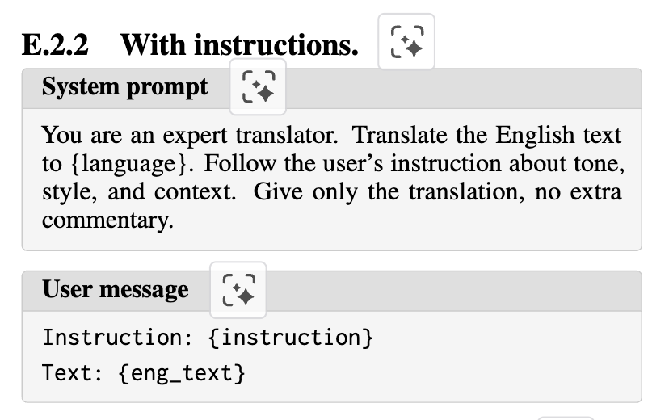

- Translation Conditions
    - Baseline: fixed 3-shot prompt **without instructions**
    - Instruction: adds user instruction to both the **prompt** and the **3-shot examples** 
    - Few-shot condition: semantically simlar translation pairs 5개 (고정됨)을 replace하며 사용 (BOUQuET test set으로 부터 heldout)
        - Embedding model: all-MiniLM-L6-v2 (hf.co/sentence-transfomares/) 
    - Paragraph condition: full source paragraph with markers delimiting the sentence to translate
        - translation은 paragraph condition에서 빼고 다 sentence level로 진행됨

- Inference
    - single A100 80GB with VLLM
    - greedy decoding (temperature 0)
    - 8,192-token context window, 1,024-token generation capacity (출력양)
    - Qwen의 경우 reasoning disabled

### 4.4 Evaluation

- 무엇을 재는가?: Translation rating (meaning preservation) and adaptedness (tone/context matching) 
    - Translation ratinig -> ESA (by LLM Judge)
    - Adaptedness -> adaptedness (by LLM Judge) + human annotations (Pearson 0.86)

- Evaluation model
    - Setup
        - LLM Judge: Gemini-3-Flash
        - output: ESA, adaptedness score, critical-failure
        - Judge always sees the instruction
        - Scoring is reference-free (reference on과 별차이 없었다고 함)
        - Gemini-3.1-Pro thinking mode도 해봤는데 별 차이 없었다고 함
    - Validation
        - LLM-human agreement
            - Krippen-dorff's alpha: 개별 판정 하나하나의 일치를 보고 우연 보정도 강함 (보수적)
            - ICC(3,k): 평균 점수의 안정성을 보고 편향을 무시

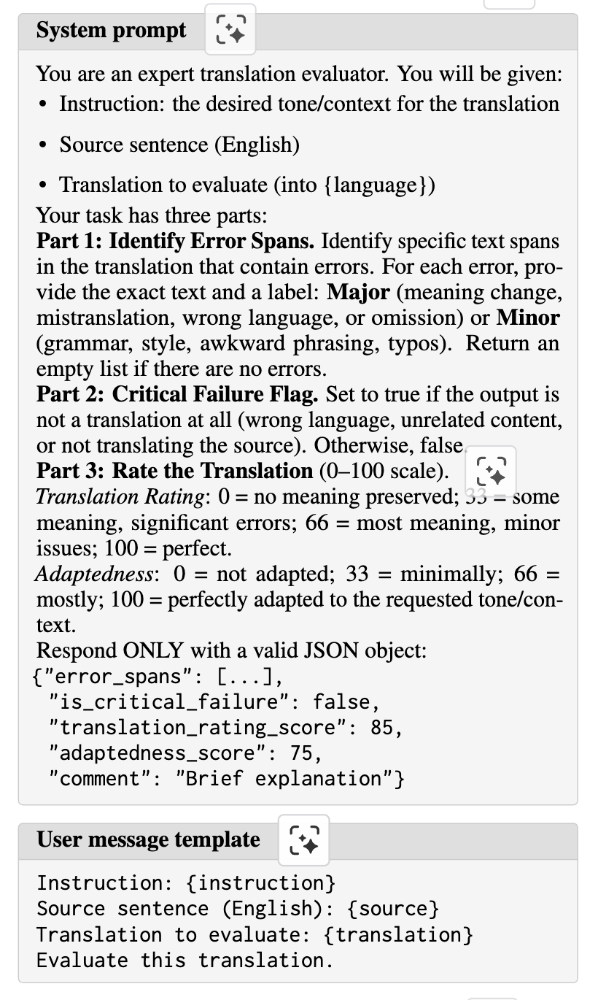

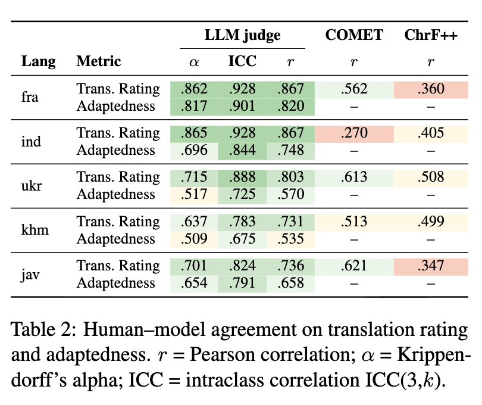

## 5. Results

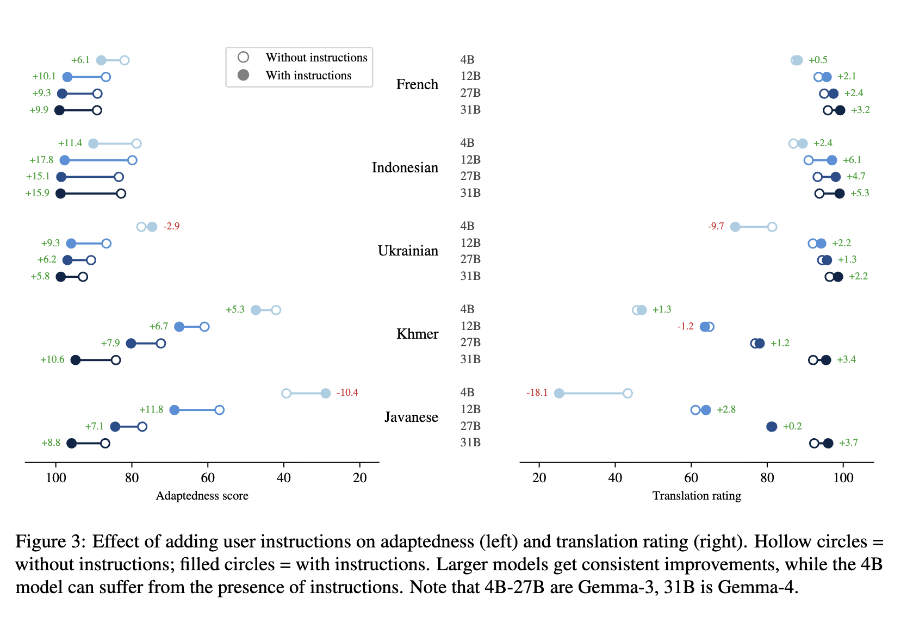

### 5.1 Effect of model size

- Larger models benefit more: 12/27/31B models show consistent improvement
    - both for adaptedness and translation rating
    - 4B model에서는 Instruction의 존재의 benifit이 언어쌍마다 갈림

- Critical failure to follow instructions for smaller models -> due to small models' limited multilingual capacity
    - wrong language
    - failure to perform the task

### 5.2 Effect of language resource level

- Approximte resource level: French > Indonesian > Ukrainian > Khmer > Javanese
    - resource level이 높을 수록 instruction에서부터 benefit하는 정도도 큼
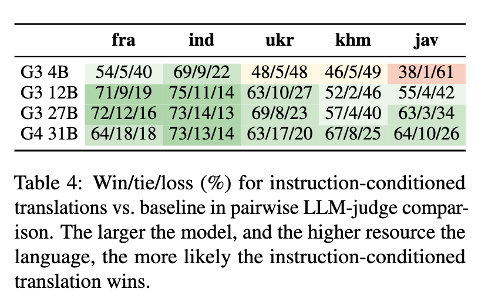

- resource level 밖에도, register richness (언어 안에 사회적 관계 (상하, 격식 정도)가 많이 표현되어 있는 정도)에 따라 adaptedness가 높아짐

### 5.3 Effect of domain 

- Informal domains drive largest gains

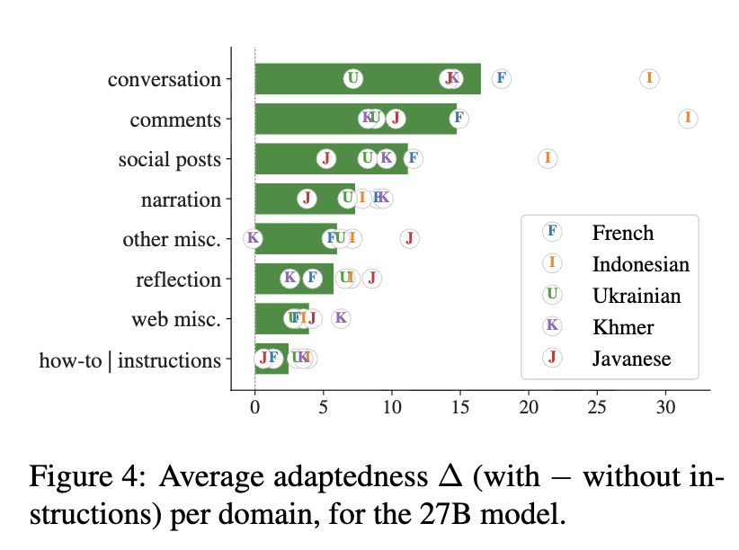

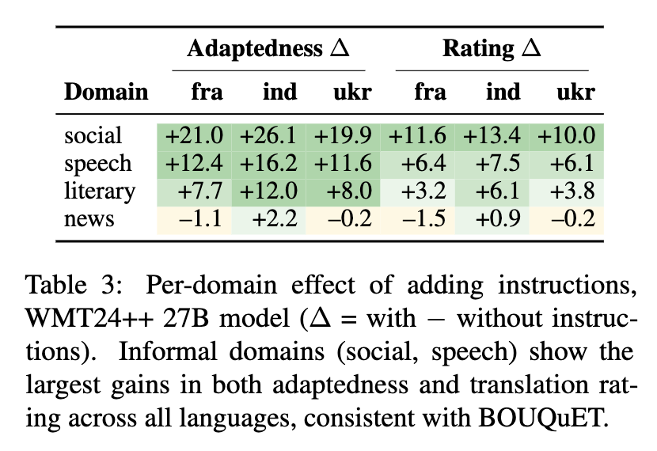

### 5.4 Comparison with semantic few-shot and paragraph-level translation

- Adaptedness에서 효과: Instruction이 > semantic few-shot examples 

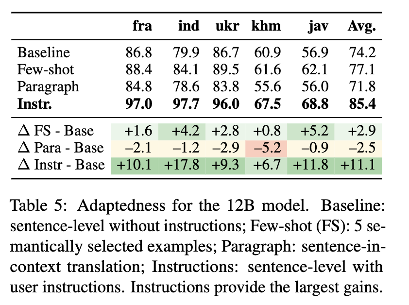

- Paragraph-level translation (한꺼번에 하기)가 Single sentence translation 보다 결과가 좋지 않음

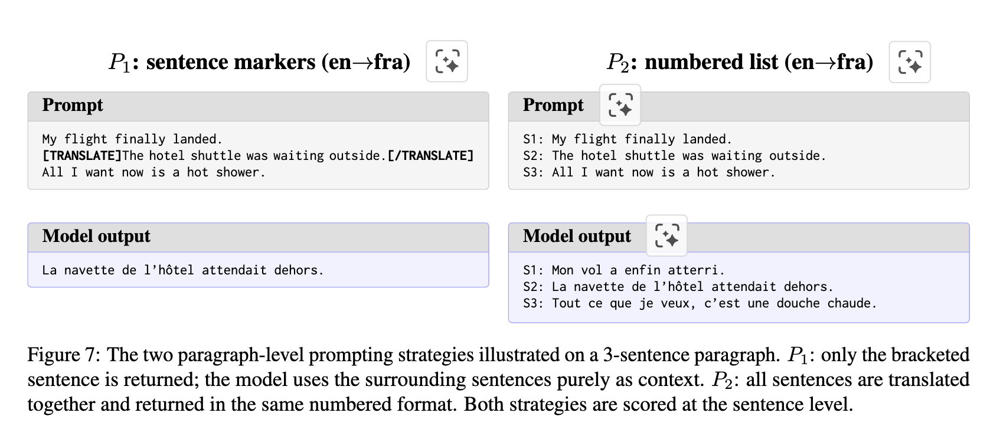

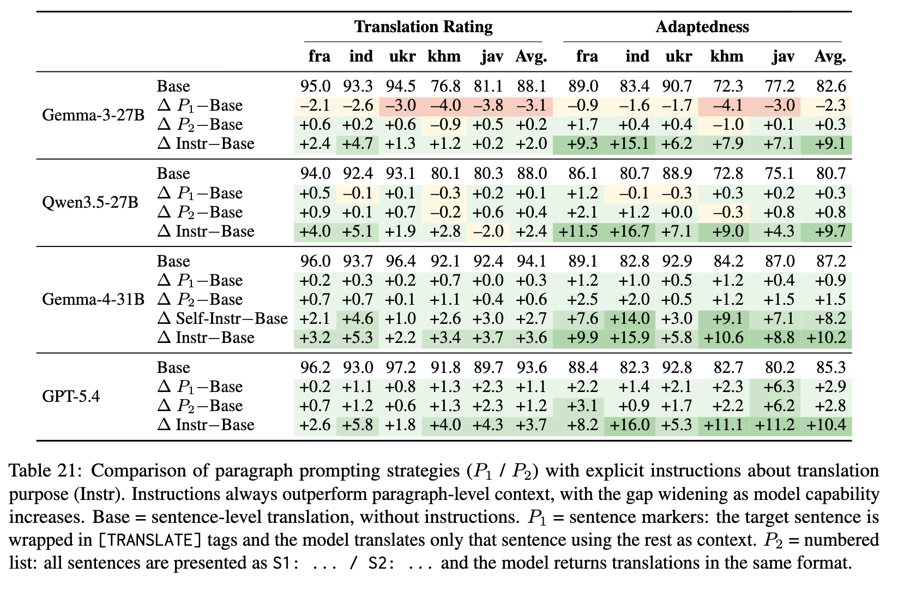

## 6. Self-Introducing from Document Context

- 모델이 주어진 텍스트로부터 context를 'guess'할 수 있는지 봄

### 6.1 Pipeline

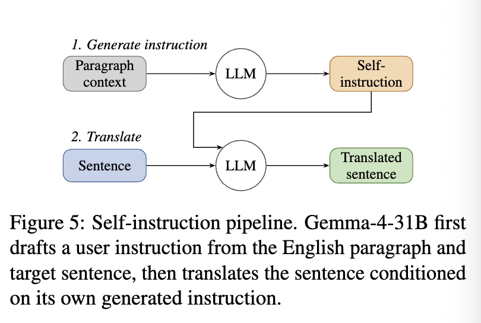

- Gemma에게 EN src paragraph를 주고 그 중 tgt sentence에는 [TARGET] tag를 부여
- 모델에서 inferred setting을 추론하게 함
- 3-shot prompt with greedy decoding

### 6.2 Results

- Gemma-4-31B에서 Self-generated instructions는 대부분의 주어진 instruction gap을 채울만큼 효과적이다.

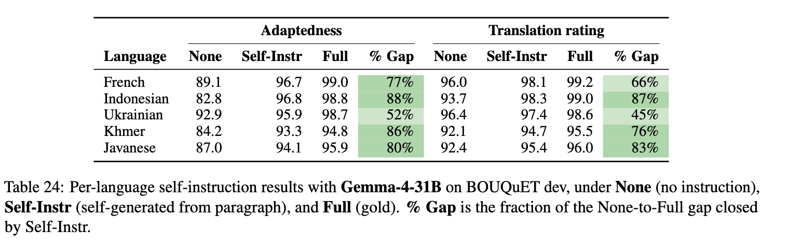

## 7. Discussion & Limitation

### 7.1 Discussion

- Purpose-adapted MT is a measurable capability

- Need for diverse domains in evaluation

- The instruction-failure tradeoff
    - for smaller models, instructions는 도움이 될 수도 있지만 complexity trigger가 될 수도 있다.

- Practical implications
    - for models more than 12B, adding use instructions is a reliable way to improve translation quality
    - instruction이 없을 때는 self-instruction from surrounding document context offers a practical recipe

### 7.2 Limitations

- Limited few-shot comparison
- Limited language coverage
- Limited model diversity
- LLM-as-judge reliability

## 8. 생각 및 좋은 인용절

### 8.1 생각

- 모델에 대하여: Instruction 생성 및 Evaluation이 Gemini-3-Flash로 동일하고, 번역 모델은 (Qwen3.5-27B 제외) 모두 Gemma Family이다. 너무 좁은 모델 pool 안에서 진행된 실험인듯함.
    - 얘네가 돈 좀 더 써서 SOTA급 모델들 api 썼으면 결과가 많이 달라졌을 듯

- 평가 메트릭에 대하여: Translation rating에서 ESA가 (특히 row resource)에서 human annotation과 그다지 좋지 못한 상관관계를 갖는 것을 우리는 알고 있고, 따라서 meaning preserving으로서의 evaluation method를 다른 것을 채택하는게 어땠을까 하는 생각...
    - 이 부분에 관련해서는 IFMTBench의 설계가 확실히 설득력있고 좋을 것 같다.

- 실험 설계 자체에 대해서는 이전에 읽얶던 IFMTBench보다 의문이 드는 점이 많지만, ablation 축의 관점에서는 인용할게 많은듯하다. 

- 또한 paragraph level이 sentence level보다 성능이 좋지 않았다는게 눈여겨볼만한데, 이를 multi-turn 관점으로 확장시키면 좀 더 대비되는 결과가 나올듯

### 8.2 인용절

- Skopos theory: translation's adequacy should be measured against its intended function, not against a universal standard correctness (Nord, 1994)

- LLMs offers a potential solution (a translation should be faithful to its intended purpose, not merely to the source), as they let users specify the intended context (audience, formality level, domain) alongside the source text (본문 Introduction)