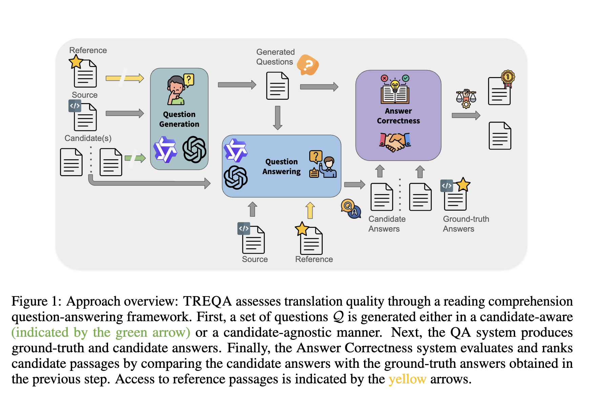
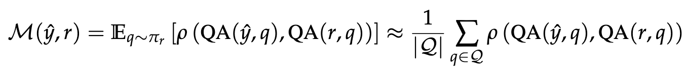
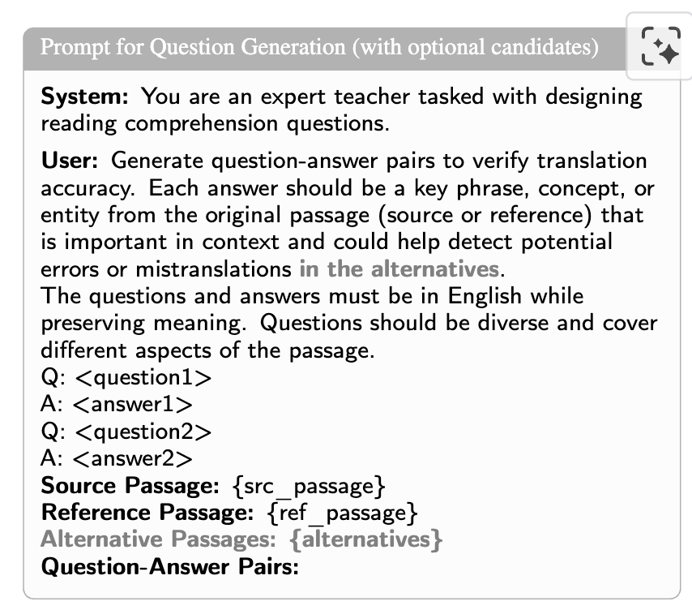
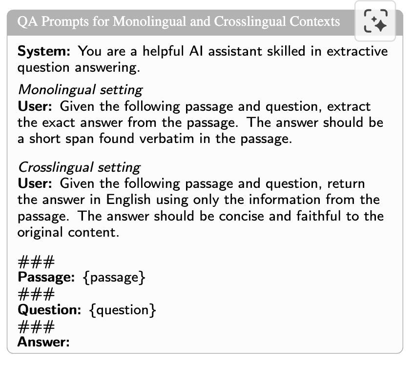
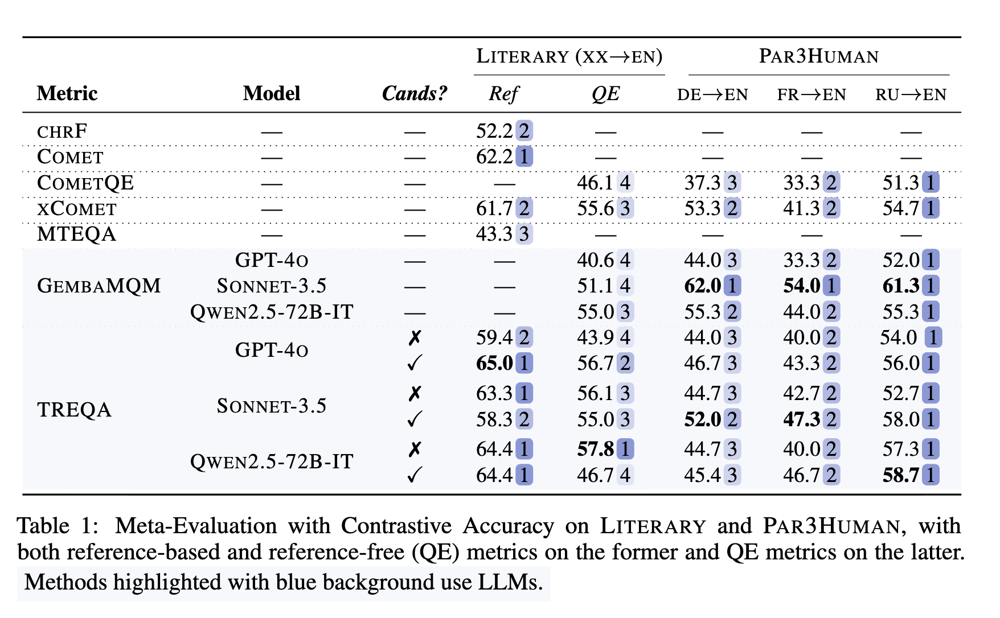
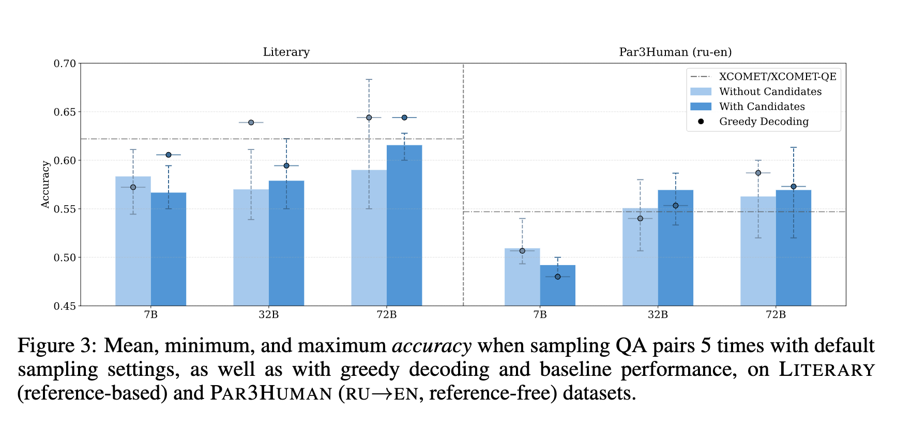
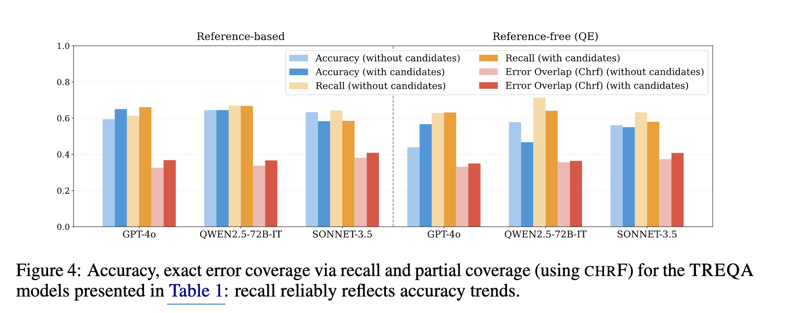
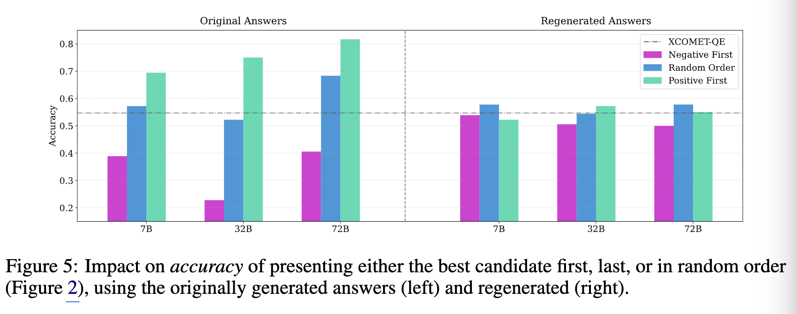
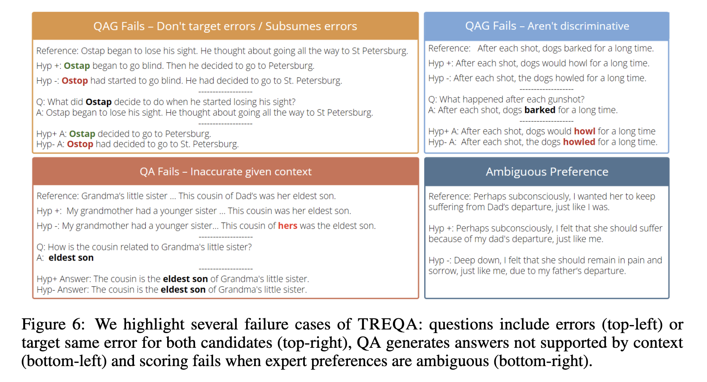

# Do LLMs Understand Your Translations? Evaluating Paragraph-level MT with Question Answering

- **저자**: Patrick Fernandes, Sweta Agrawal et al.
- **arXiv**: https://arxiv.org/abs/2504.07583
- **발표**: COLM 2025
- **분류**: evaluation framework
- **Reviewed by**: Jisoo Jang

---

## 내용 요약

### 1. Introduction

- 배경
    - High-resource language domain에서는 MT가 매우 발전하며 거의 인간 수준에 도달하였음. 
    - 동시에 automatic MT evaluation metric도 발전함 (sentence-level neural metric COMET, MetricX 등)

- 기존 한계
    - **sentence level**이 아닌 level에서의 MT와 automatic evaluation은 상대적으로 느리고 제한적으로 발전해옴
    - MT: 전체 문서에서 관련성과 일관성을 유지하는 challenge
    - automatic metric: translated cross-sentence phenomena를 정확하게 측정하는 challenge 

- 저자들은 위와 같은 한계의 fundamental issue가 single **intrinsic** quality score에 의존하는 것으로 보고 있음
    - single instrinsic quality score는 개별 문장 평가에는 실용적이지만, complex, multi-faceted nature of document-level translation에서는 적합하지 않음.
    - sentence level 이상의 번역을 평가하는 것에는 좀 더 실용적인 (pragmatic) 접근이 필요함: 번역이 얼마나 그것의 내재된 목적을 보존하느냐 (how well a translation serves its intended purpose)
    - 이러한 한계를 극복하기 위하여 번역의 품질을 *reading comprehension questions*를 통해 측정하는 방법론들이 기존에 연구 되었지만, 후술할 한계 때문에 도태됨
        - 그러나, 기존 방법들은 poor scalability 때문에 simpler judgment-based evaluation에 머물렀음
        - 또한, 질문들은 모든 에러들을 잡기 위해 철저하게 모든 key concept들을 잡게 설계 됨 (해당 질문들이 평가 대상이 되는 hypotheses로부터 uninformed된 채로 만들어졌기 때문)

### 2. Main Idea: TREQA (Translation Evaluation via Question Answering)

- Age of LLMs에서는 위에서 논의되었던 옛 extrinsic evaluation의 유용함을 다시 한 번 재고해봐야 함 
    - LLM은 문제 생성 및 정답 검증의 과정에서 human-intensive effort를 낼 수 있기 때문

- 따라서 **extrinsically** translation quality를 잴 수 있는 question-answering-based automatic metric을 제안함
    - 번역문을 통해 원문 또는 reference text 내의 key information을 타겟팅하는 **reading comprehension questions**에 얼마나 잘 응답하느냐

- 이 때 가능한 질문의 수를 좁히고 error localizing의 성능을 높이기 위해, 평가 대상이 되는 hypotheses를 질문 생성시 *optionally* 제공함.
    - 이것은 모델이 더 hypotheses and reference 사이의 차이를 바탕으로 targeted question을 만들 수 있게 함. 

- 장점: TREQA는 fully unsupervised - human quality assesment dataset에 의존하지 않음

#### 2.1 Formalization

- ${M(\hat{y},r)}$ 는 평가 대상 텍스트에 대한 quality score이다.

- ${\hat{y}}$: candidate translation (MT model이 생성한 번역)
- ${x}$: source text
- ${y}$: reference text (given optionally)
- ${{\pi}_r}$: distribution of possible questions 
    - questions: ground-truth text ${r}$ 에 대해서 semantic content를 조사할 수 (probe) 있어야함
    - 이때 ground-truth text ${r}$ 은 ${x}$ 또는 ${y}$
- ${Q}$: automatic question-answer generation model (QAG)를 이용하여 ${{\pi}_r}$ 로부터 샘플링하여 만든 set of questions
- ${QA(\hat{y}, q)}$: QA model's answer to the question ${q}$ using the candidate translation ${\hat{y}}$
- ${p(\hat{a}, a)}$: comparison function ($\hat{y}$ 로 부터 나온 ${\hat{a}}$ 와, ${r}$ 로부터 나온 ${a}$ 를 비교)

#### 2.2 Question-Answer Generation (QAG)

- 저자들의 가설: 좋은 question은 discriminative해야 하며 맥락의 중요한 concept에 집중해야 한다고 정의
    - discriminative: 좋은 번역과 나쁜 번역을 확실히 구분
    - concept: 번역 결과들 사이의 의미 있는 divergence들이 발생할만 하고 (likely to occur), 모호한 (superficial) 디테일들은 disregard

- Question-Answer 쌍을 만들기 위해 LLM에게 프롬프팅을 할 때 저자들은 두개의 다른 QAG 셋팅을 상정하였음
    1. Candidate-agnostic QAG: source text ${x}$ 혹은 reference translation ${y}$, 혹은 둘 다 (x,y)에 base하여 QA 쌍을 만듦
    2. Candidate-aware QAG: candidate translation을 아는 상태에서 QA쌍을 만듦. Candidate translation에서 발생할 수 있는 potential errors에 대해 사전에 접근 가능함

- 아래 이미지 프롬프트: Reference-based QAG setting
    - Alternative passages - optional components

#### 2.3 Question-Answering (QA)

- 언어 셋팅
    - 질문들은 항상 영어임
    - 하지만 context는 영어만 있지 않음 
    - 이러한 셋팅을 반영하기 위해 두가지 프롬프트를 디자인함 (아래 이미지 프롬프트)
        1. monolingual
        2. crosslingual

- Answer (Re)-Generation
    - 위에서 생성해낸 initial answers는 directly하게 사용되지 않음. (bias 우려, 아래 ablation에서 또 다뤄짐)
    - QA model에게 Question과 reference (또는 소스 텍스트)를 제공하여 Answer를 다시 생성하게 함

- Answer Correctness: LERC 사용 (Fabbri et al., 2022)
    - learned metric that scores **semantic similarity** between 후보와 정답, **conditioned on the context and question**
    - on 1-5 scale 

### 3. Experimental Setup

#### Data

1. LITERARY Dataset (Karpinska & Iyyer (2023))
    - subset: XX (폴란드어, 일본어, 러시아어, 프랑스어, 독일어, 중국어) -> English
    - includes MQM error span annotation, expert preference
    - 도메인을 문학으로 채택한 이유
        - 특히 challenging and underexplored domain for MT evaluation
        - 문학은 deep semantic understanding, multi-sentence reasoning, subtle discourse-enforced meaning nuances capture를 요구함
        - 문학은 해석의 방향성이 여러가지로 갈릴 수 있기 때문에, TREQA에 의해 생성된 많은 질문들은 인물들 간의 관계, 사건의 발생 순서 등을 다룸 

2. PAR3HUMAN Dataset
    - subset: XX (프랑스어, 러시아어, 독일어) -> English
    - includes expert preference between *Google Translate* vs *reference translation by human"

- 재는 것: **contrastive accuracy**
    - 이 metric이 expert preference을 얼마나 잘 예측하냐
    - 상황: source만 (QE) / source, reference 둘 다 줬을 때 (reference-based)

#### Baselines

1. Lexical metrics: CHRF 등 (문자 단위 n-gram, BLEU의 대안으로 표준적으로 같이 보고됨)
2. Sentence-level neural metrics: COMET, COMETQE, XCOMET (reference based, free 둘 다)
3. LLM-based metrics: GEMBAMQM (same llm backbones as TREQA)

#### LLM Backbones

- diverse set of SOTA langauge models 사용
- closed models: GPT-4o, SONNET-3.5
- open-source: QWEN2.5-72B-IT, QWEN2.5-32B-IT, QWEN2.5-7B-IT

#### Decoding

- greedy decoding
- temperature 0

#### Significance Testing

- pairwise Wilcoxon signed-rank tests 수행
    - 같은 대상에 서로 다른 두 조건을 적용했을 때, 차이가 유의미한지 보는 검정 방법
    - 차이의 크기가 아니라 순위를 사용하기 때문에 정규성 가정이 필요 없고 outlier에 강함
    - 모든 metric pairs - each dataset and type of eval

- resulting p-values에 Benjamini-Hochberg FDR correction 적용
    - 유의미하고 선언한 것들 중 false positive의 비율

- corrected p-values (threshold 0.05) 기반 significance matrix 제작
    - 이 matrix는 두가지 목적성을 띔
        1. ranking에 더 적합한 metric 판별
        2. 비슷한 패턴을 보이는 group metrics를 위한 distance matrix 역할

### 4. Results

- 아래 표: contrastive accuracy for TREQA and baseline metrics on all datasets
    - 파란 작은 박스: 순위 cluster
    - Cands? : candidate-aware 여부

- 결과
    - TRAQA가 기존 베이스라인과 outperform하거나 competitive 
    - Question generation에 있어서 가장 좋은 모델이 뭔지 1등은 없지만, candidate-aware generation이 candiate-agnostic보다 성능이 좋음
    - 큰 모델을 쓰는게 TREQA's accuracy 향상에 좋음
    - Candidate conditioning은 평균 점수를 높이고 분산을 줄임 (아래 figure 3 참고)

### 5. Ablation Analysis

#### 5.1. Do the generated questions target translation errors?

- 가설: candidate-aware generation은 QA를 생성하는 LLM으로 하여금 target의 translate error를 콕 집는 질문을 생성할 것

- 검증: model이 생성한 '정답'과 expert-annotated error spans를 overlap

- 결과: 아래 그림
    - Accuracy 자체는 candidate 제공 여부에 왔다갔다함
    - Error overlap은 확실히 경향성을 반영 
    - 추가로, error span annotation이 그냥 surface-level similarity보다 더 힘들다는 것을 시사 (이번 wmt26에서도 보였던듯)

#### 5.2. How important it is to regenerate the answers with the QA system?

- Answer Generation이 진짜로 필요한건지 측정하기 위해 QAG가 생성한 'gold answer'와 QA가 생성한 것 비교
    - QAG-generated answers는 best candidate이 맨 첫 순서로 나왔을 때 성능이 가장 좋고, worst candidate이 first로 나왔을 때 성능이 가장 안 좋다 -> 아주 강한 positional bias

- 따라서 regenerating answers는 이런 문제를 조금 줄일 수 있음

#### 5.3. Where does TREQA fail?

- TRAQA가 실패할 때는 3개의 메인 유형이 있음
    1. 생성된 질문이 target error를 겨냥하는데 실패하거나, candidate error를 오히려 질문 안에 상속받음
    2. 잘못된 Answer 생성
    3. expert preference 자체가 좀 이상한 경우

- 아래 이미지: examples

### 6. Pracical Recommendations

- Start with candidate-aware QAG
- Use powerful LLMs
- Always regenerate answers
- Condider sampling for QAG (e.g., temperature > 0)
- Non-English target texts: newer multilingual LLMs 사용