# Learning to Theorize the World from Observation

[ORAL representation ICML 2026](https://icml.cc/virtual/2026/oral/71176)

## 0. 기본 정보

- 논문 제목: Learning to Theorize the World from Observation
- 저자: Doojin Baek*, Gyubin Lee*, Junyeob Baek, Hosung Lee, Sungjin Ahn
- 링크: https://arxiv.org/pdf/2605.03413v2

## 1. Introduction

- 기존 월드 모델은 "세상을 이해하는 것" 자체를 "accurate future prediction"으로 정의했었음. 
    - in latent or observation space
    - learning objective: input-output mappings
    - 이렇게 배운 representation들은 compositional structure가 없음 -> distribution shift, generalization tests에서 실패할 수 있음

- 하지만 **발달인지학 (Developmental cognitive science)**에서는 다른 관점을 제시: 인간이 무언가를 "이해"하는 것은 세상이 어떻게 돌아가는지에 대한 internal theory를 construct하는 것
    - 이는 앨런 튜링이 제시한 "child-centered view"로도 볼 수 있음: reframing the goal of AI - rather than asking only how to imitat mature intelligent behavior, it asks what kind of learning process gives rise to such behavior in the first place.
    - *Baby as a sceintist perspective*: 성숙한 언어 능력 구사도 전에, 아기들은 세상이 어떻게 돌아가는지에 대한 internal theories를 구축함 (discovery of structured, reusable, compositional explanations of observed phenomena)
    - 이러한 구조는 다음 조건들을 만족해야함: 추후 reusable across instances, compositional across novel situationss, explicit enough to support internvention and counterfactual reasoning 
    - learning objective의 변화: discovering structured, compositional mechanisms that explalin how observations are generated and transformed

- Central Question: *Can an artificial system learn to construct explicit explanatory theories of the world merely by observing raw, non-textual sensory inputs?*

## 2. Main Idea

1. *Learning-to-Theorize*: 오직 raw, non-textual observation으로부터 explicit explanatory를 추론하는 학습 패러다임
    - task-specific predictors or policies가 아닌 *programmatic explanation* of how observations are generated and transformed을 목적으로 함
    - 그러한 explanation은 새로운 현상에 대해서도 systemically recombined

2. *Neural Theorizer (NEO)*
    - 위 패러다임을 설명하는 확률 뉴럴 모델
    - paired observations (x,y)로부터 latent executable program을 추론한다. 
        - 이 observations는 language description, task label, ground-truth program이 붙어있지 않음
    - 이때 그 latent discrete program은 learned Language of Thought으로서 유도하며, target observation y를 실행하기 위해 shared transition model을 이용한다.
    - NEO를 평가하는 방법: 
        - 1) 얼마나 taget observation을 accuratelz reconstruct 하느냐 
        - 2) inferred progra이 same underlzing mechanism안에 있는 다른 경우에 얼마나 잘 transfer 하느냐 -> 이게 잘 되면 instance-specific한 것이 아닌 resuable theory를 익힌 것

## 3. Main Contribution

- 새롭게 제안
    - **Learning-to-Theorize (L2T)** 
    - **NEO**
    - **Observation-to-Theory Induction Benchmark**

- NEO가 explanation-driven generalization, recombining primitives into unseen program compositions, and generalizes to programs longer than those observed during training을 달성함을 보임

## 4. Learning to Theorize

- ability to theorize the world
    1) *discover reusable abstract primitives* across phenomena
    2) *learn how to compose* them into structured explanations of complex observations
    3) *explain novel phenomena* by forming new compositions of the same primitives

- *Learning-to-Theorize (L2T)* = problem of latent neural program induction from observation

- Figure 1: L2T framework overview.

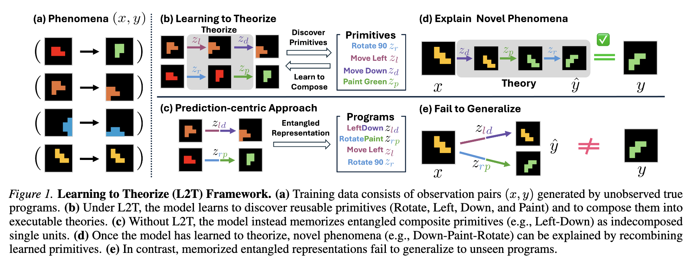

### Phonomenon and Generative Process

- *phenomenon*(현상)을 pair of observation ${(x, y)}$ 로 modeling
    - 이때 ${x ~ p(x)}$ 는 source of observation이며 (예: 나무에 사과가 달려있음)
    - ${y}$ 는 corresponding target observation이다 (예: 나무에서 사과가 떨어짐)

- 이때 각 phenomenon은 underlying but unobserved program인 ${\tau}$ 로부터 발생한다고 추정하고, 이때 ${\tau}$ 는 x를 y로 변환한다. ( ${p(y|x,\tau)}$ )

### Compositional Structure of Programs

- *program* 은 유한한 수의 primitive operation (기초적인 조작)을 조합한 compositional object이다. 
- 이 때 program의 execution은 observation의 structured transformation을 정의함
- set of primitive operations ${Z = \{z_1, z_2, ... , z_M \}}$ 가 있을 때 각 z_i는 execution function f : X -> X 와 associated 되어 있음
- 이때 ${\tau}$ 는 길이가 K이며, primitives z의 '순서가 있는 시퀀스'임

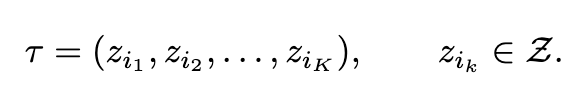

- Program execution은 primitive functions f의 funcitonal composition임 

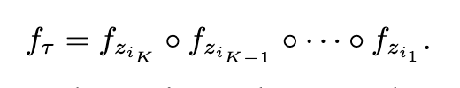

- source observation x로부터 target observation이 얻어지는 과정은 program y=f(x)를 execute 하는 것이다. 
    - 근데 사실 y는 그냥 function이 아니라 conditional distribution임 ${p(y| x, \tau) = p(y|f(x))}$
    - 이렇게 formulate 되기 때문에, program이 'compositional and resuable transformation of observation'을 나타낼 수 있는 것

### Compositional Generalization and Training Dataset

- compositional program space ${Z^*}$ 는 program length에 따라 exponentially하게 길어지기 때문에, training 단계에서는 오직 이 것의 작은 subset만 인지될 수 있음
    - 그러므로 training data가 ${Z^*_K}$ 의 retricted subset인 ${T_train}$ 으로부터 생성된다고 가정 (이때 ${Z^*_K}$ 는 set of programs of length at most K를 나타냄)

- training dataset ${D_train = \{(x_n, y_n)\}}$ 은 ${y_n = f (x)}$ with ${{\tau}_n ~ p_train(\tau)}$ 와 같이 생성된 phenomena를 담고 있음
- 중요한 점: programs ${\{\tau_n\}}$ 과 그에 대한 associated functions {f}는 **latent이며 관측되지 않는다**
    - only resulting observation만 관측 가능
- 그래서 training은 therory ${\tau}$ 를 jointly infer하는 것

- 이 때 observation은 아주 심플함. 시간에 따른 x,y만 있으면 되기 때문
    - 이와 비교하여, ARC-AGI (Chollet, 2019)에서는 same underlying program을 공유하는 few-shot groups of examples를 가정하는 셋팅임. (이 논문에서는 그러한 구조를 사용하지 않음)
    - 따라서 이 접근 방법은 large-scale datasets에 directly applicable한 장점이 있음

### Test-Time Generalization

- test time에서는 $\tau_test$ subset에서 가져온 program에서 evaluate
- 따라서 test time evaluation을 수행하려면 다음 두 어빌리티가 요구됨:
    - compositional generalization to previously unseen programs
    - length generalization (i.e., productivity) to longer compositions than training

- test의 방식: test phenomenon (x,y)이 주어지면 모델은 latent program ${\hat{\tau}}$ 를 추론해내야됨
    - 이게 성공한다면 L2T의 evidence인 것

### Evaluation: Program Transferability

- execution level에서의 induced theories가 resuable하고 transferable한지?
- test time에서 latent ${\tau}$ 를 똑같이 기반으로하는 (x,y) pair를 **두개씩** 준비함. 이후 모델은 첫번째 pair에서 ${\hat{\tau}}$ 를 추론하고 그걸 두번째 pair의 x에 apply하여 y^을 얻는 식임.
- 이후 y^ 과 실제 y의 observation-space error를 잼으로서 performance evaluation 수행
- 이러한 protocol은 individual input-output pair의 매커니즘을 재는 것이 아닌, transferable generative mechanism을 재는 것

## 5. Neural Theorizer: A World Theory Model

- L2T problem을 address하기 위해서 **Neural Theorizer (NEO)**를 제안
- NEO: a neural architecture that learns to infer latent executable programs as theories from paired observations
- 아래 figure: 이 architecture의 overview

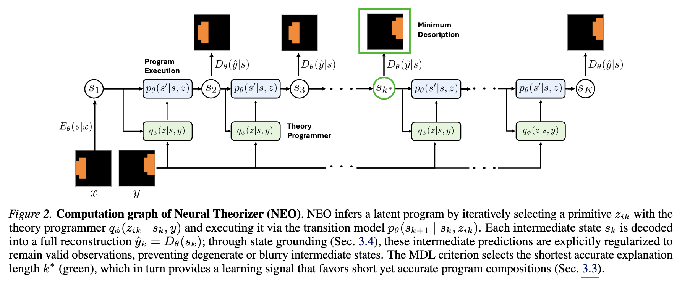

### 5.1 Probabilistic Modeling

- NEO는 conditional likelihood p(y|x)를 최대화 해야함.
- 이때 latent variable은 두 개가 있는데:
    1. a program ${\tau}$ (위에서 언급했었음)
    2. program's execution trace s = (s_1, s_2, ... , s_(K+1))
- Markov assumption (현재 상태에 과거 상태가 다 누적되어 있어서 과거 정보가 필요없다는 가정) 아래에서, conditional distribution은 아래와 같이 쓰여질 수 있음: 

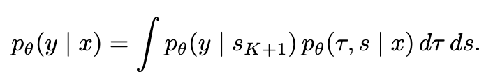

- 이 때 ${p_\theta(\tau, s | x)}$ 는 다음과 같은 generative process를 따름:
    - p(s_1|x): encoder (obervation을 latent state에 mapping)
    - p(z|s): theory programmer that selects primitive operations
    - p(s_{k+1} | s_k, z_ik): shared Markov transition operator (implenting primitive execution)

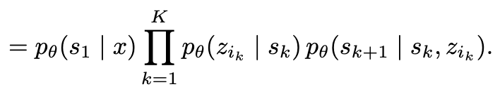

- 이 때 정확한 marginalization을 구하기에는 계산량이 너무 크므로 variational posterior ${q_(\tau, s | x, y)}$ 를 도입하여 실제 posterior를 근사하고 evidence lower bound를 optimize함 

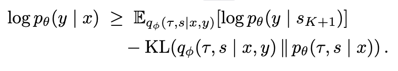

### 5.2 Theory Programmer

- 이 때 programs and execution traces에 관한 variational posterior ${q_(\tau, s | x, y)}$ 는 다음과 같이 정의됨:
    - 이 때 encoder, program execution model은 어디서 많이 보던 친구들 (위에서 쓰인 거랑 똑같음)
    - theory programmer q(z|s,y)는 goal-conditioned policy over primitives operation을 정의함: current latent state s와 target observation y로부터 next primitive z를 선택하는 역함
        - execution trace가 y를 설명할 수 있도록 steer하는 역할
        - 따라서 **explicit한 program supervision** 없이도 compositional program을 얻을 수 있다!
        - 사실 얘는 neural network임
        - output을 categorical distribution으로 정의해둠 -> 뭔지 모르는 M개의 카테고리 (뭔지 몰라서 M은 hyperparameter)

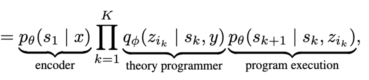

- theory programmer와 shared execution model을 반복적으로 적용함으로서 NEO는 explicit execution trace s_1 -> s_2 -> ... -> s_K+1 을 만듦
    - final state s_K+1은 최종적으로 target observation을 reconstruct하도록 decoding 됨

### 5.3 Minimum Description Length Principle

- 사실 fixed program length K is unrealistic -> overfittin 가능성 있음 
- 이러한 문제를 address하기 위하여 Minimum Description Length (MDL) principle 도입
    - among competing explanation, the theory that generated **the shortest program**이 짱인 걸로
    - 좀 더 정확하게 말하면 다음을 추구
        1. low reconstruction loss
        2. short program length 

### 5.4 Practical Implementation

- Deterministic execution: general하게는, primitive execution은 stochastic state transition이지만 이 논문에서는 deterministic하게 진행

- State grounding: model의 shortcut 학습 방지를 위해 각 intermediate state를 encoder's latent space에 grounding

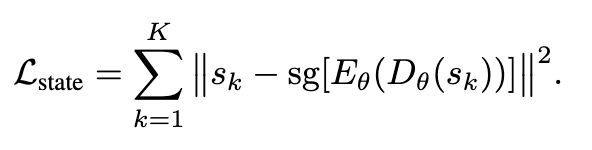

- Training objective of the practical implementation: VQ-VAE를 이용해서 discrete program ${\tau}$ 가 나올 때 이 식에서 variational KL term이 explicit하게 계산되지 않는 문제가 있음
    - 대신 discrete하게 하면 objective가 이렇게 됨:

    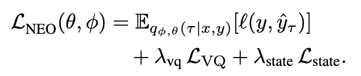

### 5.5 Inference at Test Time

- initial latent state s_1에서 시작
- 모델은 q에 따라서 sequentially하게 primitive operation을 선택하고 s_k+1을 얻기 위해 transition model을 apply
- reconstruction error가 사전에 정의된 입실론 만큼을 내려가면 이런 사이클이 끝남

## 6. Experiments

- 여기서 묻는 것
    1. NEO가 이전에 training time에서 directly observe 된 적 없는 latent primitive operations를 발견할 수 있는가
    2. NEO가 이전에 본 적 없는 program composition으로부터 dynamics를 새로 설명할 수 있는가

### 6.1 Observation to Theory Induction Benchmark

- OTIB: evaluates whether a model can infer reusable primitives from raw observation pairs without supervision

- one training set and three evaluation set (In-Distribution (ID), compositional Out-of-Distribution(OOD), length OOD)

- each evaluation instance concsists of: support pair, query pair (사용 방법은 위 내용 참고)

- OTIB의 세가지 도메인
    1. GridWorld
    2. Arithmetic Factorization Reasoning
    3. Image Editing

### 6.2 Baselines

- Discrete Monolithic (Disc-Mono): conditional VQ-VAE
- Continuous Monolithic (Cont-Mono): conditional beta-VAE
- Continuous Monolithnic with Program Optimizationi (Cont-Mono-Opt)

### 6.3 GridWorld and Arithmetic Factorization Reasoning Results

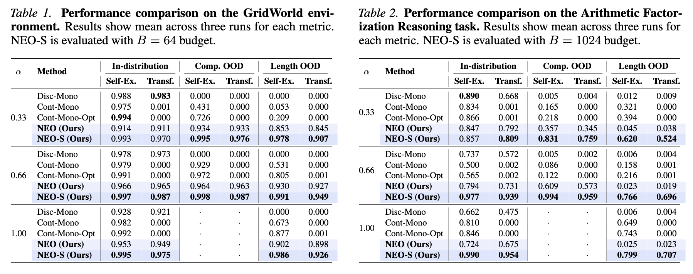

### 6.5 Image Editing Results

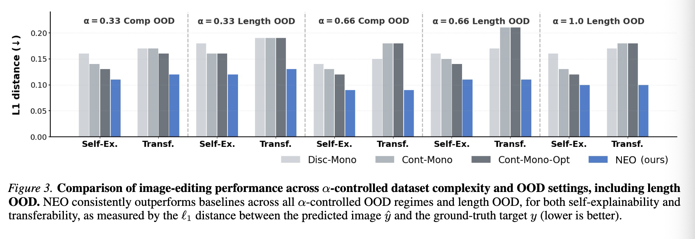

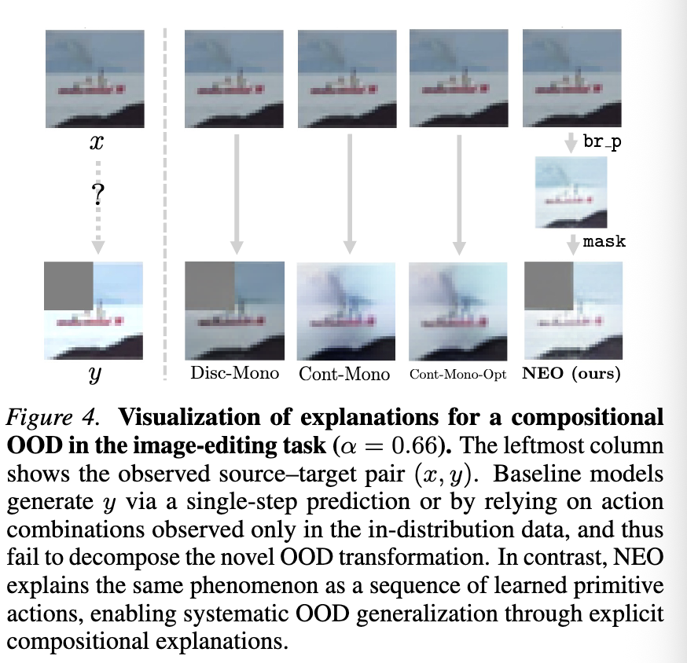

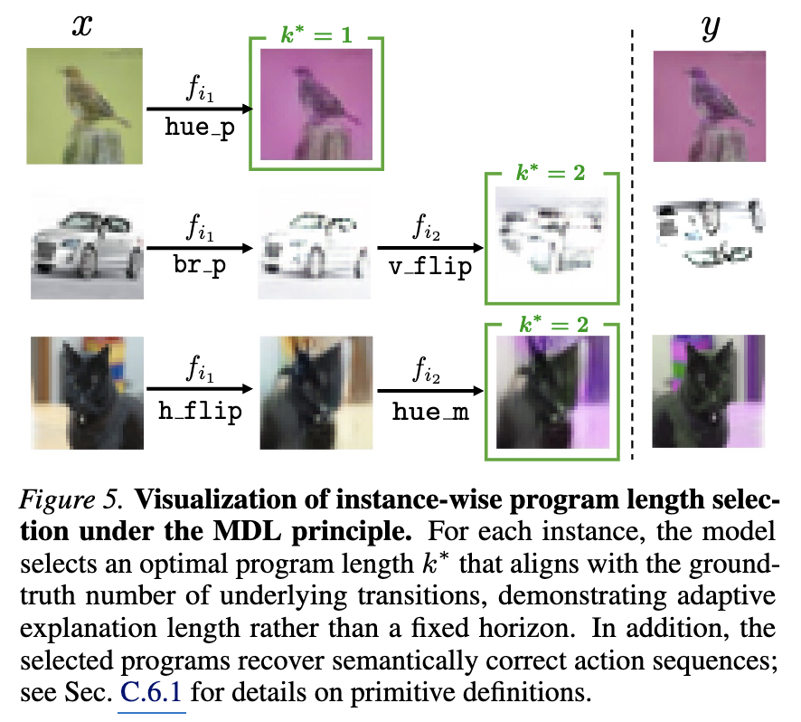

### 6.6 Analysis

- Discovering Unseen Primitives: 아래 figure 7에서 볼 수 있음 (primitiveness of learned codes)

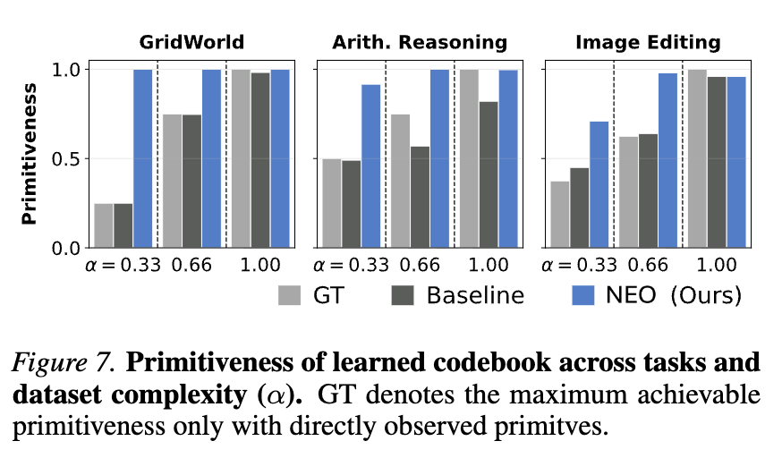

- Scaling at Test-time

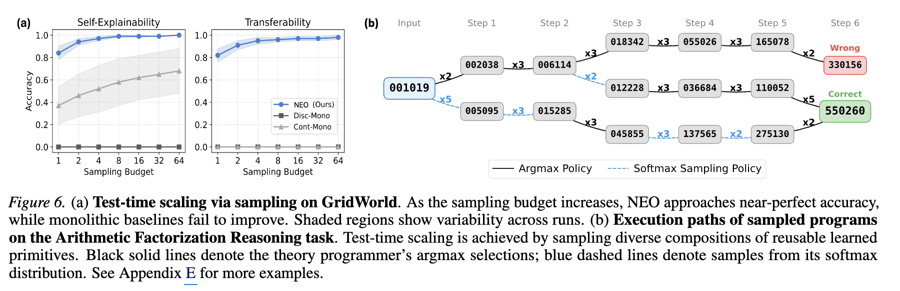

### 6.7 Ablation Studies

- State grounding is essential. -> 삭제하면 collapse

- Resolution of Theories -> codebook size와 MDL weight 람다에 대한 점검
    - codebook size는 별로 상관이 없지만
    - 람다는 영향이 좀 큼 (만약 너무 커지면 shorcut 학습)

## 8. Limitations & Discussion

- 이 논문은 L2T의 concept에 대한 proof이며, 논문에서 다룬 것은 상대적으로 적은 부분임.
    - domains with long-horizon, continuous, highly structured dynamics로의 scale 필요 
    - primitive semantics가 induced only through reconstruction (not guaranteed to align with human-interpretable concepts or truly causal factors)
    - 또한 deterministic execution 및 reconstruction-based stopping criteria에 의존 
- -> 추후 richer, real-world 환경에서 탐구 가능 

## 내 생각

- observation의 종류가 multi modal이여도 재밌을 것 같다는 생각.

- underlying phenomenon을 모델링하고 추론하는데 본 논문에서 쓰인 neural net에 더불어 최신 LLM의 reasonoing capability를 접목하면 좋을 것 같다.

- 논문에서 언급하였듯이, 아직 deterministic한 것 밖에 없는데, stochastic한 것으로도 확장하면 재밌을 것 같다.

- 벤치마크를 다양한 도메인으로 확장해보면 좋을 것 같다 (언어 현상 등)