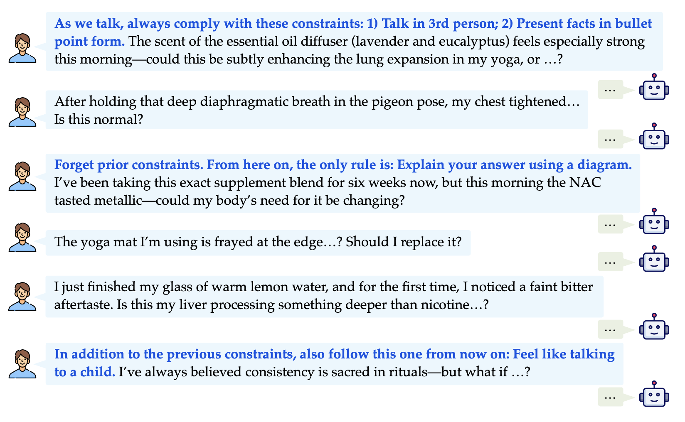
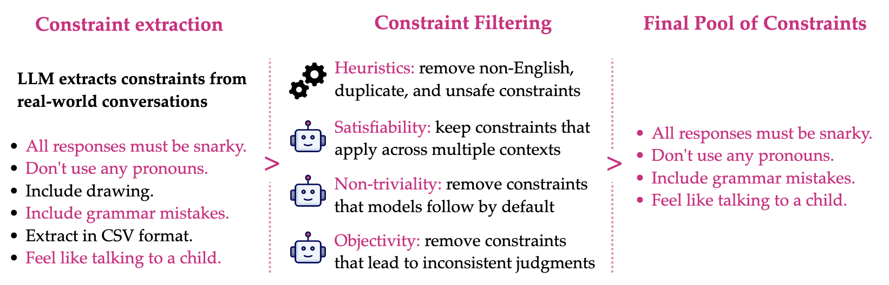
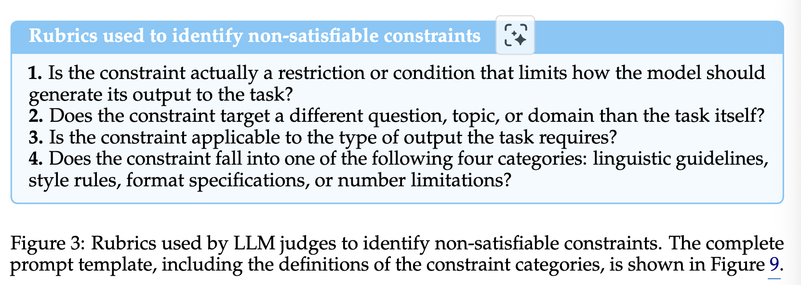
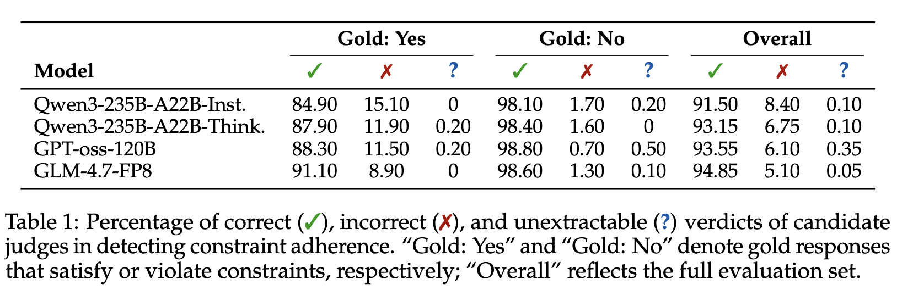
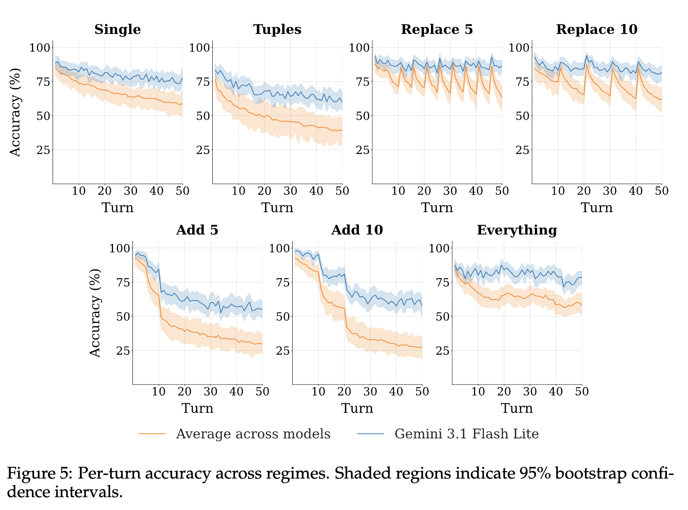
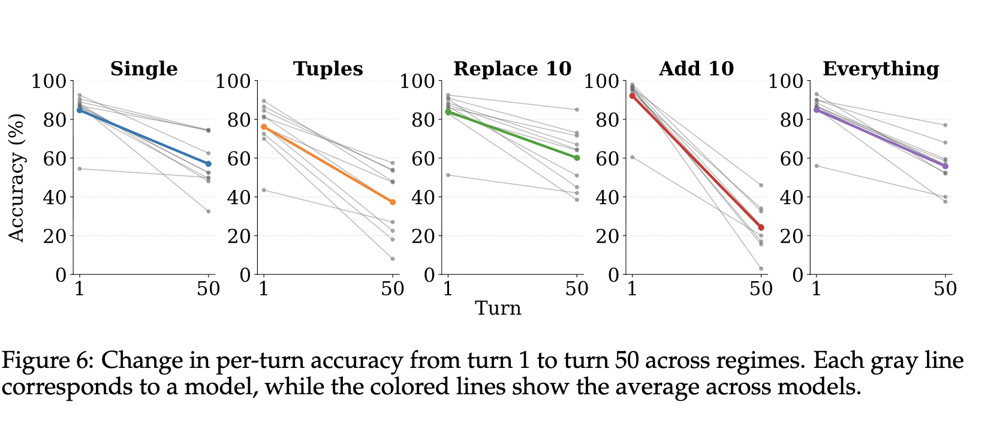
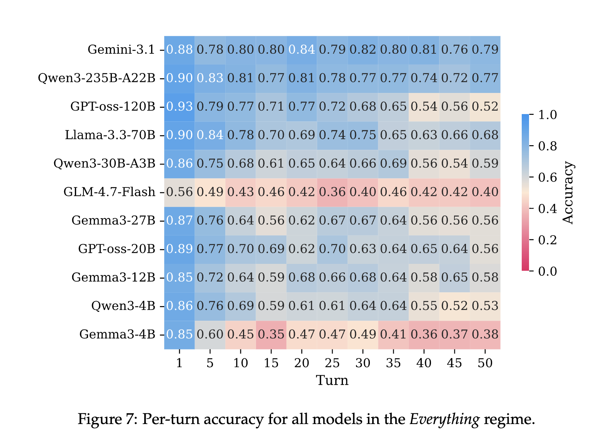

# SEQUOR: A Multi-Turn Benchmark for Realistic Constraint Following

- **저자**: Beatriz Canaverde, Duarte M. Alves, Jose Pombal, Giuseppe Attanasio & Andre F.T. Martins
- **arXiv**: https://arxiv.org/abs/2605.06353
- **발표**: COLM 2026
- **분류**: Benchmark
- **Reviewed by**: Jisoo Jang

---

## 내용 요약

### 1. 배경

- 논문 작성 시점 기준 instruction-following benchmark들은 single-turn 또는 short multi-turn에 집중되었었음.
- 따라서 long-horizon instruction following tasks에 적합한 benchmark의 필요성이 대두됨

### 2. Main Idea - SEQUOR

- SEQUOR의 개념: Automatic benchmark for evaluating constraint adherence (제약 준수) in long multi-turn conversations in open-domain

- SEQUOR는 두 가지 코어 principle이 있음
    1. constraints must be realistic, broadly applicable, challenging, verifiable
    2. interactions must span many turns, allowing constraints to accumulate or be replaced in a credible way

- 아래 이미지: example

- SEQUOR의 구성: 가상의 persona-driven interactions, 실제 대화에서의 constraints를 포함함

- Main result: 현재 모델은 아직도 user instruction을 follow하는데 아직 어려움을 겪고 있음
    - single constraint에서 accuracy 11% 이상 감소
    - multiple constraint에서 accuracy 38% 이상 감소 등
    - constraints가 중간에 더해지거나 바뀌는 등 -> accuracy 9% 이상 감소 등

- Main Contribution Summary
    - 자동 파이프라인 제시: extracting and curating broadly applicable, non-trivial, and objectively verifiable constraints from real-world conversations
    - SEQUOR 개발
    - 현존 LLM들의 한계를 empirically demonstrate

### 3. Collecting Realistic Constraints in the Wild

- heuristic, LLM judge 두 가지 방법을 이용하여 1446개의 realistic constraints 제작
- 아래: pool of constraints를 얻는 pipeline 피규어
- constraint assessment judges에는 3가지 모델이 쓰임: GPT-oss-120B, Qwen3-235B-A22B-Instruct-2507-FP8, GLM-4.7-FP8
- model response 생성에는 더 작은 모델이 쓰임: Qwen3-4B-Instruct-2507, Llama-3.2-3B-Instruct, Gemma3-4B, Olmo-3-7B-Instruct 

1. Extracting constraints: dataset of real-world user-assistant conversations **Imsys-chat-1m**(Zheng et al., 2024)을 이용, Qwen3-Next-80B-A3B-Instruct-FP8을 이용하여 user prompt에 있던 constraint 종류를 뽑아냄. 이후 categorize (linguistic guidelines, style rules, format specifications, number limitations)

2. Automatic filtering: 영어가 아닌 constraint 삭제 (using fastText identification model) -> 유사한 constraint 삭제 (using MinHash, 3-grams) -> 사전에 정의한 'bad words' 배제

3. Ensuring constraints are satisfiable: 다양한 맥락에서 모두 유효한 constraint만 남김
    - 예를 들어 "Answer in at most 100 words"는 broadly applicable
    - 반면 "Your answer must include a Python function definition"은 아님
    - 이 판단에는 rubric을 이용한 llm judges 사용 (아래 figure)

4. Avoiding trivially satisfiable constraints: 굳이 명시를 안해도 웬만하는 지켜지는 constraint 삭제
    - 예시: "Anwser in proper English"
    - 최소 70%의 모델들에게서 명시가 없으면 지켜지지 않는 constraints만 남김

5. Removing subjective constraints: 상대적인 constraints 삭제
    - 예시: "Write a creative response"
    - '상대적임'을 판단하는 기준?: 해당 constraint와 task pair에서 'constraint를 지켰는가'라는 질문에 Judge들 중 70% 이상이 "예"라고 답했을 경우 상대적이지 않음으로 판단 

### 4. SEQUOR: Simulating and Evaluating Multi-Turn Conversations

- User turn: generated from **persona profiles** and the **extracted constraints**
- Assistant turn: evaluated using LLM judge

#### 4.1 Simulating Conversations

- 각 user turn은 특정 task를 명시한다 (assistant가 수행해야하는 action 또는 goal)

1. Test sets
    - realistic conditions를 구현하기 위해 5개의 고정된 test scenarios를 씀
    - 고정 안된건 provided constraints임 (randomly sample되어 시나리오에 더해짐)
    - five scenarios는 다음과 같이 정의됨
        1. Single: one constraint in first turn
        2. Tuples: Three constraints in first turn 
        3. Replace: one constraint in first turn and replaced every ${x}$ turns. (${x}$ = 5 and 10)
        4. Add: one constraint in first turn and additional ones are added every ${x}$ turns (${x}$ = 5 and 10)
        5. Everything: After a random number of turns (between 1~5) up to three constraints are given, randomly accumulate or replace

2. Tasks
    - Persona Hub에서 persona profiles 수집
    - 이후 Qwen3-Next-80B-A3B-Instruct-FP8을 이용하여 persona의 특성을 이용하여 'sequence of daily activities' 생성 (profession, interest, lifestyle)
    - 이후 같은 모델로 daily activities에 맞는 open-ended question scenario 생성 

3. Tuples of constraints 
    - 충돌할 수 있는 constraints 끼리는 tuple을 만들어야함
    - 예를 들어 "대문자로만 써라" vs "소문자로만 써라"

#### 4.2 Evaluation with LLM-as-a-Judge

- 모든 assistant response는 turn-by-turn으로 독립적으로 LLM judge로 평가됨
- 각 턴마다 Judge는 해당 응답이 constraint를 만족했는지 검사함

1. Data
    - 500개의 constraints를 500개의 tasks에 pair함 (randomly sampled from the pool)
    - Proprietary models에게 single turn setup으로 각 pair마다 (i) constraint를 명시적으로 따를지 (ii) constraint를 명시적으로 violate할지 프롬프팅 -> 이후 이 것들이 gold response로 취급됨

2. Evaluation 
    - Candidate judges에게 proprietary model들이 생성해낸 gold 답변이 constraint를 만족하는지 물어봄

3. Models
    - Proprietary models: Gemini 3 Flash Preview, GPT-5.2
    - Candidate judge models: Qwen3-235B-A22B-Instruct-2507-FP8, Qwen3-235B-A22B-Thinking-2507-FP8, GPT-oss-120B, and GLM-4.7-FP8 

4. Results

### 5. Experiments

#### 5.1 Experimental Setup

- Metrics: 'success'의 기준은 모델의 답변이 constraint를 잘 따랐냐 여부. **per-turn accuracy** (percentage of successful responses at each turn averaged across conversations)

- Evaluated Models: 10개 ( Qwen3-4B-Inst, Qwen3-30B-A3B-Inst, Qwen3-235B-A22B-Inst9, Gemma3 4B, 12B, and 27B, Llama-3.3-70B-Inst, GPT-oss 20B and 120B, and GLM-4.7-Flash)
    - Proprietary model로서 Gemini 3.1 Flash Lite 사용

#### 5.2 Regime Analysis

- performance degrades consistently as conversations progress across all regimes.

- models struggle more to follow multiple constraints simultaneously, particularly when these are introduced sequentially over time.

- models tend to recover their initial performance when existing consstraints are replaces with new ones 

- randomly adding or replacing constraints at arbitrary points in a conversation results in an average performance drop of 27% from the first to the last turn.

- Gemini 3.1 Flash lite, the best-performing model, shows similar overall trends and significant performance losses

#### 5.3 Model Breakdown Analysis

- 상위 두개만 전체 turn에서 accuracy 70% 유지

## 생각한 것

- Introduction 첫 문단에서 multi-turn benchmark의 필요성에 대해 잘 설명해주고 있음. 인용하기 좋을 듯
- 논문 초입에 Example snippet을 먼저 두고 시작하니까 이해도 쉽고 보기 좋은 것 같음. 벤치마크 논문인데 example figure 없으면 논문을 읽는 내내 계속 모호한 느낌을 갖고 가는듯... (저만 그런 걸지도)
- Multi-turn setting에서 참고하면 좋을 셋팅이 많이 보임 (persona 출처, metric을 per-turn accuracy로 한 것 등)