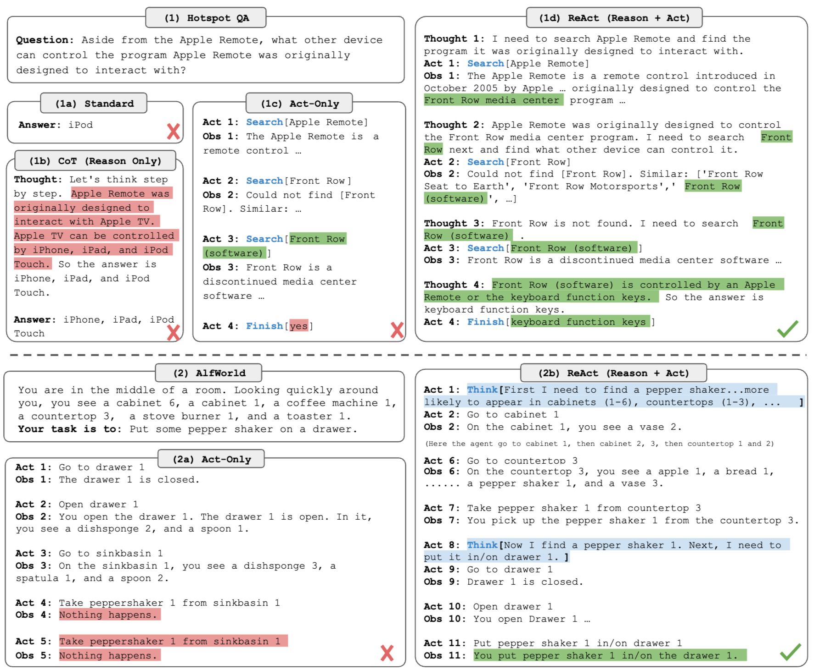
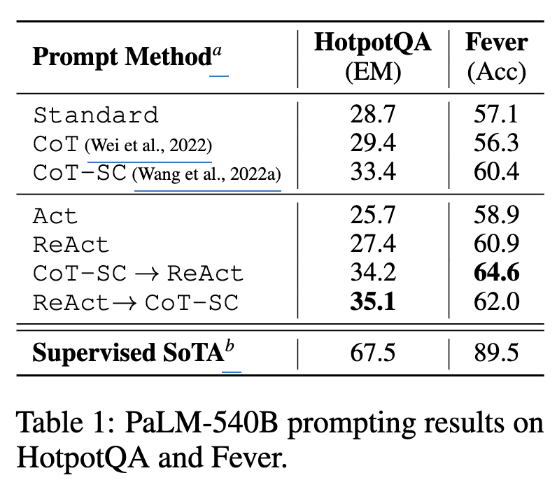
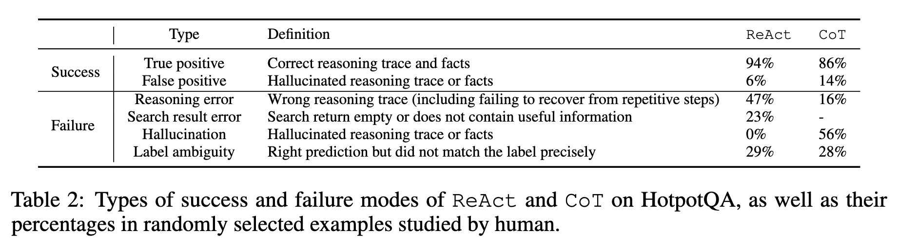
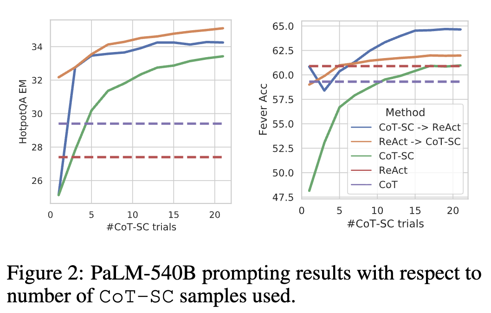
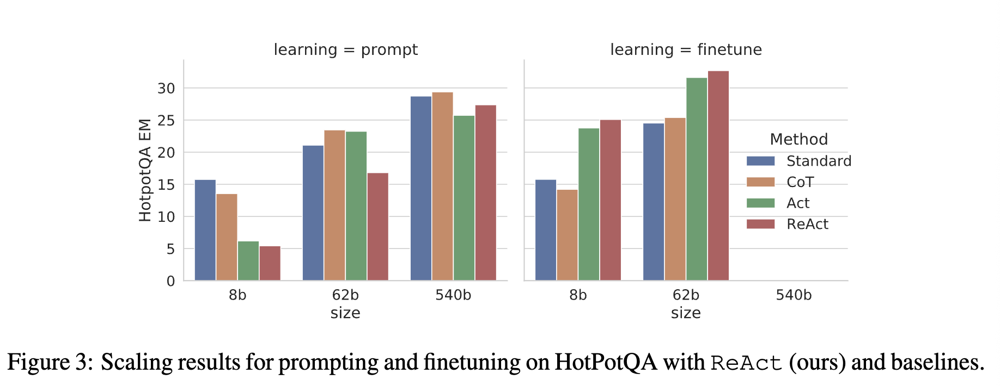
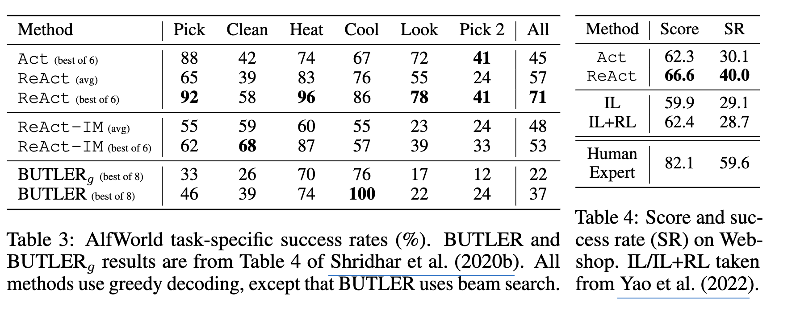

# ReAct: Synergizing Reasoning and Acting in Language Models

- **저자**: Shunyu Yao, Jeffrey Zhao, Dian Yu, Nan Du, Izhak Shafran, Karthik Narasimhan, Yuan Cao
- **arXiv**: https://arxiv.org/abs/2210.03629
- **발표**: ICLR 2023
- **분류**: Agentic Setting
- **Reviewed by**: Jisoo Jang

---

## 1. 배경 및 Key Idea

### 1.1 배경

- "Human Intelligence"는 verbal reasoing 또는 inner speech로 task-oriented actions를 매끄럽게 combine하는 능력을 의미함
    - 이는 self-regulation or strateginzation을 하기 위한 인지 능력과 working memory 유지에서 중요한 역할을 함
    - 이 때 인간은 'acting'과 'reasoning'을 매끄럽게 연결하여 수행하며, 이러한 능력은 인간들이 새로운 task를 마주하거나 혹은 uncertatinties를 대하면서도 robust decision making을 하는데 기여

- 당대 (2023년도)에 LLM의 성능, 즉 'tasks in language understanding'과 'interactive decision making'이 비약적으로 발전하였음

- 하지만 LLM의 abilities인 'reasoning (e.g. CoT)'과 'acting (e.g. action plan generation)'은 지금까지는 (2023) 별개의 토픽으로 취급되어 왔음

### 1.2 Key Idea

- ReAct: "reasoning traces"와 "task-specific acting"을 LLM에서 synergize하게 할 수 있는 general paradigm 제시

- ReActsms LLM에게 interleaved manner로서 *1) verbal reasoning traces 와 2) actions pertaining to task* 둘 다를 generate 하도록 프롬프팅함

- 이러한 방법은 시너지를 발휘함
    - Reason to act: reasoning traces는 모델이 action plan을 기획하고, 따라가고, 업데이트하는데 도움을 주며
    - Act to reason: actions는 모델이 외부 소스들(예: knowledge bases or environments)로부터 추가적인 정보를 모집하는데 도움을 준다.

## 2. ReAct: Synergizing Reasoning + Acting

### General setup of an angent interacting with an environment for task solving

- ${t}$ 번째 time step에서
- agent는 환경으로부터 observation ${o_t}$ 를 받음
- 그리고 특정 policy ${\pi({a_t} | {c_t})}$ 를 통해 action ${a_t}$ 를 취함. 이때 ${c_t}$ 는 agent에게 *context*임.
- policy를 학습하는 것은 매우 어려움. c_t 와 a_t mapping이 highly implicit하고 extensive computation을 요구함

### Idea of ReAct

- ReAct의 아이디어는 심플함: 기존 agent의 action space가 ${A}$ 에만 머물렀다면, 그 action space를 space of language인 ${L}$ 까지 확장하는 것.

- ${L}$ 에서의 action ${\hat{a_t}}$ 는 *thought* 또는 *reasoning trace* 로 일컫어짐
    - 근데 ${\hat{a_t}}$ 는 external environment와의 직접적인 상호작용이 없으므로, observation feedback을 전달받지 않음
    - 대신 ${\hat{a_t}}$ 는 current context ${c_t}$ 에 대해 reasoning함으로서 useful information을 compose함
    - 이후 ${c_{t+1} = (c_t , \hat{a_t})}$ 로 미래 context를 업데이트하여 future reasoning or acting을 support

- 이러한 "유용한 생각"은 다양할 수 있음. 아래는 예시
    - decomposing task goals and create action plans
    - injecting commomsense knowledge relevant to task solving
    - extracing important parts from observations
    - 등등

- 이 논문에서는 frozen LLM PaLM-540B (2022)에 few-shot ICL prompting하는 것에 mainly focus함 -> to generate *domain-specific actions* and *free-form language thoughts* for task solving

- ReAct의 several unique features
    1. Intuitive and easy to design: ReAct prompt design is straightforward as human annotators just type down their thoughts in language on top of their actions taken.
    2. General and flexible: flexible thought space and thought-action occurence foramt -> diverse tasks
    3. Performant and robust: ReAct는 새로운 task에도 strong generalization이 가능 (1~6 in-context examples로만으로도...)
    4. Human aligned and controllable: 해석 가능한 sequential decision making and reasoning process 제공 -> 인간들이 보고서 이해/평가/조종 하기에 용이함

## 3. Knowledge-Intensive Reasoning Tasks: Hot-PotQA and FEVER

### 3.1 Setup

- Domains: Question-only setup for both tasks 
    1) **Hot-PotQA**: multi-hop question answering benchmark that requires reasoning over two or more Wikipedia passages
    2) **FEVER**: a fact verification benchmark where each claim is annotated *supprots, refutes*, or *not enough info* (based on if there exists a Wikipedia passage to verify the claim)

- Action Space: Wikipedia web API with three types of actions to support interactive information retrieval
    1) search[entity]: returns the first 5 sentences from the corresponding e[entity] wiki page if it exists, or else suggests top-5 similar entities from the Wikipedia search engines
    2) lookup[string]: return the next sentecne in the page containing [string] (browser에서 command+F랑 동작이 같음)
    3) finish[answer]: finish the current task with answer. 

### 3.2 Methods

- ReAct Prompting
    - training set에서 6 또는 3 cases를 radomly select -> ReAct format trajectories로서 manually compose -> ReAct의 few-shot example로서 씀
    - 각 trajectory는 여러개의 thought-action-observation steps를 포함하고 있음 (아래 figure에서 1d 참고)



- Baselines: 위 figure에서 1a - 1c 부분
    - a) Standard prompting **(Standard)**: removes thoughts, actions, observations
    - b) Chain-of-Thought prompting **(CoT)**: removes actions observations
        - Self-concsistency baseline **(CoT-SC)**: 추론 과정에서 21개의 CoT trajectories (decoding ${\tau}$ 0.7)를 샘플링한 뒤 majority answer를 채택
    - c) Acting-only prompt **(Act)**: removes thoughts

- Combining Internal and External Knowledge: ReAct + CoT+SC
    - ReAct: problem solving에서 more factual and grounded
    - CoT: more accurate in formulating reasoning structure, but can easily suffer from hallucination
    - 그러므로 **ReAct**와 **CoT-SC**를 incorporate한 방법론을 만듦. 모델은 다음 두 가지 중 선택하면 됨
        - A) ReAct -> CoT-SC: when ReAct fails to return an answer within given steps (5 또는 7), bach off to CoT-SC
        - B) CoT-SC -> ReAct: n개의 CoT-SC에서 얻은 majority answer가 n*루트2 번보다 적게 등장할 때 ReAcT로 back off 

- Finetuning
    - PaLM-540B (2022) 대신 더 작은 모델로도 시도해보려고 함
    - correct answers를 담은 3000개의 trajectories로 PaLM-8B, PaLM-62B 모델들을 fine-tune 
    - decode trajectories: all thoughts, actions, observations <- conditioned on input questions/claims

### 3.3 Results and Observations



- *ReAct* outperforms *Act* consistently: 위 Table 1

- *ReAct* vs *CoT*
    - ReAct가 FEVER에서는 ourperform, HotpotQA에서는 slightly lags behind
    - HotpotQA 분석을 위해 correct/incorrect 중 각각 50개의 trajectories를 randomly sample (ReAct, CoT 둘 다 -> 총 200개 example) -> 아래 Table 2
    - Key Observations
        - a) Hallucination is serious problem for CoT: much higher false poisitive rate
        - b) While interleaving reasoning, action and observation steps improves ReAct's groundedness and trustworthiness, such a structural constraint also reduces its flexibility in formulating reasoning steps, leading to more reasoning error rate than CoT. (트레이드 오프가 있는듯)
        - c) For ReAct, successfully retrieving informative knowledge via search is critical



- *ReAct* + *CoT-SC* perform best for prompting LLMs
    - Table 1 (위)에서 보면 best prompting method는 ReAct -> CoT-SC와 CoT-SC -> ReAct 인 걸 알 수 있음
    - Figure 2 (아래)에서 보면 CoT-SC sample 숫자에 따른 성능을 확인 가능
    - These results indicate the value of properly combining model internal knowledge and external knowledge for reasoning tasks.



- *ReAct* performs best for fine-tuning 
    - 아래 Figure 3: scaling effect of prompting/fine-tuning four methods (Standard, CoT, Act, ReAct) 
    - 결론: ReAct의 성능을 끌어올리기 위해선 human-written data로 fine-tuning 하면 좋다



## 4. Decision Making Tasks: ALFWorld and WebShop

- ALFWorld
    - Synthetic text-based game designed to align with the embodied ALFRED benchmark 
    - text action을 통해 주변 환경과 interact하고, high-level goal을 달성해야됨
        - 예: to examine paper under desklamp, go to coffetable, take paper, and use desklamp
        - 마크와 유사
    - ReAct를 프롬프팅은 각 task type에서 3개의 trajectories를 randomly annotate. 각 trajoectory는 다음의 sparse thoughts를 포함함
        - 1. decompose the goal
        - 2. track subgoal completion
        - 3. determine the next subgoal
        - 4. reason via commonsense where to find an object and what to do it
    - Baseline으로는 BUTLER (Shridhar et al., 2020b) 사용: an imitation learning agent

- WebShop
    - Online shopping website environment with 1.18M real-world products and 12k human instructions
    - ALFWorld와 달리, hight variety of structured and unstructured texts 포함, user instruction에 따라 agent가 물건을 구입해야됨
        - 예: "I am looking for a nightstand with drawers. It should have a nickel finish, and priced lower than $140" -> 검색하고, 고르거나, 더 찾거나 등등
    - 여기서는 Act, ReAct 평가 
    - Baseline으로는 Imitation + Reinforcement Learning (IL + RL)

- Results
    - ReAct가 ALFWorld, Webshop 둘 다에서 Act를 능가함 (아래 Table 3,4)



- On the value of internal reasoning vs. external feedback
    - 당대 (2023) 저자들의 아는한, ReAct는 clossed-loop system에서의 최초의 combined reasoning and action using an LLM applied to interactive environment
    - 가장 유사한 이전 연구는 Inner Monologue (Huang et al., 2022b)지만 여기서는 "observation of the environment state" 및 "goal 달성"에만 국한되어 있음.
        - 반면 ReAct에서는 reasoning trace가 있다는 것
    - IM과의 차이점을 나타내고 internal reasoning vs simple reactions to external feeedback을 비교하기 위하여 Table3에 ablation experiment가 포함되어 있음

## 번외) "ReAct 그 자체"와 "ReAct 구현 Framework"를 혼동하지 말라.

- ReAct = 알고리즘/패턴
    - LLM Agent가 어떻게 생각하고 도구를 사용할지에 대한 '행동 패턴'

- ReAct 구현 Framework = 그 패턴을 실제 프로그램으로 굴려주는 구현체 
    - '행동 패턴 (ReAct)'을 실제 코드로 실행할 수 있게 만들어놓은 '소프트웨어 프레임워크'
    - Pilot 실험 1 -> 2 넘어오면서 구현 framework를 다음과 같이 다르게 했음
        - 1번 실험: 직접 구현한 JSON runner (아주 단순)
        - 2번 실험: 공식 `qwen-agent==0.0.34` (Qwen이 제공, LLM과 tool call interface를 통합)

``` plain text
ReAct
= Reason → Act → Observe → Reason → Act → Observe → ...
  라는 agent 동작 방식

Qwen-Agent
= LLM 호출 + Tool 등록 + Tool 실행 + 결과 전달 + 반복 등을
  실제 Python 코드로 구현해 놓은 framework
```

| 용어                      | 정체                      | 쉽게 말하면                                  |
| ----------------------- | ----------------------- | --------------------------------------- |
| **ReAct**               | agent paradigm/pattern  | "생각 → 행동 → 관찰을 반복하자"                    |
| **ReAct prompt/format** | tool-use 표현 방식          | `Thought / Action / Observation`        |
| **ReActChat**           | 실제 agent implementation | 위 동작을 코드로 굴리는 클래스                       |
| **Qwen-Agent**          | agent framework         | LLM·tool·agent 실행을 묶어주는 전체 Python 프레임워크 |

- `ReActChat` ∈ `Qwen-Agent`이고, `ReActChat`이 구현하려는 동작 원리가 `ReAct`