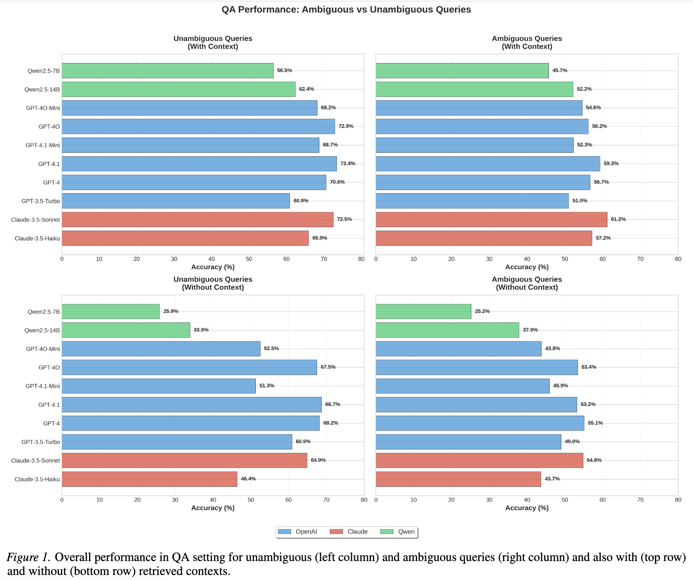
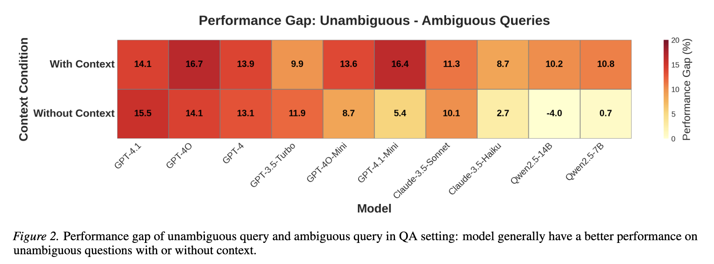
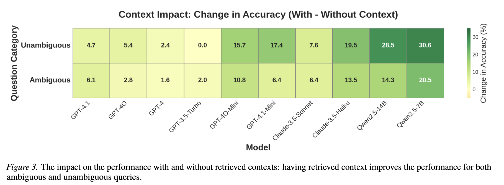
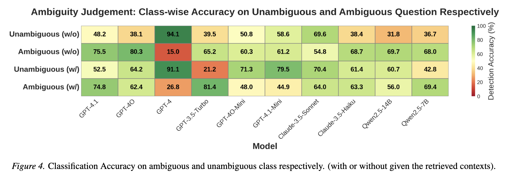
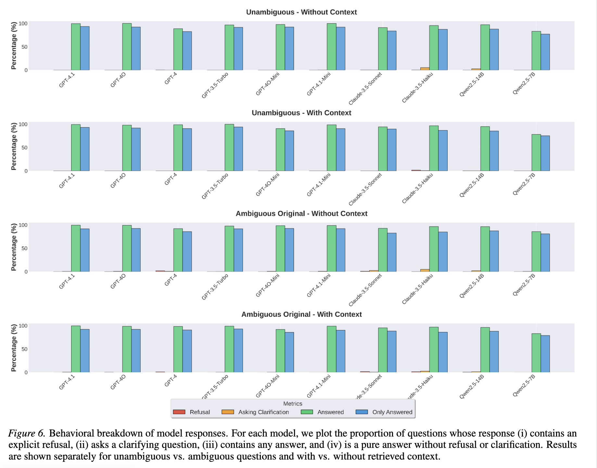
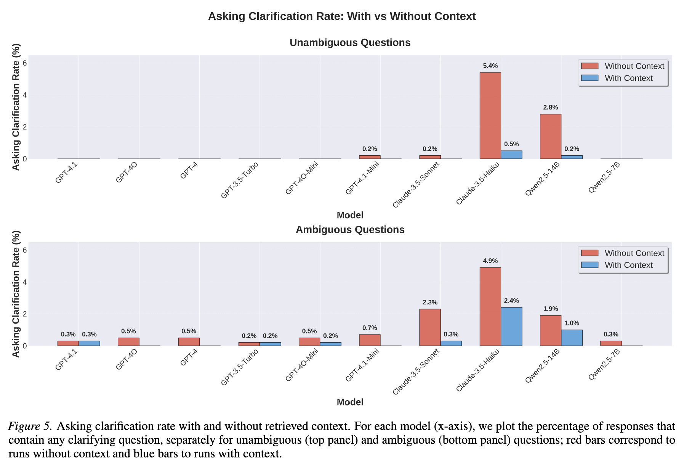
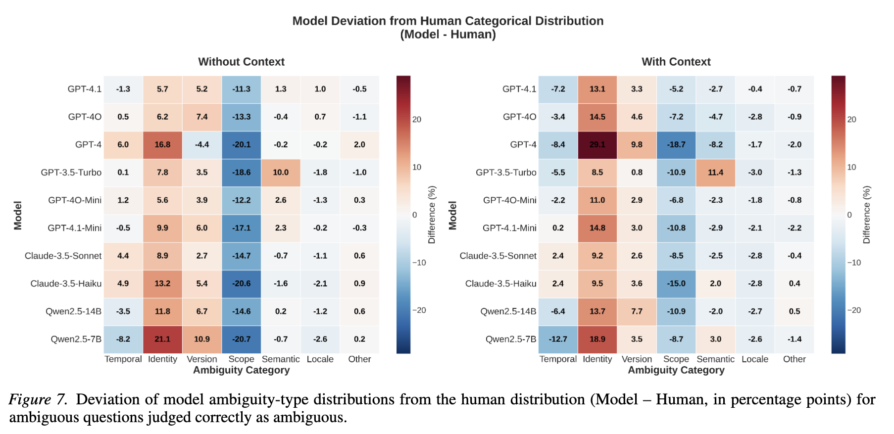
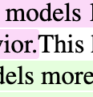
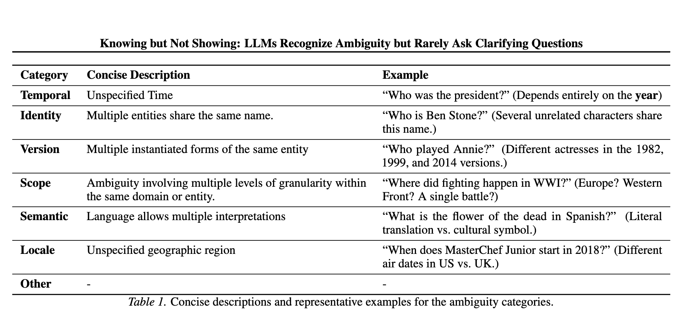

# Knowing but Not Showing: LLMs Recognize Ambiguity but Rarely Ask Clarifying Questions

## 기본 정보

- 논문 제목: Knowing but Not Showing: LLMs Recognize Ambiguity but Rarely Ask Clarifying Questions
- 링크: https://arxiv.org/pdf/2605.25284
- 저자: Jinyan Su, Claire Cardie (Cornell University)
- 논문 발표일: 24 May 2026 

- 논문 세미나 날짜: 2026년 9월 29일
- 논문 세미나 발표자: 장지수
- [논문 세미나 발표자료](https://docs.google.com/presentation/d/1ZAvPc0su8wfI77TEWaPT-KFk2i-XUDctHQbdYitXjvQ/edit?usp=sharing)

## 논문 요약

### 배경

- User query는 모호할 때가 꽤 잦음 -> 그럴 때 모델은 유저의 의도에 대해 자의적으로 해석하기 보다는 clarifying question을 다시 던져서 모호함을 해소해야 함

- 그러기 위해서는 두 가지 능력이 필요함
    1. Ambiguity awareness: 먼저 그 query가 ambiguous하다는 것을 알아차리는 능력
    2. Clarification behavior: 바로 대답하기 보단 clarification을 모색할줄 아는 능력

- 논문의 목적: 위 두 가지 능력이 현존 LLM에서 얼마나 되나 보자!

### 실험 setup

- Dataset: AmbigQA (Min et al., 2020)
    - QA dataset built from open domain version of Natural Questions (Kwiakowski et al., 2019)
    - 각 example은 다음을 포함함:
        - One question
        - One or more answer strings
        - Set of Wikipedia passages retrieved for that question (i.e., context)
    - Question의 종류 
        1) ambiguous: 모호한 질문
        2) umambiguous: 모호하지 않은 질문 
        3) disambiguated questions: 모호함이 해소된 질문 (disambiguated rewrites of the ambiguous questions) 
    - 이 논문에서는 1000개의 data를 randomly sample

- Evaluation metric
    1) QA accuracy
        - on ambiguous/unambiguous/disambiguated questions, 
        - retrieved context가 있/없는 상태에서
    2) Ambiguity awareness
        - LLM에게 query가 모호한지 아닌지에 대한 explicit judgment를 내리게 함
        - 마찬가지로 retrieved context가 있/없는 상태에서
        - 만약 ambiguous 하다고 판단되면 ambiguity taxonomy 중 하나의 카테고리 부여
    3) Clarification behavior
        - 모델들에게 직접적으로 모호성에 대해 clarify하라고 시키지 않고 그냥 질문 그 자체만 했을 때 ambiguity awareness가 고려되는지 점검
        - 모델들에게 ambiguity awareness에서 사용한 질문들과 동일한 질문들을 줬을 때, '모호하다'는 판단에 대해 실제로 그걸 반영한 행동을 하는지 점검
        - LLM이: clarifying question을 다시 던지는가 / 대답을 그냥 하는가 / 명시적으로 대답을 거부하고 더 많은 정보를 요구하는가

- Task Formulation
    1) standard question answering (QA) -> asked to answer to the question directly, then the correctness of the model's response is measured (against reference answers)
    2) explicit ambiguity judgment -> binary classificaiton
    3) behavioral analysis -> clarifying question을 다시 던지는가 / 대답을 그냥 하는가 / 명시적으로 대답을 거부하고 더 많은 정보를 요구하는가

- Model
    - OpenAI family (GPT-4.1, GPT-4O, GPT-4, GPT 3.5-Trubo, GPT-4O-Mini GPT-4.1-Mini)
    -  Claude family (Claude-3.5-Sonnet and Claude-3.5-Haiku)
    - Qwen family (Qwen2.5-14B and Qwen2.5-7B)

### Results

- 주된 발견: 모호함을 **인지**하는 것과 그것에 대하여 **행동**하는 것에는 clear gap이 존재함
    - 모호함에 대해 대놓고 언급하면 그것을 인지하지만, 보통 (특히 QA setting에서) 그냥 대답함

#### QA setting

- ambiguous queries are harder to answer correctly

- having retrieved context amplified the gap between ambiguous and unambiguous queries (adding context boosts QA accuracy)

- ambiguous queries가 context가 주어졌을 때 얻는 이득이 더 많다.

#### Ambiguity-judgment setting

- ambiguous한지 아닌지에 대해서 binary classification을 수행 (prompting)
- 그래서 gold ambiguous vs unambiguous label에 대해 class-wise accuracy 
- 표 해석: 
    - many models are biased toward over-predicting ambiguity
    - models are not reliably using the retrieved passages to reason about whether the original query still admits multiple interpretations

#### Behavioral Analysis

- 모델의 대답 종류 구분에는 gpt-5-nano를 Judge로 사용: (i) refuse to answer, (ii) provide an answer, and (iii) ask a clarifying question.

- 위 표는 "behavioral breakdown"을 보여줌. 모든 모델과 조건에서, "direct answer"가 dominant. 
- 세부 정보는 아래 figure에서 clarification rate를 볼 수 있음. Context 제공이 pure answer 증가시킴.

- 아래 figure: ambiguity type에 대해 human과의 차이 (model - human, in percentage points)
    - 거의 모든 모델과 context condition에서 *Identity* 와 *Version* ambiguity 종류가 인간에 비해 over-assigned

#### 결론

- "Knowing but not showing". 모델들은 '모호함'에 대해 인지 가능하지만, 답변 태도에 이 '모호성 인지 여부'를 눈에 띄게 반영하지 않고, 맥락이 주어졌을 때는 더욱 disambiguity를 표명하는 것에 대해 소극적이게 된다. 

- RL의 관점에서는 "ambiguity awareness를 표현 하는 것"은 high reward에 align되어 있지 않음. -> 즉 모델들은 이러한 awareness를 감추게 됨

- 이러한 사실은 두 가지 중요한 시사점을 남김
    1) RL에서 training objective를 설정할 때 "answer accuracy"를 올리는 것만이 아닌, "expressing uncertainty, asking clarification question, explicitly acknowlegding under-specification"에 대해서도 positive reward를 줘야 함
    2) LLM이 무언가를 '안다'라고 증명하거나 그들의 능력을 측정할 때, task formulation 자체도 주의해야함: 프롬프트에 ambiguity를 명시적으로 정의를 하냐 안 하냐에 따라서 모델의 답변 능력이 꽤 달라지기 때문 

## 지수 생각 (비판...)

- `.`이랑 `This`랑 붙어있음

- 뜬금 없는 RL: RL에 대해 언급하며 "answer accuracy"를 올리는 것만이 아닌, "expressing uncertainty, asking clarification question, explicitly acknowlegding under-specification"에 대해서도 positive reward를 줘야 한다고 함.
    - 근데 이 부분이 너무 무책임하게 쓰여짐 것 같음. 그리고 뜬금없음
    - 발견한 현상에 대해 원인을 RL의 reward alignment로 규정짓는 것에 대한 충분한 근거가 없고, 만약에 이러한 방향으로 잡았다면 처음부터 시작을 그렇게 들어갔어야 된다고 생각. 

- 연구 필요성에 대한 미흡한 설명: Related Work - Ambiguous Question Answering 부분에서 이전 연구들의 종류와 역사는 소개하면서 정작 이전 '모호함 QA 연구'에서 다뤄지지 않은 부분이 무엇이고, 그걸 이 논문에서 어떻게 해결했는지에 대해 언급하지 않음 (크리티컬하다고 생각). 그래서 Results 섹션에서 분석된 것들이 이전에 실제로 없었는지에 대해 계속 의심하게 됨

- '모호함' 카테고리의 정의: 위 표의 Category인 "Our ambiguity taxonomy"가 저자들이 정의한건지, 원래 데이터셋에 들어있던건지 모르겠음
    - 전자라면 뭘 기준으로 정의를 했는지 언급했어야된다고 생각하고 후자라면 언급이 안된게 문제라고 생각
    - 그리고 이런걸 애써 많이 정의해놓고, 왜 정작 ambiguity detection에서는 binary classification을 쓴거지?; 카테고리 classification을 쓰면 안되는 거였나
    - 이렇게 좋은 label을 두고 이걸 figure 7에만 쓴게 아쉬움

- 전체적인 논문 퀄리티:
    - 실험이 너무 domain-specific함: 그냥 이 논문에서 사용한 원본 데이터셋 논문의 study 혹은 analysis 섹션에 들어가는 정도가 아닌가 생각함 
    - 동어 반복, 반복 설명 너무 많음: 예를 들어 같은 개념을 위에서는 "Clarification behavior"로 말하고 아래에서는 "Behavioral Analysis"라고 함. 이런게 한 두 개가 아님.
    - 모델 family가 3개 밖에 없는게 아쉬움. 모델 사용 종류를 봐서는 돈이 없었던 것 같지도 않은데 왜 이렇게 밖에 못했을까 의문이 듦. 또한 평가 대상 모델 중 많은 부분이 GPT family인데, judge model을 굳이 또 GPT 계열로 쓴거에 대한 이유도 설명도 없음. "We concern..." 으로 동족 편향 bias에 대해서 언급이라도 해줬으면 뭐라 안 했을듯
    - 너무 당연한 말만 하는것 같음. Novelty가 뭔지 모르겠음
        - 예시: "ambiguous queries are harder to answer correctly"...
    - QA에서 reference text에 대하여 모델 response의 accuracy를 어떻게 쟀는지에 대해 안나와있음 (cosine 유사도? rubric?)