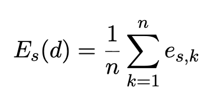
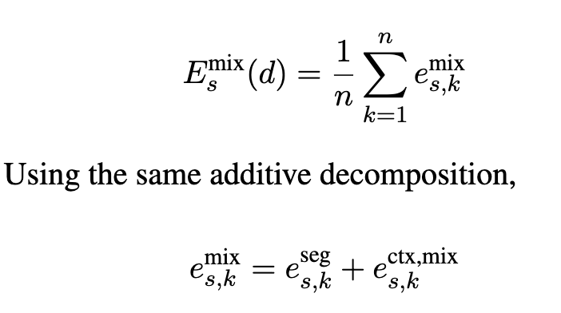
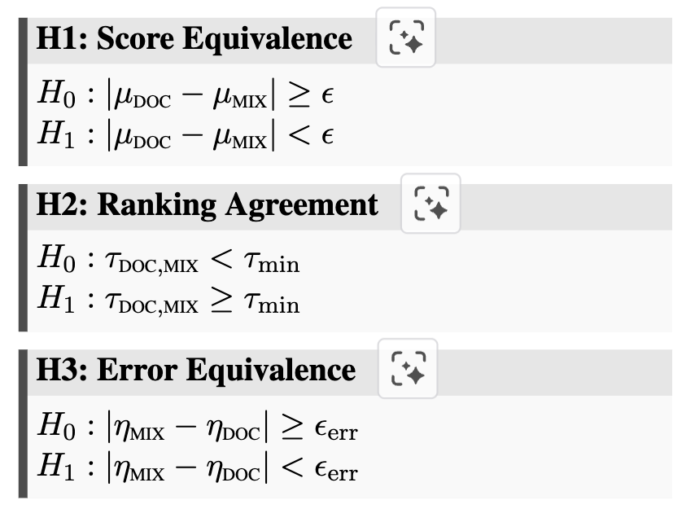

# The Blindness of Document-Level Translation Evaluation

- **저자**: Ahrii Kim, Vilem Zouhar, Chanjun Park, Seong-heum Kim
- **arXiv**: https://arxiv.org/abs/2504.07583
- **발표**: -
- **분류**: 
- **Reviewed by**: Jisoo Jang

---

## 내용 요약

### 1. Introduction

- Document-level MT는 '문서 단위로 평가될 것'이라는 assumption 하에 수행되어야 한다. 
    - 하지만 현존하는 document-level evaluation protocol들은 완전히 유효하다고 검증된적이 없음.

- 인지 언어학에서의 관점
    - *content-driven blindness*: 사람들은 익숙한 콘텐츠에 대해서는 더 엄밀한 검증을 '덜' 하는 경향이 있음.
    - *presentation-driven blindness*: 사람들의 주의는 콘텐츠의 내용 보다는 구성 양상에 따라 달라짐

- 위의 관점을 도입하여 보았을 때, document-level MT 평가에서 '순서 (cue)'가 고려되는가?라는 문제점이 있음.
    - cue를 인식하여도 평가 때 반영이 안 될 수 있다는 이야기

- 이러한 가능성을 증명하기 위하여, 저자들은 **controlled counterfacual condition (MIX)**를 도입
    - 여러 document들에서 각자 다른 문장을 뽑아와서 discourse coherence가 없는 document를 인위적으로 만듦 --> MIX
    - coherent가 유지되는 원본 document --> DOC
    - isolated segments --> SEG

- 평가는 ESA와 14개 automatic metrics

- EN -> KO
    - 한국어는 discourse-sensitive features가 많아서 번역이 까다로움
    - 18,420개의 expert annotation 수집

- Main finding:
    1. Human ESA annotation은 통계적으로 유의하며 near-identical system rankings를 가짐. 또한 MIX와 DOC 사이에 확연한 차이를 보이는 error annotation 수행
    2. 모든 14개의 automatic metrics는 DOC과 MIX 사이에서 same ranking을 수행한다. 오직 human evalauation에서만 slight divergence를 볼 수 있음.
    3. Annotator들이 느끼는 문제성은 **문장 사이의 관계에 있는데**, 기록하는 단위는 ESA로 각 문장 안의 오류이다. 따라서 문서 전체에서 느낀 문제를 어디에, 얼마나 감점해서 반영해야 하는지 불명확해질 수 있음. 따라서 divergence가 slight했다고 해서, 'annotator들이 context를 무시했다'라고 할 수 없으며 'score recoverability', 'agreement', 'time-on-task'등이 annotator behavior를 바꾸게 할 수 있음.

- 결론: 현존 evaluation protocol에서는 document-level 평가라고 보고된 많은 것들이 그저 'segment-level signal aggregated at the document level'임. --> 더 많은 discourse-level에서의 발전 필요

### 2. Related Works

#### 2.1 Human Evaluation of Document MT

- segment-level aggregation: DA (Direct Assessment)
- error taxonomies and annotation interfaces: MQM (Multidimensional Quality Metrics), ESA (Error Span Annotation), RATE
- 최근 document-level error category도 도입됨 (Kim, 2025a; Song et al., 2025)
- 하지만 현존 방법론들은 모두 segment-centric: no direct evidence that the resulting annotations capture document-level quality.

#### 2.2 Automatic Evaluation of Document MT

- Context-Extended Metrics
    - full document operation: d-BLUE, doc-COMET
        - remains unclear whether the metrics encode doc-level information or merely exploit extended surface context.
    - adaptive sentence alignment (w/ local window): SEGALE
        - may not capture phenomena requiring global coherence

- Discourse-Targeted Metrics 
    - 담화의 특정 현상을 겨냥한 번역 평가 지표. 
        1. Pronoun Resolution (대명사가 무엇을 가르키는지 파악): AutoPRF (지표), APT (지표), PROTEST (benchmark)
        2. Lexical Choice (어떤 단어를 선택했는가): ATEC (지표)
        3. Multi-phenomenon Evaluation (시제, entities, 전문 용어 등 여러 현상을 함게 평가하기): BlonDe (지표)
    - 하지만 특정 요소를 검사하는 것만으로는 글 전체의 일관성을 평가하기 어려움 (reference 의존 혹은 일부 언어에서만 검증)
    - MUDA: 문맥을 고려해야하는 부분을 찾아주는 도구. -> MIX를 만들면서 "어떤 종류의 불일치가 얼마나" 생겼는지 구체적으로 조사할 수 있음 

- LLM-as-judge: prompting LLMs to score document-level phenomena such as coherence/ coreference/formality
    - context를 진짜로 사용하는 llm system은 해당 context가 바뀌었을 때 다른 행동 양상을 보여야함.
    - 이 논문에서는 이걸 검증

### 3. Methods

- The ESA protocol
    - translation system ${s}$ 에 의해 번역된 document ${d}$ 를 ${n}$ 개의 segments로 분리
    - segment 하나 당 채점하지만, context로는 full context를 부여받는다.
    - 시스템 s에 의해 번역된 k번째 segment에 부여된 score가 ${e_{s,k}}$ 라고 할 때, document-level score는 average of segment scores이다:
    -   
    - 또한 각 segment score ${e_{s,k}}$ = ${e^{seg}_{s,k}}$ + ${e^{ctx}_{s,k}}$
        - ${e^{seg}_{s,k}}$ = score the segment would receive if judged in isolation
        - ${e^{ctx}_{s,k}}$ = document-level cues induced by access to cross-segment context. -> document level effects를 capture

- The counterfactural ESA protocol
    - MIX: counterfactual condition 
        - document-level display with per-segment judgments
        - while removing genuine document-level coherence by synthetic construction 
    - mixed document ${d^{mix}}$ is assembled from segments of multiple systems
    - Annotators provide segment scroes ${e^{mix}_{s,k}}$ under ESA condition
    - The counterfactual document score is defined:
    - 
        - 이때 ${e^{ctx,mix}_{s,k}}$ 는 **any context-driven cues induced by the mixed presentation**을 반영한다. 

- Context cues
    - ESA는 ${e^{ctx,mix}_{s,k}}$ 에 반영되는 세가지 output을 냄 (우리가 잘 알고있는 그것...)
        1. a numeric score on a 100-point sclae
        2. error span annotations
        3. severity level on each span
    - 만약 ${e^{ctx,mix}_{s,k}}$ 를 정말로 ${e^{ctx}_{s,k}}$ 와 다르게 인식한다면, 점수가 더 낮아야함

### 4. Experiment

#### 4.1 Hypothesis

- 만약 cross-segment coherence가 제대로 반영되고 있다면, 다음과 같이 세 개의 prediction을 formalize 할 수 있다.
    - ${\mu_{c}}$ -> mean segment-level score
    - ${\gamma_{c}}$ -> induced system ranking
    - ${\eta_{c}}$ -> mean error count per annotation.
    - ${\tau_{a,b} = \tau(\gamma_{a} , \gamma_{b})}$ -> Kendall's ${\tau}$ between rankings under conditions a and b
    - ${\epsilon}$, ${\epsilon_{err}}$  -> pre-specified equivalence margins for **scores** and **error counts**
    - ${\tau_{min}}$ -> lower bound for ranking agreement

- Primary comparison: DOC vs MIX
- additional comparison: SEG vs DOC -> to check whether the document-level presentation format affects evaluation outcomes independently of coherence.

#### 4.2 Dataset

- WMT2025 English --> Korean test set in *news, social, literary* domains
- 한국어는 document-level translation이 어려운 특징이 있음: discourse-sensitive phenomena가 많아서 (pro-drop, honorifics, cross-segment entity consistency 등 때문에)
- 구성 방식
    1. 같은 문서 내의 segment 순서는 유지
    2. 각 위치에서 그 segment를 번역한 여러 시스템의 출력 중 하나를 무작위로 선택
    3. MIX 문서 안에 후보 시스템들이 각각 최소 한 세그먼트를 기여하도록 하고, 같은 위치의 DOC에서 사용 
- 필터링 후 --> 3070개의 unique translations from 9 MT systems and one humen reference across 23 document
- 이후 ESA annotation은 두명의 전문가가 수행

#### 4.3 Manipulation checks

- MIX가 진짜로 의도한대로 incoheren한 문서인가?를 위한 점검

1. Do the pooled systems differ? (섞는 재료인 시스템들의 번역이 서로 다른가?)
    - 기존 MQM 순위가 가장 많이 겹치는 시스템 쌍 세개를 고름
    - 평가자들에게 해당 쌍과 원문을 보여주고 "A 선호 / B 선호 / 차이 없음" 중 하나 고르게 함
    - 그 결과 85%의 판단에서 어느 한쪽이 더 좋다고 선택함 -> 즉 MQM 순위가 비슷한 시스템 번역들도 실제 인간 평자가 눈에는 구별 가능한 차이가 있다는 것 

2. Does the assembled document read as inconsistent? (실제로 섞은 문서를 읽으면 일관성이 떨어지는가?)
    - 같은 원문의 연속된 6개 segment (즉 document)에 대해 두 버전을 비교
        - DOC: system이 한개인 글
        - MIX: 여러 시스템의 번역을 섞은 글
    - 평가자들에게 두 개의 버전을 보여주고 "어느 쪽이 일관적으로 보이는가?" 선택하게 함
    - 그 결과 87%의 판단에서 DOC가 선택됨

#### 4.4 Human Evaluation

#### 4.5 Automatic Metrics

#### 4.6 Testing Procedure

### 5. Results

#### 5.1 Scores are insentive to discourse

#### 5.2 System rankings collapse 

#### 5.3 No additional errors are marked

#### 5.4 Mechanism: MIX is evaluated in isolation

#### 5.5 Behavioral analysis

#### 5.6 Domain-wise replication

### 6. Conclusion

## 우리 연구와의 연결